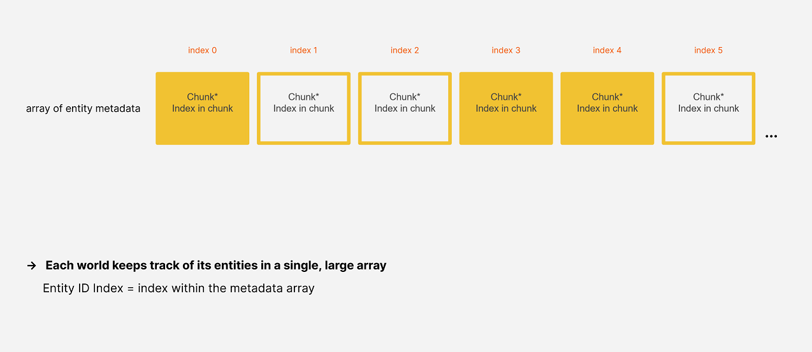
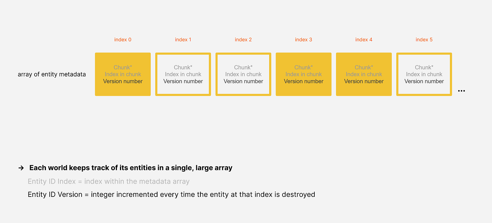

# Intro to Entities

This is an introduction to the concepts and API usage of Entities. See first the *[Intro to Collections and Jobs](./intro-jobs.md)*.

- [Video overview of entities and components](https://youtu.be/jzCEzNoztzM) (*see [a few corrections]()*)
- [Video overview of systems](https://youtu.be/k07I-DpCcvE) (*see [a few corrections]()*)

TOC: 

- [Entities](#entities)
- [Archetypes and chunks](#archetypes)
- [Queries](#queries)
- [Entity jobs](#entity-jobs)
- [Systems and system groups](#systems-and-system-groups)
- [SystemState](#systemstate)
- [ComponentLookup](#componentlookupt)
- [EntityCommandBuffer](#entitycommandbuffer)
- [DynamicBuffer](#dynamicbuffer)
- [Enableable components](#enableable-components)
- [Aspects](#aspects)

<br/>

# Entities

Entities resemble GameObjects in many ways and can serve a similar role, but they have key differences:

- Unlike a GameObject, an entity is not a managed object but simply a unique identifier number.
- The components associated with an entity are usually struct values.
- A single entity can only have one component of any given type. For example, a single entity cannot have two components both of type *Foo*.
- Although entity component types can be given methods, doing so is generally discouraged.
- An entity has no built-in concept of parenting. Instead, the standard [`Parent`](https://docs.unity3d.com/Packages/com.unity.entities@latest?subfolder=/api/Unity.Transforms.Parent.html) component contains a reference to another entity, allowing formation of entity transform hierarchies.

An entity component type is usually defined as a struct implementing [`IComponentData`](https://docs.unity3d.com/Packages/com.unity.entities@latest?subfolder=/api/Unity.Entities.IComponentData.html). Additional kinds of component types are defined with some additional interfaces: [`ICleanupComponent`](https://docs.unity3d.com/Packages/com.unity.entities@latest?subfolder=/api/Unity.Entities.ICleanupComponentData.html), [`IBufferElementData`](https://docs.unity3d.com/Packages/com.unity.entities@latest?subfolder=/api/Unity.Entities.IBufferElementData.html), and [`ISharedComponent`](https://docs.unity3d.com/Packages/com.unity.entities@latest?subfolder=/api/Unity.Entities.ISharedComponentData.html), among others.

<br>

# Worlds and EntityManagers

A [`World`](https://docs.unity3d.com/Packages/com.unity.entities@latest?subfolder=/api/Unity.Entities.World.html) is a collection of entities. An entity's ID number is only unique within its own world, *i.e.* the entity with a particular ID in one world is entirely unrelated to the entity with the same ID in a different world.

The entities in a world are created, destroyed, and modified through the world's [`EntityManager`](https://docs.unity3d.com/Packages/com.unity.entities@latest?subfolder=/api/Unity.Entities.EntityManager.html). Key `EntityManager` methods include:

- [`CreateEntity()`](https://docs.unity3d.com/Packages/com.unity.entities@latest?subfolder=/api/Unity.Entities.EntityManager.CreateEntity.html) creates a new entity.
- [`Instantiate()`](https://docs.unity3d.com/Packages/com.unity.entities@latest?subfolder=/api/Unity.Entities.EntityManager.Instantiate.html) creates a new entity with a copy of all the components of an existing entity.
- [`DestroyEntity()`](https://docs.unity3d.com/Packages/com.unity.entities@latest?subfolder=/api/Unity.Entities.EntityManager.DestroyEntity.html) destroys an existing entity.
- [`AddComponent<T>()`](https://docs.unity3d.com/Packages/com.unity.entities@latest?subfolder=/api/Unity.Entities.EntityManager.AddComponent.html) adds a component of type T to an existing entity.
- [`RemoveComponent<T>()`](https://docs.unity3d.com/Packages/com.unity.entities@latest?subfolder=/api/Unity.Entities.EntityManager.RemoveComponent.html) removes a component of type T from an existing entity.
- [`GetComponent<T>()`](https://docs.unity3d.com/Packages/com.unity.entities@latest?subfolder=/api/Unity.Entities.EntityManager.GetComponentData.html) retrieves the value of an entity's component of type T.
- [`SetComponent<T>()`](https://docs.unity3d.com/Packages/com.unity.entities@latest?subfolder=/api/Unity.Entities.EntityManager.SetComponentData.html) overwrites the value of an entity's component of type T.

<br>

#  Archetypes

All of the entities in a  world which have the same set of component types are stored together in an *archetype*. For example:

 - All of a world's entities with component types *A*, *B*, and *C*, are stored together in one archetype
 - ...but the entities with just component types *A* and *B* are stored together in a second archetype
 - ...and the entities with component types *B* and *D* are stored in a third archetype.

Effectively, adding or removing components of an entity changes which archetype the entity belongs to, necessitating the `EntityManager` to actually move the entity and its components from its old archetype to its new one.

Archetypes are created by the `EntityManager` as you create and modify entities, so you don't have to worry about creating archetypes explicitly.

<br>

# Chunks

The entities of an archetype are stored in blocks of memory belonging to the archetype called *chunks*, which each store up to 128 entities. The entity ID's and component types are each stored in their own separate array within the chunk. For example, in the archetype for entities which have component types *A* and *B*, each chunk will store three arrays:

- one array for the entity ID's
- ...a second array for the *A* components
- ...and a third array for the *B* components.

The ID and components of the first entity in the chunk are stored at index 0 of these arrays, the second entity at index 1, the third entity at index 2, and so forth.

A chunk's arrays are always kept tightly packed:

- When a new entity is added to the chunk, it is stored in the first free index of the arrays.
- When an entity is removed from the chunk (which happens either because the entity is being destroyed or because it's being moved to another archetype), the last entity in the chunk is moved to fill in the gap.

The creation and destruction of chunks is handled by the `EntityManager`:

- The `EntityManager` creates a new chunk only when an entity is added to an archetype whose existing chunks are all full.
- The `EntityManager` only destroys a chunk when the chunk's last entity is removed.

Any `EntityManager` operation that adds, removes, or moves entities within a chunk is called a *structural change*. Such changes should generally be made only on the main thread, not in jobs. As we'll discuss later, though, an [`EntityCommandBuffer`](https://docs.unity3d.com/Packages/com.unity.entities@latest?subfolder=/api/Unity.Entities.EntityCommandBuffer.html) can be used to work around this limitation.

<br>

# Queries

An [`EntityQuery`](https://docs.unity3d.com/Packages/com.unity.entities@latest?subfolder=/api/Unity.Entities.EntityQuery.html) efficiently finds all archetypes having a specified set of component types and gathers all of the archetypes' chunks into an array. For example, for a query that matches on component types *A* and *B*, the query will gather the chunks of all archetypes having those two component types, regardless of whatever other component types those archetypes might have, so say, the archetype with component types *A*, *B*, and *C* would match the query.

A query can also specify component types to *exclude* from the matching archetypes. For example, a query for component types *A* and *B* but *excluding* *C* would match the archetype with component types *A* and *B* but *not* the archetype with component types *A*, *B*, and *C*.

*[Examples of creating and using queries](../cheatsheet/components_systems.md#querying-for-entities).*


A query can filter its results based on whether component values may have possibly changed since a prior point in time or based on the values of the chunk's [shared components](). These filters are generally only needed in advanced use cases. *[See the manual pages about filters.]()*

<br>

# Entity ID's

In order to look up entities by ID, the world’s `EntityManager` maintains an array of entity metadata. Each entity ID has an index value denoting a slot in this metadata array, and the slot stores a pointer to the chunk where that entity is stored, as well as the index of the entity within the chunk. When no entity exists for a particular index, the chunk pointer at that index is null. Here, for example, no entities with indexes 1, 2, and 5 currently exist, so the chunk pointers in those slots are all null.



In order to allow entity indexes to be reused after an entity is destroyed, each entity ID also contains a *version number*. When an entity is destroyed, the version number stored at its index is incremented, and so if an ID’s version number doesn’t match the one currently stored, then the ID must refer to an entity that has already been destroyed or perhaps never existed.



<br>

# Entity Jobs

For jobs that access the entities matching a query, we have two special job interfaces:

- [`IJobChunk`](https://docs.unity3d.com/Packages/com.unity.entities@latest?subfolder=/api/Unity.Entities.IJobChunk.html), whose `Execute()` method processes an individual chunk matching the query.
- [`IJobEntity`](https://docs.unity3d.com/Packages/com.unity.entities@latest?subfolder=/api/Unity.Entities.IJobEntity.html), whose `Execute()` method processes the components of an individual entity matching the query. 

`IJobEntity` is the convenience option, and `IJobChunk` is the fallback option for niche cases. In most cases, their performance is identical.

*[See examples of IJobChunk](../cheatsheet/jobs.md#ijobchunk) [and IJobEntity](../cheatsheet/jobs.md#ijobentity).*

To split the work of an `IJobChunk` or `IJobEntity` across multiple threads, schedule the job by calling `ScheduleParallel()` instead of `Schedule()`. When you use `ScheduleParallel()`, the chunks matching the query will be split into separate batches, and these batches will be farmed out to the worker threads. *[See related: EntityCommandBuffer.ParallelWriter](https://docs.unity3d.com/Packages/com.unity.entities@latest?subfolder=/api/Unity.Entities.EntityCommandBuffer.ParallelWriter.html)*

<br/>

# Systems and system groups

A *system* is a unit of code that runs on the main thread, usually once per frame. A system is defined as a struct implementing the [`ISystem`](https://docs.unity3d.com/Packages/com.unity.entities@latest?subfolder=/api/Unity.Entities.ISystem.html) interface, which has three key methods: `OnUpdate()`, `OnCreate()`, and `OnDestroy()`.

*[See examples of ISystem](../cheatsheet/components_systems.md#system-and-systemgroup).*

System instances are added to worlds, and the systems of a world are organized into a hierarchy of [*system groups*](https://docs.unity3d.com/Packages/com.unity.entities@latest?subfolder=/api/Unity.Entities.ComponentSystemGroup.html). Each system group has any number of systems and other system groups as its children.

A system group has an update method that can be overridden, but the base update method simply updates the group's children in a sorted order.

The [`[UpdateBefore]`](https://docs.unity3d.com/Packages/com.unity.entities@latest?subfolder=/api/Unity.Entities.UpdateBeforeAttribute.html) and [`[UpdateAfter]`](https://docs.unity3d.com/Packages/com.unity.entities@latest?subfolder=/api/Unity.Entities.UpdateAfterAttribute.html) attributes can be used to determine the relative sort order amongst the children in a group. For example, if a `FooSystem` has the attribute `UpdateBefore(typeof(BarSystem))]`, then `FooSystem` will be put somewhere before `BarSystem` in the sorted order. If however `FooSystem` and `BarSystem` don't belong to the same group, the attribute is ignored.

<br>

## World and system creation

By default, an automatic bootstrapping process creates a default world with three system groups: `InitializationSystemGroup`, `SimulationSystemGroup`, and `PresentationSystemGroup`.

An instance of each system and system group in your project will also be created and added to this default world. The systems and system groups will normally be added to the `SimulationSystemGroup`, but this can be overridden by marking them with the [`[UpdateInGroup]`](https://docs.unity3d.com/Packages/com.unity.entities@latest?subfolder=/api/Unity.Entities.UpdateInGroupAttribute.html) attribute. For example, if a `FooSystem` has the attribute `UpdateInGroup(typeof(InitializationSystemGroup))]`, then `FooSystem` will be added to the `InitializationSystemGroup` instead of the `SimulationSystemGroup`.

You can disable the automatic bootstrapping process with the scripting define `#UNITY_DISABLE_AUTOMATIC_SYSTEM_BOOTSTRAP`.

<br>

# SystemState

The [`SystemState`](https://docs.unity3d.com/Packages/com.unity.entities@latest?subfolder=/api/Unity.Entities.SystemState.html) parameter of a system's `OnUpdate()`, `OnCreate()`, and `OnDestroy()` methods represents the system instance and has important methods and properties, including:

- `World` (the world the system instance belongs to)
- `EntityManager` (the EntityManager of the world the system instance belongs to)
- [`GetEntityQuery()`](https://docs.unity3d.com/Packages/com.unity.entities@latest?subfolder=/api/Unity.Entities.SystemState.GetEntityQuery.html)
- [`GetComponentTypeHandle<T>()`](https://docs.unity3d.com/Packages/com.unity.entities@latest?subfolder=/api/Unity.Entities.SystemState.GetComponentTypeHandle.html)
- [`GetComponentLookup<T>()`](https://docs.unity3d.com/Packages/com.unity.entities@latest?subfolder=/api/Unity.Entities.SystemState.GetComponentLookup.html)

Although entity queries, component type handles, and component lookups can be acquired directly from the `EntityManager`, it is generally proper for a system to only acquire these things from the `SystemState` instead. By going through `SystemState`, the accessed component types get tracked by the system, which is essential for the [`Dependency`](https://docs.unity3d.com/Packages/com.unity.entities@latest?subfolder=/api/Unity.Entities.SystemState.Dependency.html) property to correctly pass job dependencies between systems.

## SystemState.Dependency

When we schedule a job in a system, we want it to depend upon any currently scheduled jobs that might conflict with the new job, even if those jobs were scheduled in other systems. The job handle property `Dependency` of `SystemState` is used to facilitate this. Immediately before a system updates:

1. ...the system's `Dependency` is completed
2. ...and then assigned a combination of the `Dependency` handles of all other systems which access any of the same component types.

The user is then expected to do two things in every system:

- All jobs we schedule in a system update should (directly or indirectly) depend upon the job handle that was assigned to `Dependency` right before the update.
- Before a system update returns, the `Dependency` property should be assigned a handle that includes all the jobs scheduled in that update.

As long as you follow these two rules, every job scheduled in a system update will depend upon all jobs scheduled in other systems that might access any of the same component types.

<br>

# ComponentLookup\<T\>

We can randomly access the components of individual entities through an `EntityManager`, but we generally shouldn't use an `EntityManager` in jobs. Instead, we should use a type called [`ComponentLookup<T>`](https://docs.unity3d.com/Packages/com.unity.entities@latest?subfolder=/api/Unity.Entities.ComponentLookup-1.html), which can get and set component values by entity ID.

*[See an example of creating and using CompoenentLookup\<T\>](../cheatsheet/components_systems.md#enableable-components).*

`ComponentLookup<T>` also has a [`HasComponent()`](https://docs.unity3d.com/Packages/com.unity.entities@latest?subfolder=/api/Unity.Entities.ComponentLookup-1.HasComponent.html) method, which returns true if the specified entity has the component, and a [`TryGetComponent()`](https://docs.unity3d.com/Packages/com.unity.entities@latest?subfolder=/api/Unity.Entities.ComponentLookup-1.TryGetComponent.html) method, which does the same but also outputs the value.

To test whether an entity simply exists, we can call [`Exists()`](https://docs.unity3d.com/Packages/com.unity.entities@latest?subfolder=/api/Unity.Entities.EntityStorageInfoLookup.Exists.html) of an [`EntityStorageInfoLookup`](https://docs.unity3d.com/Packages/com.unity.entities@latest?subfolder=/api/Unity.Entities.EntityStorageInfoLookup.html). Indexing an `EntityStorageInfoLookup` returns an [`EntityStorageInfo`](https://docs.unity3d.com/Packages/com.unity.entities@latest?subfolder=/api/Unity.Entities.EntityStorageInfo.html) struct, which includes a reference to the entity's chunk and its index within the chunk.

> [!IMPORTANT]
> Keep in mind that lookups of entities by ID tend to incur the performance cost of cache misses, so avoiding random lookups when you can is generally a good idea. There are, of course, many problems which require random lookups to solve, so by no means are they to be avoided entirely. Just avoid using them thoughtlessly!

<br>

# SystemAPI

The [`SystemAPI`](https://docs.unity3d.com/Packages/com.unity.entities@latest?subfolder=/api/Unity.Entities.SystemAPI.html) class has many static convenience methods, covering much of the same functionality as `World`, `EntityManager`, and `SystemState`.

The `SystemAPI` methods rely upon [source generators](https://docs.microsoft.com/en-us/dotnet/csharp/roslyn-sdk/source-generators-overview), so they only work in an `ISystem` or `IJobEntity`. The advantage of using `SystemAPI` is that these methods produce the same results in both contexts, so code that uses `SystemAPI` will generally be easier to copy-paste between these two contexts.

> [!NOTE] 
> If you get confused about where to look for key Entities functionality, the general rule is to check `SystemAPI` first. If `SystemAPI` doesn't have what you're looking for, look in `SystemState`, and failing that, look in `EntityManager` and `World`.

`SystemAPI` also provides a special [`Query()`](https://docs.unity3d.com/Packages/com.unity.entities@latest?subfolder=/api/Unity.Entities.SystemAPI.Query.html) method that makes it convenient to iterate through the entities and components matching a query.

*[See examples of using `SystemAPI.Query()`](../cheatsheet/components_systems.md#querying-for-entities).*

<br>

# EntityCommandBuffer

We can defer changes to entities by recording commands into an [`EntityCommandBuffer`](https://docs.unity3d.com/Packages/com.unity.entities@latest?subfolder=/api/Unity.Entities.EntityCommandBuffer.html). The recorded commands are executed by calling [`Playback()`](https://docs.unity3d.com/Packages/com.unity.entities@latest?subfolder=/api/Unity.Entities.EntityCommandBuffer.Playback.html) on the main thread.

Recording commands to defer changes is particularly useful in jobs because jobs should generally not directly make structural changes (*i.e.* create entities, destroy entities, add components, or remove components).

*[See examples of creating and using an `EntityCommandBuffer`](../cheatsheet/jobs.md#ijobchunk).*

> [!NOTE]
> Some `EntityManager` methods have no `EntityCommandBuffer` equivalent because an equivalent wouldn’t be feasible or make sense. For example, there are no `EntityCommandBuffer` methods for getting component values because *reading* data is not something that can be usefully deferred.

> [!IMPORTANT]
> You might be tempted to share a single `EntityCommandBuffer` instance across multiple jobs, but this is strongly discouraged. There are cases where it will work fine, but in many cases it will not. Besides, you shouldn’t worry about the overhead of creating and using separate `EntityCommandBuffer`'s: recording and playing back a set of commands split across multiple `EntityCommandBuffer`'s is not really any more expensive than recording the same set of commands into one `EntityCommandBuffer`, so it’s almost always best to create and use one `EntityCommandBuffer` per job.

## Temporary entities
---

When you call [`CreateEntity()`](https://docs.unity3d.com/Packages/com.unity.entities@latest?subfolder=/api/Unity.Entities.EntityCommandBuffer.CreateEntity.html) or [`Instantiate()`](https://docs.unity3d.com/Packages/com.unity.entities@latest?subfolder=/api/Unity.Entities.EntityCommandBuffer.Instantiate.html) of an `EntityCommandBuffer`, no new entity is created until the command is executed in playback, so the entity ID returned by these methods are *temporary* ID's. In playback, a temporary ID will be correlated to an *actual* entity ID once the entity is created.

Because a temporary entity ID has no meaning outside of the `EntityCommandBuffer` instance from which it was created, it should only be passed to subsequent method calls of the same `EntityCommandBuffer` instance.

## EntityCommandBuffer.ParallelWriter
---

To safely record commands from a parallel job, we need an [`EntityCommandBuffer.ParallelWriter`](https://docs.unity3d.com/Packages/com.unity.entities@latest?subfolder=/api/Unity.Entities.EntityCommandBuffer.ParallelWriter.html), which is a wrapper around an underlying `EntityCommandBuffer`.

A `ParallelWriter` has most of the same methods as an `EntityCommandBuffer` itself, but the `ParallelWriter` methods all take an additional 'sort key' argument. At the start of playback, the commands are all sorted based on these sort keys to make the playback order of the commands deterministic. Usually, the appropriate sort key to use is the index of the entity within the query. *[See a full explanation](#).*

## EntityCommandBufferSystem
---

An [`EntityCommandBufferSystem`](https://docs.unity3d.com/Packages/com.unity.entities@latest?subfolder=/api/Unity.Entities.EntityCommandBufferSystem.html) is a system that provides a convenient way to defer `EntityCommandBuffer` playback. An `EntityCommandBuffer` created from an `EntityCommandBufferSystem` will be played back and disposed the next time the `EntityCommandBufferSystem` updates.

*[See examples of creating and using an `EntityCommandBufferSystem`](../cheatsheet/components_systems.md#entitycommandbuffersystems).*

You generally don't need to create any `EntityCommandBufferSystem`'s yourself because the automatic bootstrapping process puts these five into the default world:

- `BeginInitializationEntityCommandBufferSystem`
- `EndInitializationEntityCommandBufferSystem`
- `BeginSimulationEntityCommandBufferSystem`
- `EndSimulationEntityCommandBufferSystem`
- `BeginPresentationEntityCommandBufferSystem`

The `EndSimulationEntityCommandBufferSystem`, for example, is updated at the end of the `SimulationSystemGroup`.

<br/>

# DynamicBuffer

A [`DynamicBuffer`](https://docs.unity3d.com/Packages/com.unity.entities@latest?subfolder=/api/Unity.Entities.DynamicBuffer-1.html) is a component type which is a resizable array.

To define a `DynamicBuffer` component type, create a struct that implements the [`IBufferElementData`](https://docs.unity3d.com/Packages/com.unity.entities@latest?subfolder=/api/Unity.Entities.IBufferElementData.html) interface.

*[See examples of creating and using `DynamicBuffer` components](../cheatsheet/components_systems.md#dynamicbuffers-ibufferelementdata).*

The initial capacity of each entity’s buffer can be specified by using the [`InternalBufferCapacity`](https://docs.unity3d.com/Packages/com.unity.entities@latest?subfolder=/api/Unity.Entities.InternalBufferCapacityAttribute.html) attribute on the `IBufferElementData` struct.

If the length of an entity’s buffer ever exceeds its internal capacity, then the contents of its buffer are copied to a new larger array outside the chunk, and the internal array is then no longer used. If the length of the buffer ever exceeds the capacity of the external array, then the contents of the buffer are copied to another new, larger array outside the chunk, and the old array is disposed. The buffer can also be shrunk.

When we make any structural change, the safety checks will invalidate all `DynamicBuffer`'s on the main thread, meaning all of their methods will subsequently throw an exception if called. To use a buffer again after a structural change, it must be re-retrieved.

The contents of a `DynamicBuffer` cannot be accessed while any scheduled jobs that access the same buffer component type remain uncompleted. If, though, the uncompleted jobs all just have read-only access of the buffer component type, then the main thread is allowed to read the buffer.

## DynamicBuffer methods in EntityCommandBuffers

The `EntityCommandBuffer` method [`AddBuffer()`](https://docs.unity3d.com/Packages/com.unity.entities@latest?subfolder=/api/Unity.Entities.EntityCommandBuffer.AddBuffer.html) returns a `DynamicBuffer` which is stored in the recorded command, and the contents of this buffer will be copied to the entity's actual buffer when it is created in playback. Effectively, writing to the returned buffer allows you to set the initial contents of the component.

The [`SetBuffer()`](https://docs.unity3d.com/Packages/com.unity.entities@latest?subfolder=/api/Unity.Entities.EntityCommandBuffer.SetBuffer.html) method is like `AddBuffer()`, but it assumes the entity already has a buffer of the component type. In playback, the entity's already existing buffer is overwritten by the contents of the returned buffer.

The [`AppendToBuffer()`](https://docs.unity3d.com/Packages/com.unity.entities@latest?subfolder=/api/Unity.Entities.EntityCommandBuffer.AppendToBuffer.html) method simply appends an individual value to the end of the entity's existing buffer.

<br/>

# Enableable components

A struct implementing `IComponentData` or `IBufferElementData` can also implement [`IEnableableComponent`](https://docs.unity3d.com/Packages/com.unity.entities@latest?subfolder=/api/Unity.Entities.IEnableableComponent.html). A component type implementing this interface can be enabled and disabled per entity.

**When a component of an entity is disabled, queries consider the entity to not have the component type.** If no entities in a chunk match the query because one or more of their components are disabled, that chunk will not be included in the array returned by the [`ToArchetypeChunkArray()`](https://docs.unity3d.com/Packages/com.unity.entities@latest?subfolder=/api/Unity.Entities.EntityQuery.ToArchetypeChunkArray.html) method of `EntityQuery`.

> [!NOTE]
> Be clear that disabling a component does *not* remove or modify the component: rather, a bit associated with the specific component of the specific entity is cleared. The disabled component can otherwise still be read and modified as normal. 

The enabled state of an entity's components can be checked and set through:

- `EntityManager`
- `ComponentLookup<T>`
- `BufferLookup<T>` (for a dynamic buffer)
- `EnabledRefRW<T>` (used in a `SystemAPI.Query` or an `IJobEntity`)
- `ArchetypeChunk`

*[See examples of checking and setting the enabled state of components](../cheatsheet/components_systems.md#enableable-components).*

In an `IJobChunk`, the `Execute` method parameters signal which entities in the chunk match the query:

- If the `useEnableMask` parameter is false, all entities in the chunk match the query. 
- Otherwise, if the `useEnableMask` parameter is true, the bits of the `chunkEnabledMask` parameter signal which entities in the chunk match the query, factoring in all enableable component types of the query. Rather than check these mask bits manually, you can use a [`ChunkEntityEnumerator`](https://docs.unity3d.com/Packages/com.unity.entities@latest?subfolder=/api/Unity.Entities.ChunkEntityEnumerator.html) to more conveniently iterate through the matching entities.

*[See an example `IJobChunk` that correctly accounts for disabled components](../cheatsheet/jobs.md#ijobchunk).*

> [!NOTE]
> The `chunkEnabledMask` is a *composite* of all the enabled states of the enableable components included in the query of the job. To check enabled states of individual components, use the `IsComponentEnabled()` and `SetComponentEnabled()` methods of the `ArchetypeChunk`.

<br/>

# Aspects

An aspect is an object-like wrapper over a subset of an entity's components. An aspect is defined as a struct implementing [`IAspect`](https://docs.unity3d.com/Packages/com.unity.entities@latest?subfolder=/api/Unity.Entities.IAspect.html):

```csharp
// This aspect wraps the Foo and Bar component types.
public readonly partial struct MyAspect : IAspect
{
    // By keeping this private, the Foo component is only 
    // exposed through a property.
    readonly RefRW<Foo> foo;

    // By making this public, the Bar component is 
    // exposed directly.
    public readonly RefRW<Bar> Bar;
    
    public Foo Foo
    {
        get
        {
            return foo.ValueRO;
        }
        set
        {
            foo.ValueRW = value;
        }
    }
}
```

> [!NOTE]
> Whether a component should be exposed directly as a public field, only as a property, or only through methods is a matter of judgement in each case.

An aspect can include fields of these types:

- [`RefRW<T>`](https://docs.unity3d.com/Packages/com.unity.entities@latest?subfolder=/api/Unity.Entities.RefRW-1.html) or [`RefRO<T>`](https://docs.unity3d.com/Packages/com.unity.entities@latest?subfolder=/api/Unity.Entities.RefRO-1.html) (to provide access to component type T)
- [`EnabledRefRW<T>`](https://docs.unity3d.com/Packages/com.unity.entities@latest?subfolder=/api/Unity.Entities.EnabledRefRW-1.html) and [`EnabledRefRO<T>`](https://docs.unity3d.com/Packages/com.unity.entities@latest?subfolder=/api/Unity.Entities.EnabledRefRO-1.html) (to provide access to the enabled state of component type T)
- `DynamicBuffer<T>` (to provide access to a dynamic buffer component type T)
- `Entity` (to provide access to the entity's ID)
- Other aspect types (the containing aspect will encompass all of the component types belonging to the 'embedded' aspects)

*[See examples of creating and using aspects](../cheatsheet/components_systems.md#aspects)*.

<br/>


