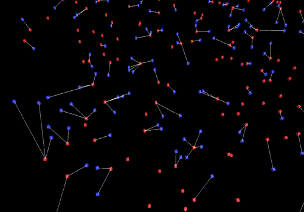
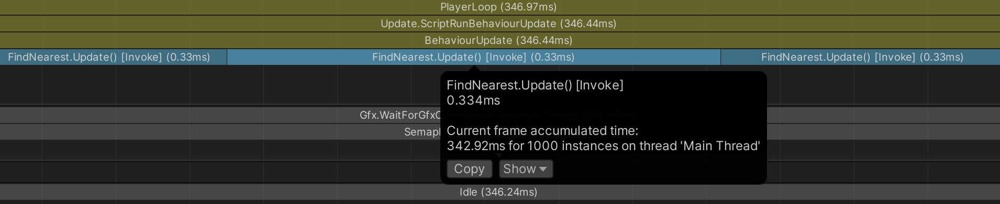
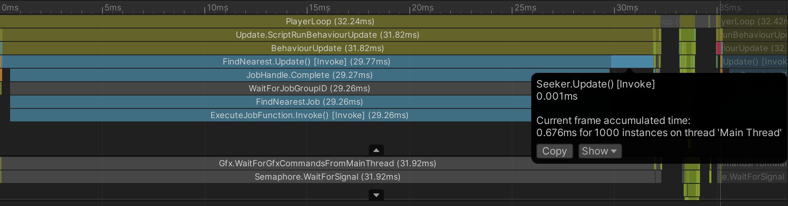
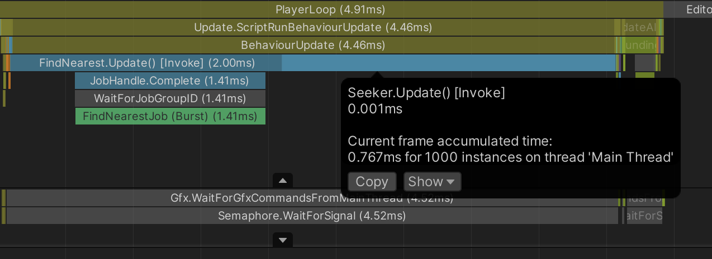
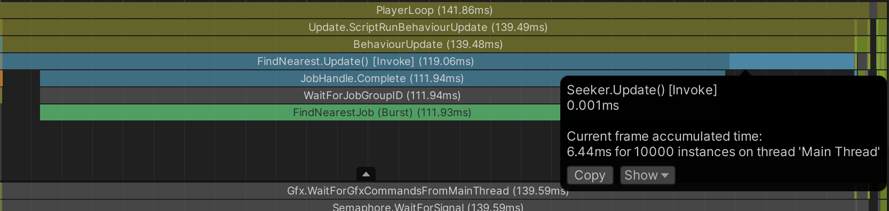
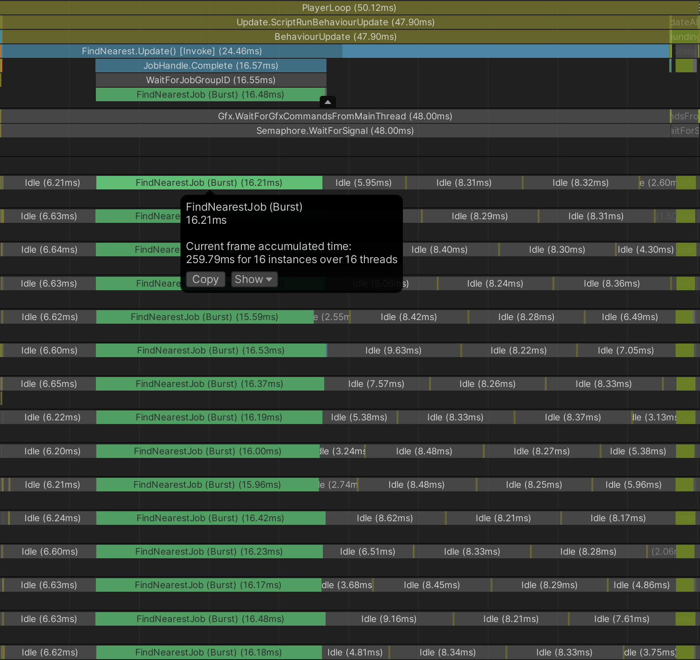
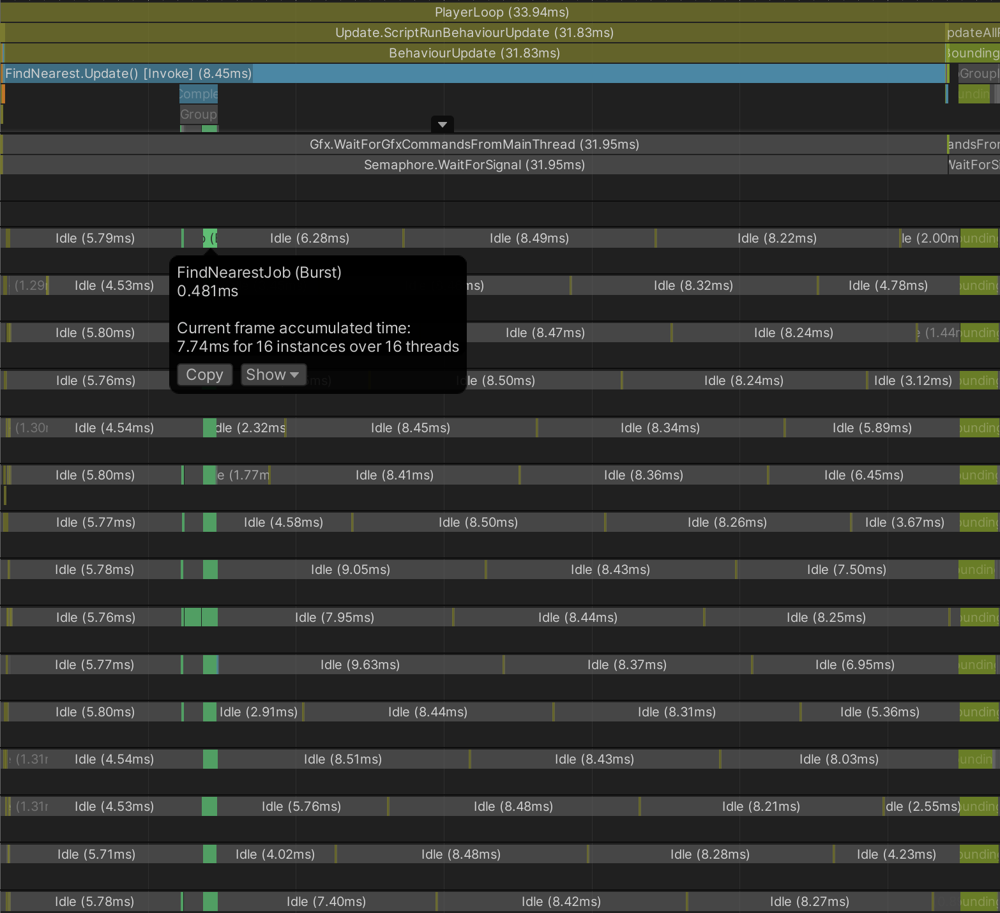
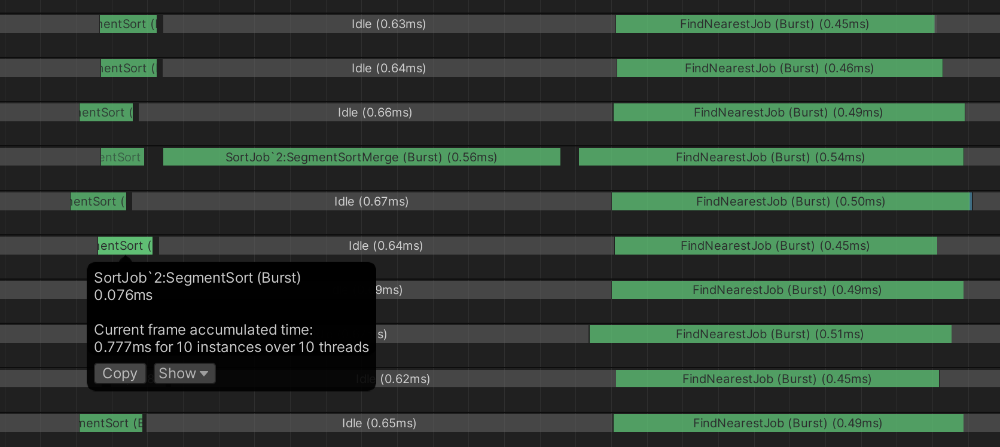

<!---
This file has been generated from jobs_tutorial.src.md
Do not modify manually! Use the following tool:
https://github.com/Unity-Technologies/dots-tutorial-processor
-->
# Jobs tutorial

This tutorial project is found in the `Projects/JobsTutorial` directory.

The tutorial is split into discrete steps that each build upon the last. The scenes, code, and other assets of each step are in their own separate asset directory, *e.g.* `Assets/Step1_Spawning`. Some common elements are stored in `Assets/Common`.

Much of the code in each step carries over from the previous step, but the notable changes are commented. See also the text below for further explanations about each step.

# The problem

Seekers (blue cubes) and Targets (red cubes) each move slowly in a random direction on a 2D plane. A white debug line is drawn from each Seeker to the nearest Target.



<br/>

# Step 1 - Solution without jobs

- A singleton `Spawner` MonoBehaviour instantiates 1000 seekers (blue cubes) and 1000 targets (red cubes) within a 500-by-500 area on the XZ plane.
- The `Seeker` and `Target` MonoBehaviours move each seeker and target slowly along a random vector.
- The `Spawner` stores the transforms of the targets in a static array field.
- The `FindNearest` MonoBehaviour (attached to the seeker prefab) uses the target transforms array to find the nearest target position and draws a white debug line.

## Results
---

The finding algorithm used here is simple brute force: for every seeker, we loop over every target.

Here's a profile of a typical frame with 1000 seekers and 1000 targets:



Each seeker takes ~0.3ms to update, taking over 330ms total.

<br/>

# Step 2 - Solution with a single-threaded job

- The `Spawner` stores the transforms of both the seekers and targets in static array fields.
- The `FindNearest` MonoBehaviour is moved from the seeker prefab to the "Spawner" GameObject.
- `FindNearest` copies the `localPosition` values of the seeker and target transforms into `NativeArray`'s of `float3`'s.
- `FindNearest` schedules and completes the new `FindNearestJob` using these NativeArray's.

## IJob and unmanaged data
---

By putting the hard work into a job, we can move the work from the main thread to a worker thread, and we can Burst-compile the code. Jobs and Burst-compiled code cannot access any managed objects (including GameObjects and GameObject components), so we must first copy all the data to be processed by the job into unmanaged collections, such as `NativeArray`'s.

> NOTE: Strictly speaking, jobs actually *can* access managed objects, but doing so requires special care and is not normally a good idea. Besides, we definitely want to Burst-compile our jobs, and Burst-compiled code strictly *cannot* access managed objects at all.

Though we could still use `Vector3`'s and `Mathf`, we'll instead use `float3` and `math` from the `Unity.Mathematics` package, which has special optimization hooks for Burst.

So here's how our `FindNearestJob` job is defined:


```c#
// from Assets/Step2_SingleThreadedJob/FindNearestJob.cs

public struct FindNearestJob : IJob
{
    // All the data which a job will access
    // must be included in its fields.
    public NativeArray<float3> TargetPositions;
    public NativeArray<float3> SeekerPositions;
    public NativeArray<float3> NearestTargetPositions;

    public void Execute()
    {
        // ... the code which the job will run goes here
    }
}
```

The `Update()` of `FindNearest`:

1. Copies the seeker and target transforms into `NativeArray`'s of `float3`'s.
1. Creates an instance of `FindNearestJob`, initializing its fields with the `NativeArray`'s.
1. Calls the `Schedule()` extension method on the job instance.
1. Calls `Complete()` on the `JobHandle` that was returned by `Schedule()`.
1. Uses the `NearestTargetPositions` array, which is populated by the job, to draw a debug line from each seeker to its nearest target.

Here's the excerpt that instantiates, schedules, and completes the job:

```c#
// from Assets/Step2_SingleThreadedJob/FindNearest.cs

// To schedule a job, we first create an instance and populate its fields.
FindNearestJob findJob = new FindNearestJob
{
    TargetPositions = TargetPositions,
    SeekerPositions = SeekerPositions,
    NearestTargetPositions = NearestTargetPositions,
};

// Schedule() puts the job instance on the job queue.
JobHandle findHandle = findJob.Schedule();

// The Complete() method will not return until the job
// represented by the handle has finished execution.
// In some cases, a job may have finished
// execution before Complete() is called on its handle.
// Either way, the main thread waits in a
// Complete() call until the job is done.
findHandle.Complete();
```

## Results
---

Here's a profile of a typical frame with 1000 seekers and 1000 targets and **without Burst compilation**: 



~30ms is definitely better than the ~330ms we saw before, but next let's **enable Burst compilation**:



At ~1.5ms, we're well within the 16.6ms budget of 60fps.

Since we have so much headroom now,  let's try 10,000 seekers and 10,000 targets:



A 10-fold increase in seekers and targets results in a 70-fold increase in run time, but this is expected given that every seeker is checking its distance to every target.

> NOTE: Notice in these profiles that the jobs run on the main thread. This can happen when we call `Complete()` on a job that hasn't yet been pulled off the job queue: because the main thread would otherwise just be sitting idle while it waits for the job to finish, the main thread may decide to run the job itself.

<br/>

# Step 3 - Solution with a parallel job

- The `FindNearestJob` now implements `IJobParallelFor` instead of `IJob`.
- The `Schedule()` call in `FindNearest` now takes two int parameters: an *index count* and *batch size*.

## IJobParallelFor
---

For a job that processes an array or list, it's often possible to parallelize the work by splitting the indices into sub-ranges. For example, one half of an array could be processed on one thread while concurrently the other half is processed on another thread.

To create such jobs, we have `IJobParallelFor`, whose `Schedule()` method takes two int arguments:

- *index count*: the size of the array or list being processed
- *batch size*: the size of the sub-ranges, *a.k.a.* batches

For example, if a job's index count is 100 and its batch size is 40, then the job is split into three batches: the first covering indexes 0 through 39; the second covering indexes 40 through 79; and the third covering indexes 80 through 99.

When a worker thread pulls a parallel job off the queue, it grabs individual batches. Effectively, each batch may be processed concurrently alongside other batches of the same job.

An `IJobParallelFor`'s `Execute()` method takes an index parameter and is called once for each index, from 0 up to the index count:

```c#
// from Assets/Step3_ParallelJob/FindNearestJob.cs

public struct FindNearestJob : IJobParallelFor
{
    [ReadOnly] public NativeArray<float3> TargetPositions;
    [ReadOnly] public NativeArray<float3> SeekerPositions;
    public NativeArray<float3> NearestTargetPositions;

    // Each Execute call processes only an individual index.
    public void Execute(int index)
    {
        // ...
    }
}
```

```c#
// from Assets/Step3_ParallelJob/FindNearest.cs

// This job processes every seeker, so the
// seeker array length is used as the index count.
// A batch size of 64 is used here simply because
// it's not too big, not too small, and it's a
// power of two.
JobHandle findHandle = findJob.Schedule(SeekerPositions.Length, 64);
```

## Results
---

Profile of a typical frame with 10,000 seekers and 10,000 targets:



With the work split across 16 cores, it takes ~260ms total CPU time but less than 17ms from start to end.

<br/>

# Step 4 - Solution with a parallel job and sorting the targets

- The `FindNearest` MonoBehaviour now schedules an additional job to sort the target positions array based on the X coords.
- Because the target positions array is sorted, `FindNearestJob` no longer has to exhaustively consider every target.

## Using a smarter algorithm
---

We can get big performance gains if we organize the data in some way, such as by sorting the targets into a [quadtree](https://en.wikipedia.org/wiki/Quadtree) or [*k*-d tree](https://en.wikipedia.org/wiki/K-d_tree). To keep things simple, we'll just sort the targets by their X coords (though we could just as well sort by Z coords: the choice is arbitrary). Finding the nearest target to an individual seeker can then be done in these steps:

1. Do a binary search for the target with the X coord that is nearest to the seeker's X coord.
2. From the index of that target, search up and down in the array for a target with a smaller 2-dimensional distance.
3. As we search up and down through the array, we early out once the X-axis distance exceeds the 2-dimensional distance to the current candidate for nearest target.

The key insights here are that:

- We don't need to check any target with an X-axis distance greater than the 2-dimensional distance to the current candidate.
- Assuming the targets are sorted by their X coord, if the X-axis distance of one target is too great, then the X-axis distances of all targets to one side of it in the array must also be too large.

So the search no longer requires considering every individual target for each seeker.

## Sorting with jobs
---

We could write our own job to do the sorting, but instead we'll call the `NativeArray` extension method `SortJob()`, which returns a `SortJob` struct. The `Schedule()` method of `SortJob` schedules *two* jobs: `SegmentSort`, which sorts separate segments of the array in parallel, and `SegmentSortMerge`, which merges the sorted segments. (Merging must be done in a separate single-threaded job because merging simply can't be done in parallel.)

## Job dependencies
---

The `SegmentSortMerge` job should not begin execution until the `SegmentSort` job has itself finished execution, so the `SegmentSort` job is made a *dependency* of the `SegmentSortMerge` job. As a rule, **the worker threads will not execute a job until all of its dependencies have finished execution.** Job dependencies effectively allow us to specify a sequential execution order amongst scheduled jobs.

Our `FindNearestJob` itself needs to wait for the sorting to finish, so it must depend upon the sorting jobs. Here's our code that creates and schedules the jobs:

```c#
// from Assets/Step4_ParallelJob_Sorting/FindNearest.cs

SortJob<float3, AxisXComparer> sortJob = TargetPositions.SortJob(
    new AxisXComparer { });

FindNearestJob findJob = new FindNearestJob
{
    TargetPositions = TargetPositions,
    SeekerPositions = SeekerPositions,
    NearestTargetPositions = NearestTargetPositions,
};

JobHandle sortHandle = sortJob.Schedule();

// To make the find job depend upon the sorting jobs,
// we pass the sort job handle when we schedule the find job.
JobHandle findHandle = findJob.Schedule(
        SeekerPositions.Length, 64, sortHandle);

// Completing a job also completes all of the job's
// dependencies, so completing the find job also
// completes the sort jobs.
findHandle.Complete();
```

The sequence of jobs is thus: `SegmentSort` -> `SegmentSortMerge` -> `FindNearestJob`.

If we neglected to make the sorting job a dependency of the find job, the job safety checks would throw an exception when we attempted to schedule the find job.

*[More about job dependencies and safety checks]().*

## Results
---

For our more sophisticated solution, here's a profile of a typical frame with 10,000 seekers and 10,000 targets:



Now the `FindNearestJob` takes just ~7.5ms total CPU time and ~0.5ms from start to end.

Zooming in, we can see the `SegmentSort` and `SegmentSortMerge` jobs:



The `SegmentSort` takes under a 0.1ms start to end, and the single-threaded `SegmentSortMerge` takes ~0.5ms. Weighed against the enormous improvement in `FindNearestJob`, the extra step of sorting is well worth the additional cost.

Most of the frame time now is eaten up by the inefficiencies of GameObjects, and the most effective way to address that problem would be to replace the GameObjects with [entities](./EntityTutorial/entitiesTutorial.md). 


