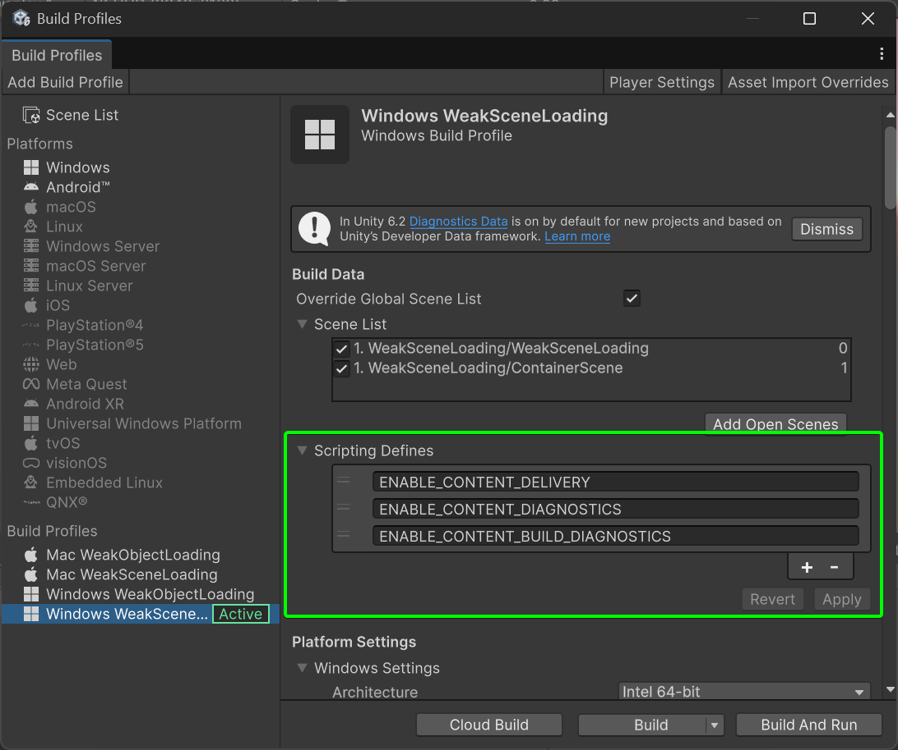
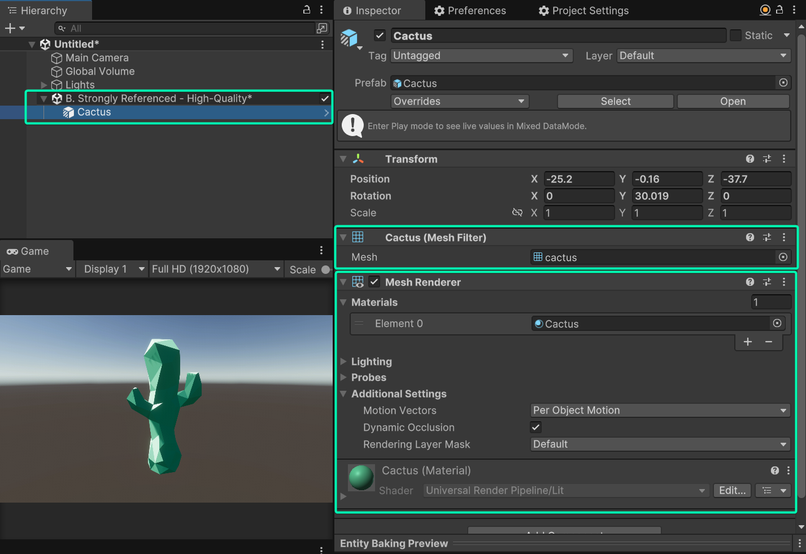
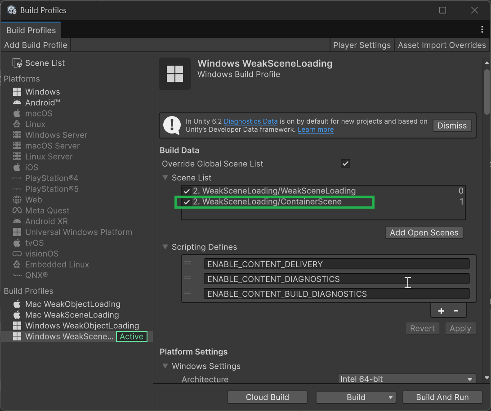
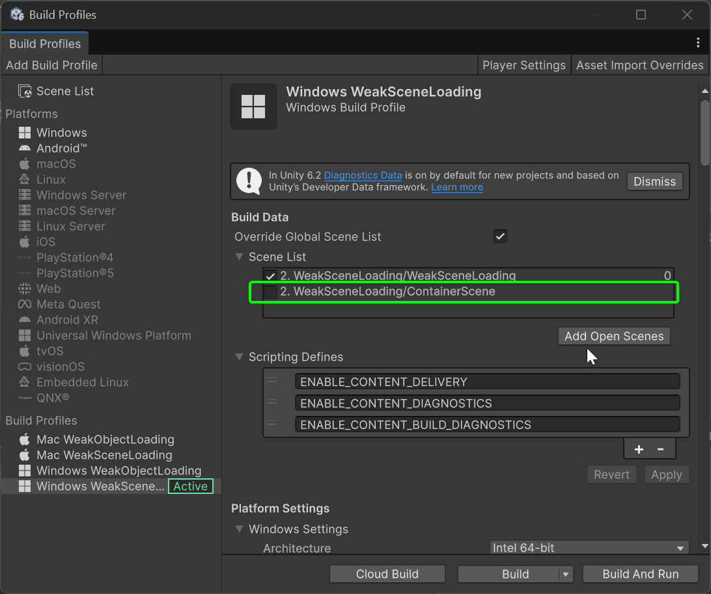
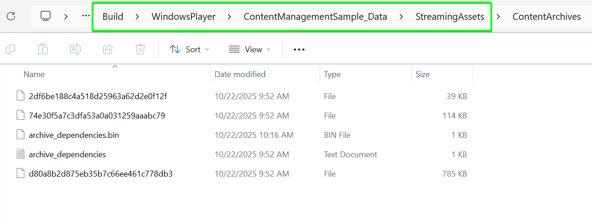
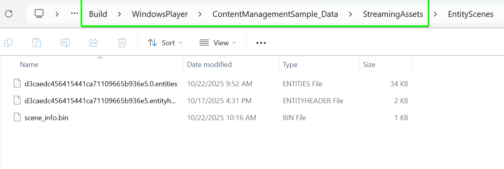
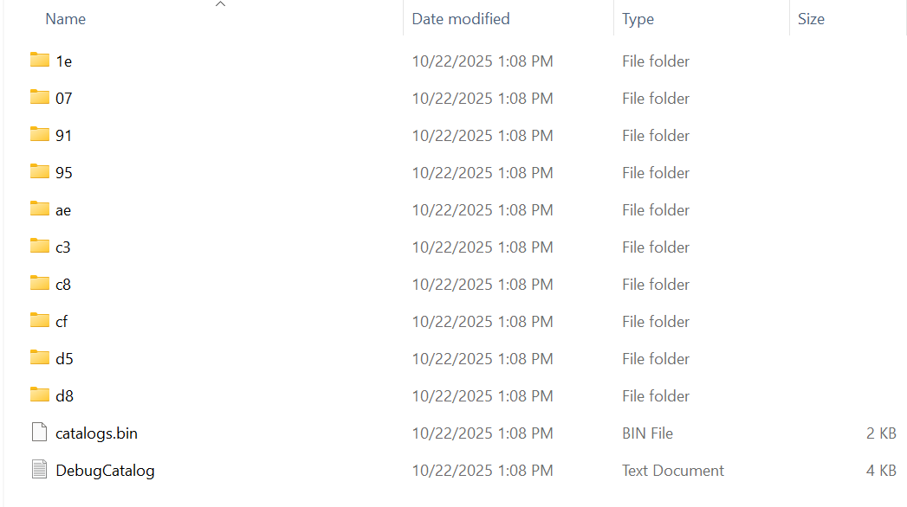

# Content Management

The Entities package's Content Management API allows you to download, load, and unload Unity assets and sub-scenes at runtime.<br>
This sample project demonstrates the basic APIs for Weak References you need for a few use cases:

- Loading alternate meshes and materials through the **local content** workflow.
- Showcases downloading, loading, and unloading scenes at runtime using both **local and remote content pipelines**.

    | Content Type          | Advantages                                                                                           | Disadvantages                                                                                                   |
    |-----------------------|------------------------------------------------------------------------------------------------------|-----------------------------------------------------------------------------------------------------------------|
    | **Local Content**     | - Provides fallback even when remote content is unreachable.<br>- No preload required.               | - Increases overall build size.<br>- Updating even a single reference requires rebuilding the entire player.    |
    | **Remote Content**    | - Reduces build size.<br>- Allows updating content without rebuilding the player.                    | - No fallback files unless previously cached.<br>- Requires an initial download before use.                     |
    |                                                                                                                                                                                                                                                |


For more detailed information, refer to the Entities documentation on [Content management](https://docs.unity3d.com/Packages/com.unity.entities@latest/index.html?subfolder=/manual/content-management.html).

## Getting Started
- See [ProjectVersion.txt](./ProjectSettings/ProjectVersion.txt) for the minimum supported Unity version.<br>
    This project currently targets [Unity 6](https://unity.com/releases/editor/whats-new/6000.2.6#installs).
- Open the 1. WeakObjectLoading/WeakObjectLoading.scene file to begin exploring the project.
- Navigate to **File > Build Profiles**, or press **Ctrl + Shift + B / Cmd + Shift + B**, to **activate** the [Platform] WeakObjectLoading or [Platform] WeakSceneLoading build profile.
---

| Section | Description |
|---------|-------------|
| [Running and Building Sample Scenes](#running-and-building-the-sample-scenes) | Instructions to switch build profiles and run sample scenes in Unity Editor. |
| [Scripting Define Symbols](#scripting-define-symbols-for-content-management) | Steps to enable content delivery and debug symbols via project settings. |
| [Strong vs Weak References](#strong-vs-weak-references) | Explanation of strong references versus weak references and their runtime behavior. |
| [Weakly Referencing an Object](#weakly-referencing-an-object) | Guide for using `WeakObjectReference<T>` and `UntypedWeakReferenceId` to load meshes and materials at runtime. |
| [WeakObjectReference](#weakobjectreference) | Code snippet for checking and loading typed weak references. |
| [UntypedWeakReferenceId](#untypedweakreferenceid) | Code snippet for checking and loading untyped weak references. |
| [Weakly Referencing a Scene](#weakly-referencing-a-scene) | Overview of loading subscenes through weak references with local or remote content options. |
| [Steps to Load Remote Subscenes (Option 1)](#steps-to-load-remote-subscenes-option-1) | Step-by-step for building player with subscene references packed locally. |
| [Behavior in the Unity Editor](#behavior-in-the-unity-editor) | Explanation of low-fidelity and high-fidelity scene toggling in the Editor. |
| [Weak Scene References](#weak-scene-references) | Using `UntypedWeakReferenceId` and `WeakObjectSceneReference` to weakly reference scenes. |
| [Building the Player](#building-the-player) | Instructions to include subscene references in the player build for local content. |
| [Steps to Load Remote Subscenes (Option 2)](#steps-to-load-remote-subscenes-option-2) | Instructions to load content remotely by building separate subscene references. |
| [Build Content Catalog](#build-content-catalog) | How to generate and publish content catalog using `RemoteContentCatalogBuildUtility`. |
| [StreamingAssets Paths](#streamingassets-paths-in-unity) | Platform-specific paths where `StreamingAssets` is stored for Windows, macOS, Android, and iOS. |
| [Serving a Catalog from a Web Server](#serving-a-catalog-from-a-web-server) | Instructions to serve a content catalog from a remote web server for runtime loading. |

## Running and building the sample scenes

Before running or building each sample scene in the editor, you may need to switch the active build profile. For example, before running the WeakObject scene, you should:

1. Open the File > Build Profiles menu
1. Set the active build profile to  "Windows WeakObject" (or "Mac WeakObject" if you're on Mac).

## Scripting define symbols for content management

To enable content delivery in a project, the project must have the scripting define symbol `ENABLE_CONTENT_DELIVERY`. <br>
For more detailed content management debug messages, you can also add the scripting define symbols `ENABLE_CONTENT_DIAGNOSTICS` and `ENABLE_CONTENT_BUILD_DIAGNOSTICS`.<br>
To set or remove define symbols:

1. Go to **Edit > Project Settings > Player**.
1. Select **Player** in the sidebar.
1. Navigate to **Other Settings > Script Compilation**.

Each Profile asset includes a Scripting Define Symbols section, where you can directly set the scripting defines associated with that profile.



For more information on scripting defines, refer to [Custom scripting symbols](https://docs.unity3d.com/Manual/custom-scripting-symbols.html).

## Strong vs weak references

When an asset is directly assigned to a property of a GameObject component, this creates a "strong reference". For example, if you set a mesh filter component to directly reference a mesh asset, the mesh asset is strongly referenced by the mesh filter.<br>
At runtime, Unity automatically loads strongly-referenced objects when they're required and unloads them when they're no longer needed. Effectively, when you access an object *via* a strong reference, you can assume that it is always in memory and ready-to-use.<br>
For example, all the assets in the subscene below are strongly referenced:



In contrast, when you access an object *via* a weak reference, the object may not necessarily loaded and ready for use.<br>
Therefore, you must always check if a weakly-referenced object is actually loaded and ready, and if not, you must trigger the load and then wait for it to be ready before using it.<br>

Although weak references impose more hassle, they allow for more flexiblity. For example, a weak reference can point to assets which have yet to be loaded from disk or perhaps haven't even been downloaded yet to the local system. <br>
The Content Management API allows you to reference assets that are not included in your build by using weak references.<br>

## Weakly referencing an object

The *WeakObjectLoading* scene demonstrates how to load objects through weak references. When you play the scene, a system loads the weakly referenced meshes and materials from local path.<br>
This is done by calling `RuntimeContentSystem.LoadContentCatalog(null, null, null, true)` ([see WeakObjectLoadingSystem.cs](Assets/1.%20WeakObjectLoading/WeakObjectLoadingSystem.cs)), which downloads all asset references from the `StreamingAssets` folder at runtime and creates rendered entities after loading completes.

To weakly reference objects like meshes and materials, we need either:

- `UntypedWeakReferenceId`, which stores a global id of a Unity object
-  `WeakObjectReference<T>`, a wrapper around `UntypedWeakReferenceId` where T is a type of Unity object

In general, `WeakObjectReference<T>` is preferred except in cases where we need a weak reference that can vary the type of referenced object. This sample demonstrates use of both.

In the `WeakObjectLoading.unity` scene, a tree GameObject and house GameObject both have the [WeakRenderedObjectAuthoring](Assets/1.%20WeakObjectLoading/WeakRenderedObjectAuthoring.cs) component. If the authoring component's `UseUntypedId` flag is set, its baker adds:

- `WeakMeshUntyped`, an `IComponentData` storing a `UntypedWeakReferenceId` for a mesh
- `WeakMaterialUntyped`, an `IBufferElementData` storing a `UntypedWeakReferenceId` for a material

If the `UseUntypedId` flag is unset, the baker instead adds:

- `WeakMesh`, an `IComponentData` storing a `WeakObjectReference<Mesh>`
- `WeakMaterial`, an `IBufferElementData` storing a `WeakObjectReference<Material>`

> NOTE: The materials are stored in a dynamic buffer because a single rendered mesh may have multiple materials, as is the case for the tree and house in this example.

The [WeakObjectLoadingSystem](Assets/1.%20WeakObjectLoading/WeakObjectLoadingSystem.cs) system looks for these weak reference components, loads the weakly referenced assets, and then adds the components that make the entity renderable. <br>
In the system's `OnUpdate`, here's the code that processes the typed weak references, please review `WeakObjectReference` and `UntypedWeakReferenceId` regions in the system to validate the different uses.

### WeakObjectReference
```csharp
#region WeakObjectReference
// mesh load status
var meshStatus = mesh.Value.LoadingStatus;
if (meshStatus == ObjectLoadingStatus.None)
{
    Debug.Log("Initiate mesh LOAD");
    mesh.Value.LoadAsync(); // trigger load
}
if (meshStatus != ObjectLoadingStatus.Completed)
{
    loaded = false;
}
#endregion
```

### UntypedWeakReferenceId
```csharp
#region WeakObjectReference
// mesh load status
var meshStatus = RuntimeContentManager.GetObjectLoadingStatus(mesh.Value);
if (meshStatus == ObjectLoadingStatus.None)
{
    RuntimeContentManager.LoadObjectAsync(mesh.Value);  // trigger load
}
if (meshStatus != ObjectLoadingStatus.Completed)
{
    loaded = false;
}
#endregion
```

> **Note** that this uses a local setup, which automatically retrieves assets from the StreamingAssets folder generated during the build process and loads them at runtime. <br>
> For further information please review the [documentation](https://docs.unity3d.com/Packages/com.unity.entities@1.4/manual/content-management-load-an-object.html) for this section.

## Weakly referencing a scene

The *WeakSceneLoading* sample scene demonstrates how to load scenes through weak references. 
Additionally, there are two paths to accomplish this:  

- **Option 1:** Build the project normally and pack all references inside the `StreamingAssets` folder during the project build.
- **Option 2:** Build separate subscene references to download content remotely.  

### Steps to Load Remote Subscenes (Option 1)
1. **Configure Target:**  
   Navigate to  
   ```
   /Assets/2. WeakSceneLoading/Content Settings/WeakSceneList.asset
   ```  
   Add the desired subscenes and set their `Content Source` parameter to **Local**. This will assign the right component to the Entity in the Scene.

2. **Target the local content catalog:**  
   Similar to the WeakObject sample, call  
   ```csharp
   RuntimeContentSystem.LoadContentCatalog(null, null, null, true);
   ```  
   In the project, the script [`Assets/1. WeakObjectLoading/LoadingLocalCatalogSystem.cs`] automatically does this once there is an entity with a `LocalContent` component attached.  

---

### Behavior in the Unity Editor

When you play the sample scene, a low-fidelity version of the environment scene `Assets/2. WeakSceneLoading/Subscenes/LowFidelitySubscene.unity`  is loaded by the `WeakSceneLoadingSystem` once the `LoadingLocalCatalogSystem` has set the catalog source to **local** and created the `ContentReady` entity.<br>  Pressing **Enter** toggles between the low-fidelity version and a high-fidelity version of the scene: `Assets/2. WeakSceneLoading/Subscenes/HighFidelitySubscene.unity`

> **Note:** Both the low- and high-fidelity scenes are baked entity subscenes. However, the solution presented here also works for regular GameObject scenes that are weakly referenced.

---

### Weak Scene References

To weakly reference a scene, you can use either:

- `UntypedWeakReferenceId` — stores a global ID of a Unity object, such as a scene or mesh.  
- `WeakObjectSceneReference` — a wrapper around `UntypedWeakReferenceId` specifically for scenes only.

Generally, `WeakObjectSceneReference` is preferred unless a weak reference of varying object types is needed.  
This sample demonstrates the use of both `UntypedWeakReferenceId` and `WeakObjectSceneReference`.

In [`WeakSceneAuthoring.cs`](Assets/2.%20WeakSceneLoading/WeakSceneAuthoring.cs), the baker adds an `IComponentData` named `HighLowWeakScene`, which stores:

- The high-fidelity scene in an `UntypedWeakReferenceId`
- The low-fidelity scene in a `WeakObjectSceneReference`

When a scene is weakly referenced in a build, the original GameObject scene and its assets are still included in the build. To include the baked entity scenes in the build, we nest them as subscenes in another scene, "ContainerScene", which we include in the scene list of the sample's build profile.

---

### Building the Player

When building the player, make sure to include subscene references.  
In the sample, there is a scene named `ContainerScene` which references both `LowFidelitySubscene` and `HighFidelitySubscene`.  

During the build process, Unity includes these references and packs them into the **StreamingAssets** folder for the player.



### Steps to Load Remote Subscenes (Option 2)

Before loading remote subscenes, perform the following steps:

1. **Set scripting define:**  
   Define the [Scripting Define Symbols for Content Management](#scripting-define-symbols-for-content-management) in the Build Profile.
2. **Configure Target:**  
   Navigate to  
   ```
   /Assets/2. WeakSceneLoading/Content Settings/WeakSceneList.asset
   ```  
   Add the desired subscenes and set their `Content Source` parameter to **Remote**, keeping it selected in the Editor.
3. **Build content catalog:**  
   Open the menu `Assets > Publish > Publish Catalog from a WeakSceneListScriptableObject` and build the content.

4. **Target the remote content catalog:**  
   In the project, the script [`Assets/2. WeakSceneLoading/LoadingRemoteCatalogSystem.cs`] initializes the content according to the parameters.<br>
   Please review it carefully [LoadingRemoteCatalogSystem](Assets/2.%20WeakSceneLoading/LoadingRemoteCatalogSystem.cs) to check how to use it.

---

### Build content catalog
Since the Content Management API depends on subscenes, you can create content and references directly from them.  
Please review the [`ContentBuilder`](Assets/2.%20WeakSceneLoading/Content%20Settings/Editor/ContentBuilder.cs) script to see how the content build process above works.

The content can be generated by filling the following function parameters as needed:

```csharp
// Builds the subscenes and stores them in tempPath 
RemoteContentCatalogBuildUtility.BuildContent(
    subSceneGuids,
    playerGuid,
    EditorUserBuildSettings.activeBuildTarget,
    tempPath
);

// Copies from tempPath to the target folder and renames assets using their content hashes  
RemoteContentCatalogBuildUtility.PublishContent(
    tempPath,
    contentPath,
    f => new string[] { contentSetName }
);
```

---

### Weak Scene References

The [WeakSceneLoadingSystem](Assets/2.%20WeakSceneLoading/WeakSceneLoadingSystem.cs) system will initially load the low-fidelity scene:

```csharp
var weakScene = SystemAPI.GetSingletonRW<WeakSceneRefs>();

var sceneParams = new Unity.Loading.ContentSceneParameters
{
    loadSceneMode = UnityEngine.SceneManagement.LoadSceneMode.Additive,
    autoIntegrate = true,
};

// initial load of the low-fidelity scene
// (we store the loaded Scene object 
// so that we can later unload the scene)
weakScene.ValueRW.Scene = 
    weakScene.ValueRW.LowSceneRef.LoadAsync(sceneParams);
```

When the user hits the enter key, the system unloads the current scene and loads the other scene:

```csharp
// toggle between the two scenes
if (weakScene.ValueRO.IsHighLoaded)
{
    // unload high fidelity
    RuntimeContentManager.UnloadScene(ref weakScene.ValueRW.Scene);
    
    // load low fidelity
    weakScene.ValueRW.Scene = 
        weakScene.ValueRW.LowSceneRef.LoadAsync(sceneParams);
    
    weakScene.ValueRW.IsHighLoaded = false;
}
else
{
    // unload low fidelity
    // (UntypedWeakReferenceId does not have this Unload method, but
    // this method simply calls RuntimeContentManager.UnloadScene, 
    // so you could alternatively call it yourself directly)
    weakScene.ValueRO.LowSceneRef.Unload(ref weakScene.ValueRW.Scene);
    
    // load high fidelity
    weakScene.ValueRW.Scene = RuntimeContentManager.LoadSceneAsync(
        weakScene.ValueRO.HighSceneRef, sceneParams);
    
    weakScene.ValueRW.IsHighLoaded = true;
}
```
---
### Building the Player for Remote

Unlike the [local content build](#steps-to-load-remote-subscenes-option-1), the player does **not** need to include the subscene references that were already packaged during the [catalog build process](#build-content-catalog).  



> **Note:**  
> Building this way results in a smaller player build size.  
> However, there will be no fallback data if the remote path becomes unreachable.  
> To ensure content can always be loaded, whether or not the remote source is accessible, embed the content in `StreamingAssets` using a reference scene, similar to the [Local content approach](#building-the-player).
> Otherwise, if you are prioritzing build size go with the approach explaining in [remote content section](#building-the-player-for-remote).


## Downloading and Loading Scenes at Runtime

After building the player, all dependency data, object references, and scene references are stored in the `StreamingAssets` folder (also referred to as **local content** in the sample). <br>The exact path of this folder varies by platform, but it is always included as part of the player build.<br>
Inside this folder, there is a list of generated folders similar to the following:

<br>
<br>
<br>


---

If the project is configured to use remote content, the generated folders will look similar to the following:

<br>

### StreamingAssets Paths in Unity

This document outlines where Unity places the **`StreamingAssets`** folder for each supported platform after building a player.

- **Windows (Standalone Player)**
  ```
  <BuildFolder>/<GameName>_Data/StreamingAssets/
  ```

- **macOS (Standalone Player)**
  ```
  <AppName>.app/Contents/Resources/Data/StreamingAssets/
  ```

- **Android**  
  Unity packs `StreamingAssets` inside the **`assets`** folder in the APK.
  ```
  assets/
  ```
    Runtime access path (read-only):
    ```
    jar:file://<path_to_apk>!/assets/
    ```
    When using Unity’s API:  
    ```csharp
    Application.streamingAssetsPath
    // Typically resolves to:
    // jar:file:///data/app/com.company.mygame/base.apk!/assets
    ```

- **iOS**  
  ```
  <AppName>.app/Data/Raw/
  ```
    Runtime access path (via API):
    ```csharp
    Application.streamingAssetsPath
    // Typically resolves to:
    // /var/containers/Bundle/Application/<GUID>/MyProject.app/Data/Raw
    ```

---
>Note:Please review the  [Postprocessing build script](Assets/2.%20WeakSceneLoading/Content%20Settings/Editor/BuildPostProcessing.cs)(`Assets\2. WeakSceneLoading\Content Settings\Editor\BuildPostProcessing.cs`). 
>It includes a simple example of how to filter and remove duplicate dependencies based on Catalog and StreamingAsset folders. 

### Serving a catalog from a web server

In real use cases, a catalog is not stored on the same local machine as the player but rather served from a web server. With Python, for example, this can be as simple as running `python3 -m http.server --directory /path/to/your/catalog 8000` on the server. In your Unity project, you then pass the URI of the server instead of a file path to `RuntimeContentSystem.LoadContentCatalog`, *e.g.* `https://example.com:8000`.


