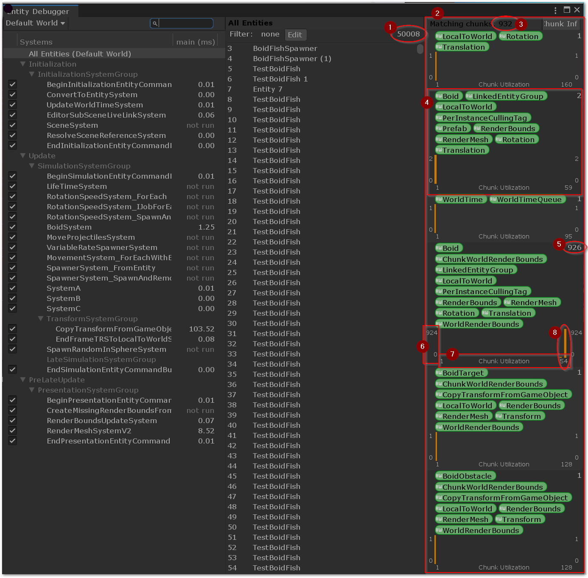

# Entity Debugger

The Entity Debugger allows you to look at currently running systems, filter entities by archetype and analyze how the entities are layed out within these archetypes.

## How to read the *Chunk Utilization* panel
Here's a breakdown of all the information available in the *Chunk utilization* panel.

1. **Number of entities** matched by the query used by the currently selected system. In this case *All Entities* is selected meaning we're visualizing all entities in the current world.
2. All this right panel is used to visualize **all the different archetypes matching the entities matched by the selection** on the left.
3. **Total number of chunks** used by these archetypes to store the data.
4. Detailed view of one archetype. The pills looking labels are the components composing the archetype.
5. **Number of chunks** used by this **archetype**.
6. Chunk utilization graph's Y axis: **number of chunks storing the X amount of entities**
   * The axis legend is also replicated on the right 
7. Chunk utilization graph's X axis: **number of entities stored in each Y chunk**
   * The max value of the X axis also shows the maximum count of entities that can fit in one chunk. In this case 54
8. The actual data points in the graph displayed as a bar chart.
   * In this case we see that this archetype is using 926 chunks total. 
   * The right orange bar shows that we have 924 chunks, each containing 54 entities.
   * The second very small bar (probably) shows that we have 2 chunks, each containing 52 entities.

