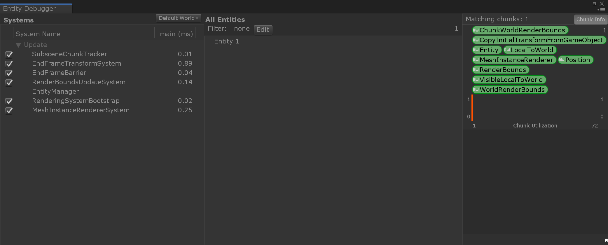

# Unity Data-Oriented Tech Stack 

This documentation covers the three main aspects of Unity's [Data-Oriented Tech Stack](Readme.md) (DOTS): Unity Entity-Component-System (ECS) as covered by the Entities package, Unity C# Job System, and the Unity Burst compiler. As Entities is the primary package involved in DOTS, it is described below:

# About Entities

Use the Unity Entities package to use [Entity-component-systems](https://en.wikipedia.org/wiki/Entity%E2%80%93component%E2%80%93system) (ECS) in your game. 

# Installing Entities

To install this package, follow the instructions in the [Package Manager documentation](https://docs.unity3d.com/Packages/com.unity.package-manager-ui@latest/index.html). 

> **Note**: While this package is in preview, the Package Manager needs to be configured to show **Preview Packages**. (Under the **Advanced** drop-down menu, enable **Show preview packages**.) Then search for the Entities package.

# Using Entities

Components hold data, systems process that data. Entities refer to individual instances of component data. For more information, see the [ECS Manual](https://docs.unity3d.com/Packages/com.unity.entities@0.0/manual/index.html) or the [Entities API](https://docs.unity3d.com/Packages/com.unity.entities@0.0/api/Unity.Entities.html).

## Entity Debugger

You can look at currently running systems and filter entities by archetype in the Entity Debugger window:

# Technical details
## Requirements

This version of Entities is compatible with the following versions of the Unity __Editor__:

* 2019.1.0b5 and later (recommended)

## Samples contents

The following table indicates the sample folders in the package where you can find useful resources:

|Location|Description|
|---|---|
|`Samples/Assets/HelloCube`|Contains a set of basic samples for getting started with the key concepts and API's of entity-component-systems.|
|`Samples/Assets/Advanced`|Contains the boid simulation for understanding more complex simulations|
