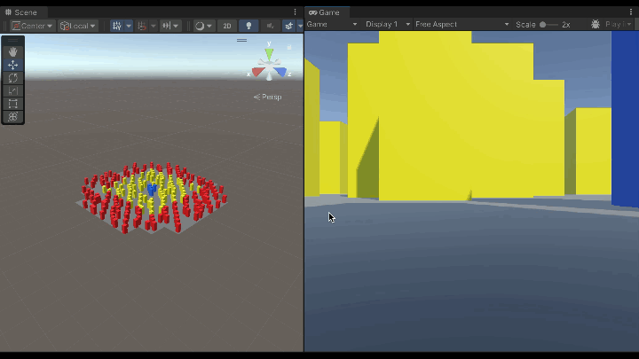
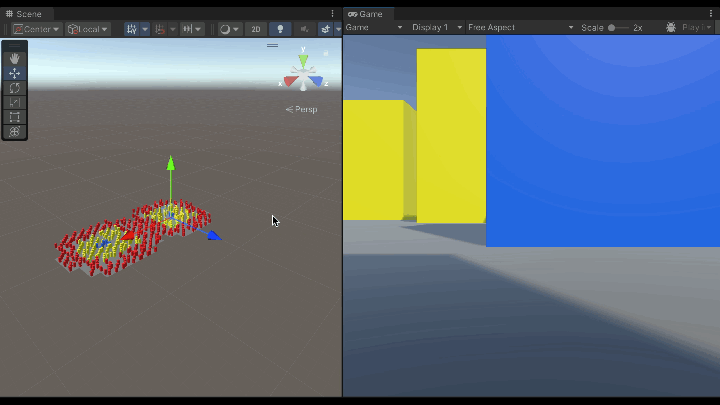

# Entities SceneLoading samples

*NOTE: In these samples, opening and closing the subscene while in playmode may trigger errors. You should enter playmode with the subscenes closed.*

## SceneLoading sample 

This sample shows how to load/unload scenes.

## SceneState

This sample has a UI for loading scenes and their sections.

## SectionLoading sample

This sample shows how to load/unload sections from a scene.

## CrossSectionReferences sample

This sample demonstrates how entities in one section can or cannot reference another.

## SectionMetadata sample

This sample shows how to add metadata to section entities.

## StreamingVolume

This sample uses custom volumes to trigger loading and unloading of subscenes. Move the player capsule with the "WASD" keys. The subscenes are loaded and unload as the player enters and leaves the volumes.

## SubsceneInstancing sample

This sample shows how to instantiate a scene multiple times using a *PostLoadCommandBuffer* and the *ProcessAfterLoad* system.

## Complete sample

This sample streams tiles based on the player position with a basic LOD solution. Move the player with the "WASD" keys. Tiles will load and unload based on their distance to the player, and tiles closer to the player will switch to a higher LOD level: 

- blue boxes = high LOD (section 1)
- yellow boxes = medium LOD (section 2)
- red boxes = low LOD (section 3)
- the ground quad = all LOD levels (section 0).

- The `TileLOD` component of the ground quad defines the distances at which each LOD level is loaded. During baking, the `TileLODBakingSystem` stores this information in the `TileLODRange` component on each section entity. At runtime, the `TileLoadingSystem` loads and unloads the tiles based on these loading and unloading distances.
- The `TileDistanceSystem` finds the distance between each tile and the closest relevant entity. 
- The `TileLODSystem` loads and unloads the sections based on the LOD distances to the closest relevant entity.

Note that we can have more than one `Relevant` entity. Here we see the effect of having two separate `Relevant` entities:

