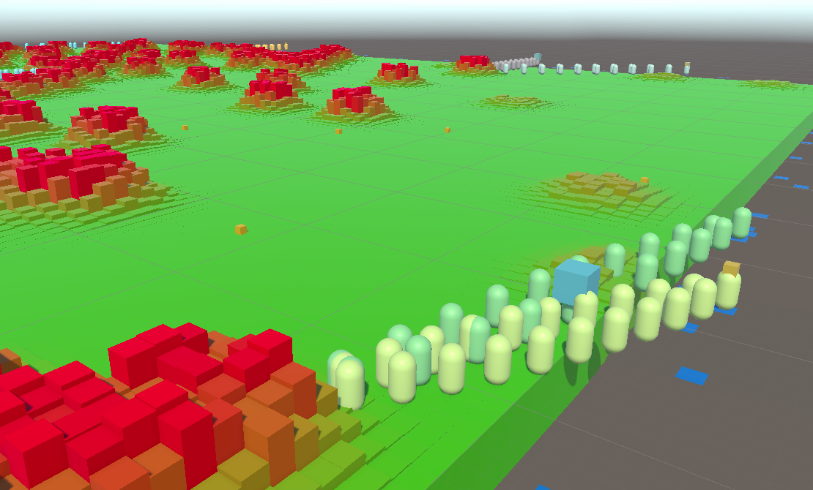

# Entities Tutorial: Firefighters

A fire spreads across a field, and bots form bucket brigade lines to douse the fire.

# Step 1: Spawning

This step sets up the core data and spawns the field, the bots, the ponds of water around the field, and the buckets on the field.

# Step 2: Fire simulation

This step adds code to spread the fire. Three solutions are demonstrated:

- A single-threaded solution running on the main thread.
- A single-threaded solution running in a job.
- A parallel-threaded solution running in a job.

# Step 3: Bot behaviour

This step adds behiour to the bots, who are organized into teams. Each team forms a line between a pond and the closest fire. A bucket is filled at the pond and then passed up the line.