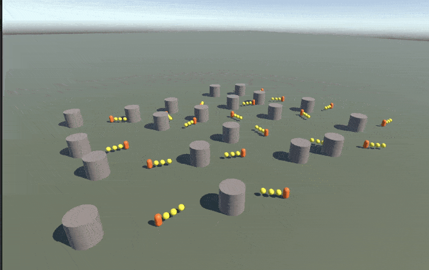
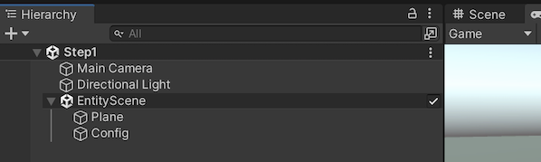
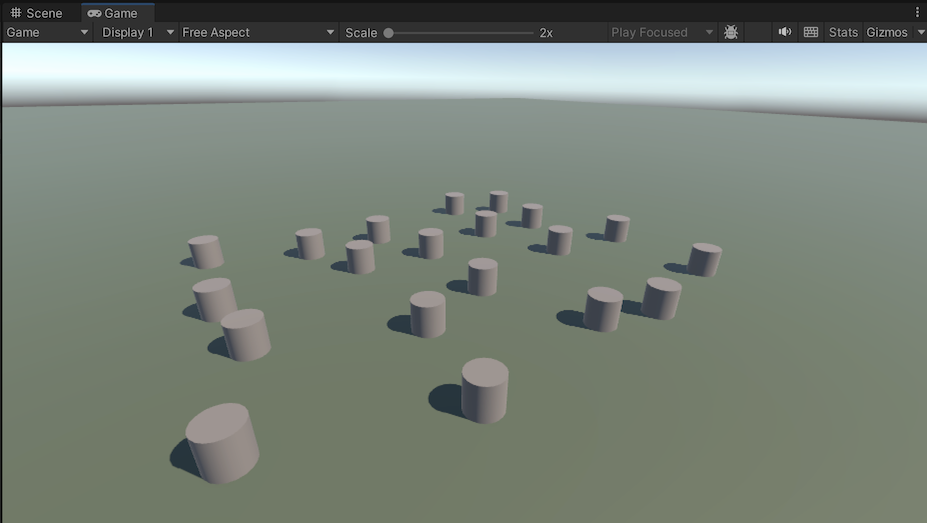
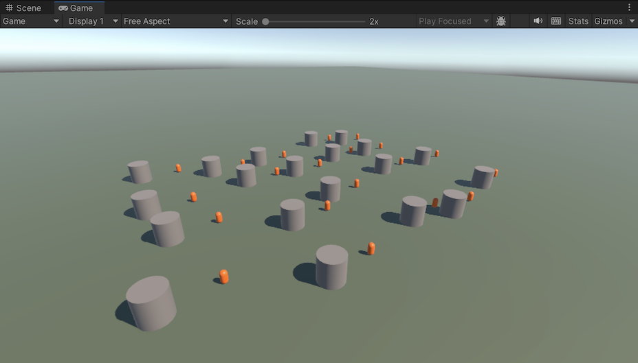
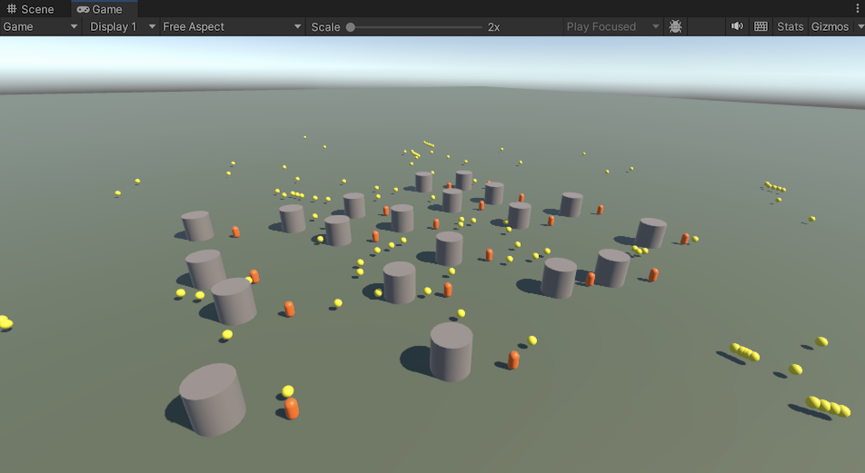

# Entities Tutorial: Kickball

This simple tutorial project demonstrates basic *Unity.Entities* usage.



- Obstacles (grey cylinders) and players (orange capsules) are spawned on a field.
- Directional input moves the players, but players cannot walk through the obstacles.
- Hitting enter spawns a yellow ball at each player capsule's location.
- Hitting space kicks the balls that are near a player.
- The balls bounce off the obstacles and lose momentum over time.

The text below describes the general idea of each step, but you're strongly encouraged to study the code and read the comments.

<br>

## **Step 1:** Obstacle spawning.

- [`ConfigAuthoring.cs `](./Assets/Step%201/ConfigAuthoring.cs)
- [`ObstacleAuthoring.cs `](./Assets/Step%201/ObstacleAuthoring.cs)
- [`ObstacleSpawnerSystem.cs `](./Assets/Step%201/ObstacleSpawnerSystem.cs)

In Step 1, the main scene contains an embedded 'sub scene', meaning a separate scene asset which is referenced by a `SubScene` MonoBehaviour in the main scene. 

- At build time, the GameObjects in a sub scene are [baked](../../Docs/baking.md) into entities, and those entities are serialized into an 'entity scene file'. 
- When the main scene is loaded at runtime, the serialized entities are loaded along with the GameObjects of the main scene.
- **The GameObjects of the sub scene are NOT loaded at runtime!**

In the Step 1 scene, the sub scene contains a rendered plane GameObject for the ground "Plane" and an un-rendered GameObject called "Config" which has the `ConfigAuthoring` MonoBehaviour. Again, be clear that the GameObjects of the sub scene will *not* be loaded at runtime: the plane you see rendered in play mode is an entity, not a GameObject.



In baking, `ConfigAuthoring` adds a `Config` component to the baked entity. This `Config` component stores a grab bag of game parameters, such as how many obstacles and players to spawn, plus the entity prefabs that we'll instantiate at runtime.

At the start of play mode, the `ObstacleSpawnerSystem` creates instances of the obstacle prefab. Because spawning should only happen once, the system disables itself to stop subsequent updates.



<br>

## **Step 2:** Player spawning and movement.

- [`PlayerAuthoring.cs `](./Assets/Step%202/PlayerAuthoring.cs)
- [`PlayerSpawnerSystem.cs `](./Assets/Step%202/PlayerSpawnerSystem.cs)
- [`PlayerMovementSystem.cs `](./Assets/Step%202/PlayerMovementSystem.cs)

After the obstacles are spawned, the `PlayerSpawnerSystem` creates instances of the player prefab, one next to each obstacle.

Each frame, the `PlayerMovementSystem` reads the player's directional input and moves all of the players accordingly. Using a simple radius collision check, players are prevented from penetrating into the obstacles.



<br>

## **Step 3:** Ball spawning, movement, and kicking.

- [`BallAuthoring.cs `](./Assets/Step%203/BallAuthoring.cs)
- [`BallSpawnerSystem.cs `](./Assets/Step%203/BallSpawnerSystem.cs)
- [`BallMovementSystem.cs `](./Assets/Step%203/BallMovementSystem.cs)
- [`BallKickingSystem.cs `](./Assets/Step%203/BallMovementSystem.cs)

When the user hits the enter key, the `BallSpawnerSystem` spawns a ball at the location of each player with an initial velocity. 

Every frame, the `BallMovementSystem` moves each ball based on its current velocity, deflects the velocity if the ball hits an obstacle, and diminishes the velocity over time.

When the user hits the space key, the `BallKickingSystem` applies an impact velocity to all balls within a short distance from a player.



<br>

## **Step 4:** Improving performance by moving the work into parallel jobs.

- [`NewPlayerMovementSystem.cs `](./Assets/Step%204/NewPLayerMovementSystem.cs)
- [`NewBallKickingSystem.cs `](./Assets/Step%204/NewBallKickingSystem.cs)
- [`NewBallMovementSystem.cs `](./Assets/Step%204/NewBallMovementSystem.cs)

These new systems duplicate the functionality of the originals, but they do the heavy lifting in jobs rather than on the main thread.

Note that the BallMovementJob and BallKickingJob both have the same query, so it *might* be more optimal if they were combined into one job, but this is just speculation. In practice, you would simply have to profile carefully to see whether consolidating them is actually faster!

Also note that when we schedule the `IJobEntity` jobs, we write:

```csharp
myJob.ScheduleParallel(); 
```

...but these schedule calls are modified by source-gen to pass and return a job handle:

```csharp
state.Dependency = myJob.ScheduleParallel(state.Dependency);   // result of source-gen
```

This is necessary to correctly handle entity job dependencies, as explained [here](../../Docs/entities-jobs.md#systemstatedependency).

<br>
<hr>

*END OF TUTORIAL*

<br>


