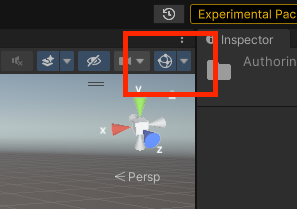

# Entities Tutorial: Tanks

[Video: Entities "Tanks" Tutorial walkthrough](https://youtu.be/jAVVxoWU5lo) (23 minutes)

- Randomly colored tanks move on a plane and spin their turrets.
- The tanks shoot colored projectiles which bounce on the ground and despawn after a while.

The text below describes the general idea of each step, but you're strongly encouraged to study the code and read the comments.

## **Step 1:** Spawn a single, immobile tank.
> Introduces instantiation of rendered entities using a baked "sub scene".

In the Step 1 scene, the subscene contains a rendered cube GameObject called "Tank", which has a child sphere called "Turret", which has its own child cylinder named "Cannon". For each of these three GameObjects, baking serializes one entity with transform and rendering components. So be clear that the GameObjects of the sub scene will *not* be loaded at runtime: the tank you see rendered in play mode is comprised of entities, not GameObjects.

## **Step 2:** Rotate the turret at a fixed rate.

>Introduces unmanaged systems (`ISystem`), queries, and `SystemAPI.Query`.

New code files:

- [`TurretRotationSystem.cs `](./Step%202/TurretRotationSystem.cs)
- [`TurretAuthoring.cs `](./Step%202/TurretAuthoring.cs)

Scene changes:

- The `TurretAuthoring` MonoBehaviour is added to the "Turret" GameObject. In baking, this will add a `Turret` component to the turret entity.

When `TurretRotationSystem` updates, it applies rotation to the transform of every entity which has the `Turret` component (defined in "TurretAuthoring.cs").

## **Step 3:** Move the tank along a random curvy path.

> Introduces scheduling a parallel job.

New code files:

- [`TankMovementSystem.cs `](./Step%203/TankMovementSystem.cs)
- [`TankAuthoring.cs `](./Step%203/TankAuthoring.cs)

Scene changes:

- The `TankAuthoring` MonoBehaviour is added to the "Tank" GameObject. In baking, this will add a `Tank` component to the tank entity.

When `TankMovementSystem` updates, it moves every entity which has the `Tank` component (defined in "TurretAuthoring.cs") along a random curve.

## **Step 4:** Spawn cannon balls at the tip of the turret at a fixed interval.

>Introduces aspects, entity prefabs, `EntityCommandBuffer`, and `IJobEntity`.

New code files:

- [`TurretShootingSystem.cs `](./Step%204/TurretShootingSystem.cs)
- [`TurretAspect.cs `](./Step%204/TurretAspect.cs)
- [`CannonBallAuthoring.cs `](./Step%204/CannonBallAuthoring.cs)

Scene changes:

- The new "CannonBall" prefab consists of a single GameObject: a sphere with the new `CannonBallAuthoring` MonoBehaviour, which in baking adds a `CannonBall` component to the entity.
- The "Cannon" GameObject has a new child "SpawnPoint" GameObject. The "SpawnPoint" transform represents the point at which to spawn the cannon balls.
- The `TurretAuthoring` field "CannonBallPrefab" is set to reference the new "CannonBall" prefab, and "CannonBallSpawn" is set to reference the "SpawnPoint" GameObject. In baking, the `TurretAuthoring` baker will assign the entities produced from this prefab and this GameObject to the fields of the `Turret` component.

The `TurretAspect` provides a (minor) abstraction around the components of the turret entity.

When `TurretShootingSystem` updates, it spawns cannon ball entities at the tip of the cannon at regular intervals.

## **Step 5:** Move the cannon balls.
> Introduces scheduling a parallel job with `IJobEntity`.

New code files:

- [`CannonBallAspect.cs `](./Step%205/CannonBallAspect.cs)
- [`CannonBallSystem.cs `](./Step%205/CannonBallSystem.cs)

The `CannonBallAspect` provides a (minor) abstraction around the components of the cannon ball entities.

When `CannonBallSystem` updates, it applies pseudo-gravity to the cannon balls and destroys them after their speed goes below a threshold.

## **Step 6:** Spawn many tanks with random colors.
> Introduces dynamically spawning entities at the start of the game.

New code files:

- [`ConfigAuthoring.cs `](./Step%206/ConfigAuthoring.cs)
- [`TankSpawningSystem.cs `](./Step%206/TankSpawningSystem.cs)

Scene changes:

- The tank has been made into a prefab.
- The `ConfigAuthoring` references the tank prefab and specifies the number of tanks to spawn.

When `TankSpawningSystem` updates, it spawns multiple tanks, setting their `URPMaterialPropertyBaseColor` components a random color value. Because we want the system to only spawn tanks one time, the system sets its `SystemState.Enabled` property to false, which stops it from updating again.

## **Step 7:** Prevent the tanks from firing when within a "safe zone" circle area around the origin.
>Introduces enableable components (`IEnableableComponent`), live conversion, and storing basic configuration data in a singleton.

New code files:

- [`SafeZoneSystem.cs `](./Step%207/SafeZoneSystem.cs)

Scene changes:

- The `ConfigAuthoring` "safe zone radius" value is set to 10.

When `SafeZoneSystem` updates, it enables the `Shooting` component of tanks outside the safe zone radius and disables the component of all tanks inside the radius.

Note that the white circle is only visible if gizmos are enabled:

Also note that changing the "safe zone radius" value in play mode triggers a re-bake, so the active value in game can be updated live.

## **Step 8:** Move the camera to follow a random tank. Cycle through tanks by hitting space bar.
>Introduces input handling in a system and simple runtime coordination between ECS and GameObjects.

New code files:

- [`CameraSingleton.cs `](./Step%208/CameraSingleton.cs)
- [`CameraSystem.cs `](./Step%208/CameraSystem.cs)

Scene changes:

- The "Main Camera" GameObject (in the main scene, not the sub scene) has the new `CameraSingleton` MonoBehaviour.

When `CameraSystem` updates, it picks a different random tank for the camera to follow if the user hits the space bar.

 

*END OF TUTORIAL*

*Tanks for reading!*
