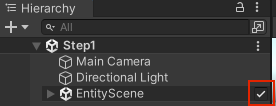
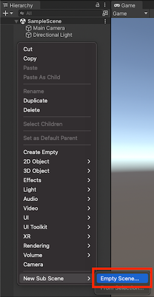

# Baking and entity scenes

&#x1F579;  *[See examples of baking and authoring components](../Assets/ExampleCode/Baking.cs).*

**Baking** is a build-time process that transforms **sub scenes** into **entity scenes** using **bakers** and **baking systems**:

- A **sub scene** is a Unity scene asset that's embedded in another scene by the [SubScene](https://docs.unity3d.com/Packages/com.unity.entities@latest?subfolder=/api/Unity.Entities.SubScene.html) MonoBehaviour.
- An **entity scene** is a serialized set of entities and components that can be loaded at runtime.
- A **baker** is a class extending [`Baker<T>`](https://docs.unity3d.com/Packages/com.unity.entities@latest?subfolder=/api/Unity.Entities.Baker-1.html), where T is a MonoBehaviour. A MonoBehaviour with a Baker is called an **authoring component**.
- A **baking system** is a normal system marked with the `[WorldSystemFilter(WorldSystemFilterFlags.BakingSystem)]` attribute. (Baking systems are fully optional and generally only required for advanced use cases.)

Baking a sub scene is done in a few main steps:

1. For each GameObject of the sub scene, a corresponding entity is created.
2. The baker of each authoring component in the sub scene is executed. Each baker can read the authoring component and add components to the corresponding entity.
2. The baking systems execute. Each system can read and modify the baked entities in any way: set components, add components, remove components, create additional entities, or destroy entities. Unlike bakers, baking systems should not access the original GameObjects of the sub scene.

When modified, a sub scene is re-baked:

1. Only the bakers that read the modified authoring components are re-executed.
1. The baking systems are always re-executed in full.
1. The live entities in Edit mode or Play mode are updated to match the results of baking. (This is possible because baking tracks the correspondence of baked entities to live entities.)

 

## Creating and editing sub scenes

A GameObject with the `SubScene` MonoBehaviour has a checkbox that opens and closes the sub scene for editing. While a sub scene is open, its GameObjects are loaded and take up resources in the Unity editor, so you may want to close sub scenes that you're not currently editing.

The convenient way to create a new sub scene is to right click within the Hierarchy window and select `New Subscene > Empty Scene...`. This creates both a new scene file and a GameObject with a `SubScene` component that references the new scene file:

 

## Accessing data in a baker

Incremental baking requires bakers to track all the data they read. The fields of a baker's authoring component are automatically tracked, but other data read by a baker must be added to its list of dependencies through the `Baker` methods:

|**Baker method**|**Description**|
|---|---|
| [`GetComponent<T>()`]() | Accesses any component of any GameObject in the Sub Scene. |
| [`DependsOn()`]() | Tracks an asset for this `Baker`. |
| [`GetEntity()`]() | Returns the id of an entity baked in the sub scene or baked from a prefab. (The entity will not yet have been fully baked, so you should not attempt to read or modify the components of the entity.) |

 

## Loading and unloading entity scenes

For streaming purposes, the entities of a scene are split into **sections** identified by index number. Which section an entity belongs to is designated by its [`SceneSection`]() shared component. By default, an entity belongs to section 0, but this can be changed by setting `SceneSection` during baking.

| &#x26A0; IMPORTANT |
| :- |
| During baking, entities in a sub scene can only reference other entities of the same section or section 0 (which is a special case because section 0 is always loaded before the other sections and only *un*loaded when the scene itself is unloaded). |

When a scene is loaded, it is represented by an entity with metadata about the scene, and its sections are also each represented by an entity. An individual section is loaded and unloaded by manipulating its entity's [`RequestSceneLoaded`](https://docs.unity3d.com/Packages/com.unity.entities@latest?subfolder=/api/Unity.Entities.ICleanupComponent.html) component: the `SceneSectionStreamingSystem` in the `SceneSystemGroup` responds when this component changes.

The [`SceneSystem`](https://docs.unity3d.com/Packages/com.unity.entities@latest?subfolder=/api/Unity.Entities.SceneSystem.html) contains static methods for loading and unloading entity scenes:

|**`SceneSystem` method**|**Description**|
|---|---|
| [`LoadSceneAsync()`](https://docs.unity3d.com/Packages/com.unity.entities@latest?subfolder=/api/Unity.Entities.ISharedComponent.html) | Initiates loading of a scene. Returns an entity that represents the loaded scene. |
| [`LoadPrefabAsync()`](https://docs.unity3d.com/Packages/com.unity.entities@latest?subfolder=/api/Unity.Entities.ICleanupComponent.html)  | Initiates loading of a prefab. Returns an entity that references the loaded prefab. |
| [`UnloadScene()`](https://docs.unity3d.com/Packages/com.unity.entities@latest?subfolder=/api/Unity.Entities.ICleanupComponent.html)  | Destroys all entities of a loaded scene. |
| [`IsSceneLoaded()`](https://docs.unity3d.com/Packages/com.unity.entities@latest?subfolder=/api/Unity.Entities.IComponentData.html) | Returns true if a scene is loaded. |
| [`IsSectionLoaded()`](https://docs.unity3d.com/Packages/com.unity.entities@latest?subfolder=/api/Unity.Entities.IBufferElementData.html) | Returns true if a section is loaded. |
| [`GetSceneGUID()`](https://docs.unity3d.com/Packages/com.unity.entities@latest?subfolder=/api/Unity.Entities.ICleanupComponent.html)  | Returns the GUID representing a scene asset (specified by its file path). |
| [`GetScenePath()`](https://docs.unity3d.com/Packages/com.unity.entities@latest?subfolder=/api/Unity.Entities.ICleanupComponent.html)  | Returns the path of a scene asset (specified by its GUID). |
| [`GetSceneEntity()`](https://docs.unity3d.com/Packages/com.unity.entities@latest?subfolder=/api/Unity.Entities.ICleanupComponent.html)  | Returns the entity representing a scene (specified by its GUID). |

| &#x26A0; IMPORTANT |
| :- |
| Entity scene and section loading is always asynchronous, and there is no guarantee of how long it will take for the data to be loaded after the request. In most cases, code should check for the presence or absence of specific data loaded from scenes rather than check the loading status of the scenes themselves. This approach avoids tethering code to particular scenes: if the data is moved to a different scene, downloaded from the network, or procedurally generated, the code will still work without modification. |

 

