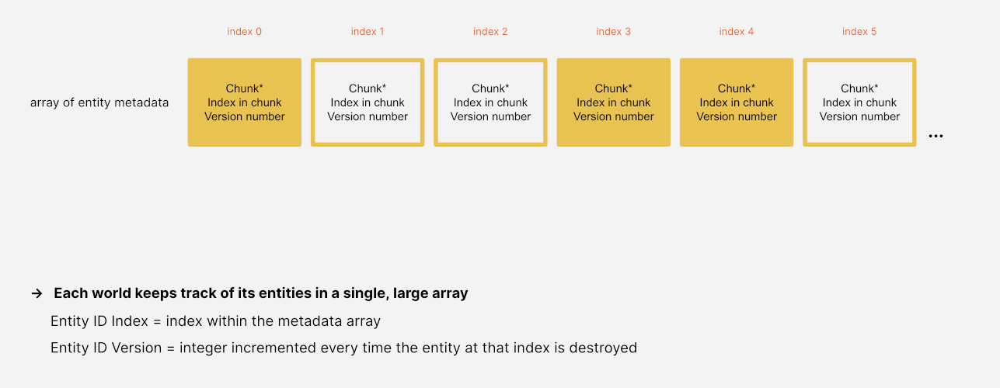

# Entities and components

In this page: 

- [Entities and components](#entities-and-components)
- [Archetypes and chunks](#archetypes)
- [Queries](#queries)
- [`IComponentData` components](#icomponentdata)
- [DynamicBuffer components](#dynamicbuffer-components)
- [Aspects](#aspects)

 

# Entities and components

An **entity** is a lightweight, unmanaged alternative to a GameObject. Entities resemble GameObjects in many ways and can serve a similar role, but they have key differences:

- Unlike a GameObject, an entity is not a managed object but simply a unique identifier number.
- The **components** associated with an entity are usually struct values.
- A single entity can only have one component of any given type. For example, a single entity cannot have two components both of type *Foo*.
- Although entity component types can be given methods, doing so is generally discouraged.
- An entity has no built-in concept of parenting. Instead, the standard [`Parent`](https://docs.unity3d.com/Packages/com.unity.entities@latest?subfolder=/api/Unity.Transforms.Parent.html) component contains a reference to another entity, allowing formation of entity transform hierarchies.

Entity component types are defined by implementing these interfaces:

|**Kind of component**|**Description**|
|---|---|
| [`IComponentData`](https://docs.unity3d.com/Packages/com.unity.entities@latest?subfolder=/api/Unity.Entities.IComponentData.html) | Defines the most common, basic kind of component type.|
| [`IBufferElementData`](https://docs.unity3d.com/Packages/com.unity.entities@latest?subfolder=/api/Unity.Entities.IBufferElementData.html) | Defines a dynamic buffer (growable array) component type.|
| [`ISharedComponent`](https://docs.unity3d.com/Packages/com.unity.entities@latest?subfolder=/api/Unity.Entities.ISharedComponent.html) | Defines a shared component type, whose values can be shared by multiple entities.|
| [`ICleanupComponent`](https://docs.unity3d.com/Packages/com.unity.entities@latest?subfolder=/api/Unity.Entities.ICleanupComponent.html)  | Defines a cleanup component type, which facilitates proper setup and teardown of resources.|

There are also two additional interfaces ([`ICleanupSharedComponent`](https://docs.unity3d.com/Packages/com.unity.entities@latest?subfolder=/api/Unity.Entities.ICleanupSharedComponent.html) and [`ICleanupBufferElementData`](https://docs.unity3d.com/Packages/com.unity.entities@latest?subfolder=/api/Unity.Entities.ICleanupBufferElementData.html)) and [chunk components](additional-entities-features.md#chunk-components) (which are defined with `IComponentData` but added and removed from entities by a different set of methods).

A component type defined with `IComponentData` or `IBufferElementData` can be made **'enableable'** by also implementing [`IEnableableComponent`](additional-entities-features.md#enableable-components).

 

# Worlds and EntityManagers

A [`World`](https://docs.unity3d.com/Packages/com.unity.entities@latest?subfolder=/api/Unity.Entities.World.html) is a collection of entities. An entity's ID number is only unique within its own world, *i.e.* the entity with a particular ID in one world is entirely unrelated to an entity with the same ID in a different world.

A world also owns a set of [systems](concepts-systems.md), which are units of code that run on the main thread, usually once per frame. The entities of a world are normally only accessed by the world's systems and the jobs scheduled by those systems, but this is not an enforced restriction.

The entities in a world are created, destroyed, and modified through the world's [`EntityManager`](https://docs.unity3d.com/Packages/com.unity.entities@latest?subfolder=/api/Unity.Entities.EntityManager.html). Key `EntityManager` methods include:

|**Method**|**Description**|
|---|---|
| [`CreateEntity()`](https://docs.unity3d.com/Packages/com.unity.entities@latest?subfolder=/api/Unity.Entities.EntityManager.CreateEntity.html) | Creates a new entity. |
| [`Instantiate()`](https://docs.unity3d.com/Packages/com.unity.entities@latest?subfolder=/api/Unity.Entities.Instantiate.html) | Creates a new entity with a copy of all the components of an existing entity. |
| [`DestroyEntity()`](https://docs.unity3d.com/Packages/com.unity.entities@latest?subfolder=/api/Unity.Entities.EntityManager.DestroyEntity.html) | Destroys an existing entity. |
| [`AddComponent<T>()`](https://docs.unity3d.com/Packages/com.unity.entities@latest?subfolder=/api/Unity.Entities.EntityManager.AddComponent.html) | Adds a component of type T to an existing entity. |
| [`RemoveComponent<T>()`](https://docs.unity3d.com/Packages/com.unity.entities@latest?subfolder=/api/Unity.Entities.EntityManager.RemoveComponent.html) | Removes a component of type T from an existing entity. |
| [`HasComponent<T>()`](https://docs.unity3d.com/Packages/com.unity.entities@latest?subfolder=/api/Unity.Entities.EntityManager.HasComponent.html) | Returns true if an entity currently has a component of type T. |
| [`GetComponent<T>()`](https://docs.unity3d.com/Packages/com.unity.entities@latest?subfolder=/api/Unity.Entities.EntityManager.GetComponent.html) | Retrieves the value of an entity's component of type T. |
| [`SetComponent<T>()`](https://docs.unity3d.com/Packages/com.unity.entities@latest?subfolder=/api/Unity.Entities.EntityManager.SetComponent.html) | Overwrites the value of an entity's component of type T. |

| &#x1F4DD; NOTE |
| :- |
| `CreateEntity`, `Instantiate`, `DestroyEntity`, `AddComponent`, and `RemoveComponent` are [structural change](https://docs.unity3d.com/Packages/com.unity.entities@1.0/manual/concepts-structural-changes.html) operations. |

 

#  Archetypes

An **archetype** represents a particular combination of component types in a world: all of the entities in a world with a certain set of component types are stored together in the same archetype. For example:

 - All of a world's entities with component types *A*, *B*, and *C*, are stored together in one archetype,
 - ...the entities with just component types *A* and *B* (but not *C*) are stored together in a second archetype,
 - ...and the entities with component types *B* and *D* are stored in a third archetype.

Effectively, adding or removing components of an entity changes which archetype the entity belongs to, necessitating the `EntityManager` to actually move the entity and its components from its old archetype to its new one.

When you add or remove components from an entity, the  `EntityManager` moves the entity to the appropriate archetype. For example, if an entity has component types *X*, *Y*, and *Z* and you remove its *Y* component, the `EntityManager` moves the entity to the archetype that has component types *X* and *Z*. If no such archetype already exists in the world, the `EntityManager` creates it.

| &#x26A0; IMPORTANT |
| :- |
| Moving too many entities between archetypes too frequently can add up to [significant costs](https://docs.unity3d.com/Packages/com.unity.entities@1.0/manual/concepts-structural-changes.html). |

Archetypes are created by the `EntityManager` as you create and modify entities, so you don't have to worry about creating archetypes explicitly. Even if all the entities are removed from an archetype, the archetype is only destroyed when its world is destroyed.

 

# Chunks

The entities of an archetype are stored in 16KiB blocks of memory belonging to the archetype called *chunks*. Each chunk stores up to 128 entities (with the precise quantity depending upon the number and size of the component types in the archetype).

The entity ID's and components of each type are stored in their own separate array within the chunk. For example, in the archetype for entities which have component types *A* and *B*, each chunk will store three arrays: 

- one array for the entity ID's
- ...a second array for the *A* components
- ...and a third array for the *B* components.

The ID and components of the first entity in the chunk are stored at index 0 of these arrays, the second entity at index 1, the third entity at index 2, and so forth.

A chunk's arrays are always kept tightly packed:

- When a new entity is added to the chunk, it is stored in the first free index of the arrays.
- When an entity is removed from the chunk (which happens either because the entity is being destroyed or because it's being moved to another archetype), the last entity in the chunk is moved to fill in the gap.

The creation and destruction of chunks is handled by the `EntityManager`:

- The `EntityManager` creates a new chunk only when an entity is added to an archetype whose already existing chunks are all full.
- The `EntityManager` only destroys a chunk when the chunk's last entity is removed.

Any `EntityManager` operation that adds, removes, or moves entities within a chunk is called a *structural change*. Such changes should generally be made only on the main thread, not in jobs (though an [`EntityCommandBuffer`](https://docs.unity3d.com/Packages/com.unity.entities@latest?subfolder=/api/Unity.Entities.EntityCommandBuffer.html) can be used as a work around).

 

# Queries

An [`EntityQuery`](https://docs.unity3d.com/Packages/com.unity.entities@latest?subfolder=/api/Unity.Entities.EntityQuery.html) efficiently finds all entities having a specified set of component types. For example, if a query looks for all entities having component types *A* and *B*, then the query will gather the chunks of all archetypes which include *A* and *B*, regardless of whatever other component types those archetypes might have. Such a query would match the entities with component types *A* and *B*, but the query would also match, say, the entities with component types  *A*, *B*, and *C*.

| &#x1F4DD; NOTE |
| :- |
| The archetypes matching a query will get cached until the next time a new archetype is added to the world. Because the set of existing archetypes in a world tends to stabilize early in the lifetime of a program, this caching usually helps make the queries much cheaper. |

A query can also specify component types to *exclude* from the matching archetypes. For example, if a query looks for all entities having component types *A* and *B* but *not* having component type *C*, the query would match entities with component types *A* and *B*, but the query would *not* match entities with component types *A*, *B*, and *C*.

 

# Entity ID's

An entity ID is represented by the struct [`Entity`](https://docs.unity3d.com/Packages/com.unity.entities@latest?subfolder=/api/Unity.Entities.Entity.html).

In order to look up entities by ID, the world’s `EntityManager` maintains an array of entity metadata. Each entity ID has an index value denoting a slot in this metadata array, and the slot stores a pointer to the chunk where that entity is stored, as well as the index of the entity within the chunk. When no entity exists for a particular index, the chunk pointer at that index is null. Here, for example, no entities with indexes 1, 2, and 5 currently exist, so the chunk pointers in those slots are all null:

In order to allow entity indexes to be reused after an entity is destroyed, each entity ID also contains a *version number*. When an entity is destroyed, the version number stored at its index is incremented, and so if an ID’s version number doesn’t match the one currently stored, then the ID must refer to an entity that has already been destroyed or perhaps never existed.

 

# `IComponentData`

The most common, basic kind of component type is defined as a struct implementing [`IComponentData`](https://docs.unity3d.com/Packages/com.unity.entities@latest?subfolder=/api/Unity.Entities.IComponentData.html).

An `IComponentData` struct is expected to be unmanaged, so it cannot contain any managed field types. Specifically, the allowed field types are:

* [Blittable types](https://docs.microsoft.com/en-us/dotnet/framework/interop/blittable-and-non-blittable-types)
* `bool`
* `char`
* `BlobAssetReference<T>`, a reference to a Blob data structure
* `Collections.FixedString`, a fixed-sized character buffer
* `Collections.FixedList`
* [Fixed array](https://docs.microsoft.com/en-us/dotnet/csharp/language-reference/keywords/fixed-statement) (only allowed in an [unsafe](https://docs.microsoft.com/en-us/dotnet/csharp/language-reference/keywords/unsafe) context)
* Struct types that conform to these same restrictions.

An `IComponentData` struct with no fields is called a ***tag component***. Although tag components store no data, they can still be added and removed from entities like any other component type, which is useful for queries. For example, if all of our entities representing monsters have a *Monster* tag component, a query for the *Monster* component type will match all the monster entities.

 

## Managed `IComponentData` components

A class implementing `IComponentData` is a *managed* component type. Unlike the unmanaged `IComponentData` structs, these managed components can store any managed objects.

In general, managed component types should be used only when really needed because, compared to *unmanaged* components, they incur some heavy costs:

- Like all managed objects, managed components *cannot* be used in [Burst](https://docs.unity3d.com/Packages/com.unity.burst@latest)-compiled code.
- Managed objects cannot normally be used safely in [jobs](https://docs.unity3d.com/Manual/JobSystem.html).
- Managed components are not stored directly in the chunks: instead, all managed components of a world are all stored in one big array while the chunks merely store indexes of this array.
- Like all managed objects, creating managed components incurs garbage collection overhead.

If a managed component type implements `ICloneable`, then any resources it contains can be properly copied when an instance is itself copied. Likewise, if a managed component type implements `IDisposable`, then it can properly dispose any resources it may contain when an instance is removed from an entity or the entity is destroyed.

 

# DynamicBuffer components

A [`DynamicBuffer`](https://docs.unity3d.com/Packages/com.unity.entities@latest?subfolder=/api/Unity.Entities.DynamicBuffer-1.html) is a component type which is a resizable array. To define a `DynamicBuffer` component type, create a struct that implements the [`IBufferElementData`](https://docs.unity3d.com/Packages/com.unity.entities@latest?subfolder=/api/Unity.Entities.IBufferElementData.html) interface.

The buffer of each entity stores a `Length`, a `Capacity`, and a pointer:

* The `Length` is the number of elements in the buffer. It starts at `0` and increments when you append a value to the buffer.
* The `Capacity` is the amount of storage in the buffer. It starts out matching the internal buffer capacity (which [defaults](https://docs.unity3d.com/Packages/com.unity.entities@latest?subfolder=/api/Unity.Entities.TypeManager.DefaultBufferCapacityNumerator.html) to `128 / sizeof(Waypoint)` but can be specified by the [`InternalBufferCapacity`](https://docs.unity3d.com/Packages/com.unity.entities@latest?subfolder=/api/Unity.Entities.InternalBufferCapacityAttribute.html) attribute on the `IBufferElementData` struct). Setting `Capacity` resizes the buffer.
* The pointer indicates the location of the buffer's contents. Initially it is `null`, signifying that the contents are stored directly in the chunk. If the capacity is set to exceed the internal buffer capacity, a new larger array is allocated outside of the chunk, the contents are copied to this external array, and the pointer is set to point to this new array. If the length of the buffer ever exceeds the capacity of the external array, then the contents of the buffer are copied to another new, larger array outside the chunk, and the old array is disposed. The buffer can also be shrunk.

The internal buffer capacity and the external capacity (if present) are deallocated when the `EntityManager` destroys the chunk itself. 

| &#x1F4DD; NOTE |
| :- |
|When a dynamic buffer is stored outside the chunk, the internal capacity is effectively wasted, and accessing the buffer contents requires following an extra pointer. These costs can be avoided if you ensure the internal capacity is never exceeded. Of course, in many cases, staying within this limit may require an excessively large internal capacity. Another option is to set the internal capacity to 0, which means that any non-empty buffer will always be stored outside the chunk. This incurs the cost of always following a pointer when accessing the buffer, but it avoids wasting unused space in the chunk.|

The `EntityManager` has these key methods for using dynamic buffers:

|**Method**|**Description**|
|----|---|
| [`AddComponent<T>()`](https://docs.unity3d.com/Packages/com.unity.entities@latest?subfolder=/api/Unity.Entities.AddComponent.html) | Adds a component of type T to an entity, where T can be a dynamic buffer component type. |
| [`AddBuffer<T>()`](https://docs.unity3d.com/Packages/com.unity.entities@latest?subfolder=/api/Unity.Entities.AddBuffer.html) | Adds a dynamic buffer component of type T to an entity; returns the new buffer as a `DynamicBuffer<T>`. |
| [`RemoveComponent<T>()`](https://docs.unity3d.com/Packages/com.unity.entities@latest?subfolder=/api/Unity.Entities.RemoveComponent.html) | Removes the component of type T from an entity, where T can be a dynamic buffer component type. |
| [`HasBuffer<T>()`](https://docs.unity3d.com/Packages/com.unity.entities@latest?subfolder=/api/Unity.Entities.HasBuffer.html) | Returns true if an entity currently has a dynamic buffer component of type T. |
| [`GetBuffer<T>()`](https://docs.unity3d.com/Packages/com.unity.entities@latest?subfolder=/api/Unity.Entities.GetBuffer.html) | Returns an entity's dynamic buffer component of type T as a `DynamicBuffer<T>`. |

A `DynamicBuffer<T>` represents the dynamic buffer component of type T of an individual entity. Its key properties and methods include:

|**Property or Method**|**Description**|
|----|---|
| [`Length`](https://docs.unity3d.com/Packages/com.unity.entities@latest?subfolder=/api/Unity.Entities.DynamicBuffer-1.Length.html) | Gets or sets the length of the buffer. |
| [`Capacity`](https://docs.unity3d.com/Packages/com.unity.entities@latest?subfolder=/api/Unity.Entities.DynamicBuffer-1.Capacity.html) | Gets or sets the capacity of the buffer. |
| [`Item[Int32]`](https://docs.unity3d.com/Packages/com.unity.entities@latest?subfolder=/api/Unity.Entities.DynamicBuffer-1.Item.html) | Gets or sets the element at a specified index. |
| [`Add()`](https://docs.unity3d.com/Packages/com.unity.entities@latest?subfolder=/api/Unity.Entities.DynamicBuffer-1.Add.html) | Adds an element to the end of the buffer, resizing it if necessary. |
| [`Insert()`](https://docs.unity3d.com/Packages/com.unity.entities@latest?subfolder=/api/Unity.Entities.DynamicBuffer-1.Insert.html) | Inserts an element at a specified index, resizing if necessary. |
| [`RemoveAt()`](https://docs.unity3d.com/Packages/com.unity.entities@latest?subfolder=/api/Unity.Entities.DynamicBuffer-1.RemoveAt.html) | Removes the element at a specified index. |

To enforce job safety, a `DynamicBuffer<T>` value holds a safety handle. The contents of a `DynamicBuffer` cannot be accessed while any scheduled jobs that access the same buffer component type remain uncompleted. If, however, the uncompleted jobs all just have read-only access of the buffer component type, then the main thread is allowed to read the buffer.

Any structural change operation will invalidate the `DynamicBuffer` safety handles, meaning all of the methods will subsequently throw an exception if called. To use a buffer again after a structural change, it must be re-retrieved.

A `DynamicBuffer<T>` can be '[reinterpreted](https://docs.unity3d.com/Packages/com.unity.collections@2.1/manual/allocation.html#array-reinterpretation)'. The target reinterpretation element type must have the same size as T.

 

# Aspects

An aspect is an object-like wrapper over a subset of an entity's components. Aspects can be useful for simplifying queries and component-related code. The [`TransformAspect`](https://docs.unity3d.com/Packages/com.unity.entities@latest?subfolder=/api/Unity.Transforms.TransformAspect.html), for example, groups together the standard transform components ([`LocalTransform`](https://docs.unity3d.com/Packages/com.unity.entities@latest?subfolder=/api/Unity.Transforms.LocalTransform.html), [`ParentTransform`](https://docs.unity3d.com/Packages/com.unity.entities@latest?subfolder=/api/Unity.Transforms.ParentTransform.html), and [`WorldTransform`](https://docs.unity3d.com/Packages/com.unity.entities@latest?subfolder=/api/Unity.Transforms.WorldTransform.html)).

Including an aspect in a query is the same as including the components wrapped by the aspect, *e.g.* a query that includes `TransformAspect` includes the standard transform matrix components.

An aspect is defined as a readonly partial struct implementing [`IAspect`](https://docs.unity3d.com/Packages/com.unity.entities@latest?subfolder=/api/Unity.Entities.IAspect.html). The struct can contain fields of these types:

|**Field type**|**Description**|
|----|---|
| `Entity` | The wrapped entity's entity ID. |
|[`RefRW<T>`](https://docs.unity3d.com/Packages/com.unity.entities@latest?subfolder=/api/Unity.Entities.RefRW-1.html) or [`RefRO<T>`](https://docs.unity3d.com/Packages/com.unity.entities@latest?subfolder=/api/Unity.Entities.RefRO-1.html)|A reference to the wrapped entity's T component.|
|[`EnabledRefRW<T>`](https://docs.unity3d.com/Packages/com.unity.entities@latest?subfolder=/api/Unity.Entities.EnabledRefRW-1.html) and [`EnabledRefRO<T>`](https://docs.unity3d.com/Packages/com.unity.entities@latest?subfolder=/api/Unity.Entities.EnabledRefRO-1.html)| A reference to the enabled state of the wrapped entity's T component.|
|`DynamicBuffer<T>`|The wrapped entity's dynamic buffer T component.|
|Another aspect type| The containing aspect will encompass all the fields of the 'embedded' aspect. |

These `EntityManager` methods create instances of an aspect:

|**Method**|**Description**|
|----|---|
| [`GetAspect<T>`](https://docs.unity3d.com/Packages/com.unity.entities@latest?subfolder=/api/Unity.Entities.EntityManager.GetAspect.html) | Returns an aspect of type T wrapping an entity. |
| [`GetAspectRO<T>`](https://docs.unity3d.com/Packages/com.unity.entities@latest?subfolder=/api/Unity.Entities.EntityManager.GetAspectRO.html) | Returns a readonly aspect of type T wrapping an entity. A read-only aspect throws an exception if you use any method or property that attempts to modify the underlying components. |

Aspect instances can also be retrieved by [`SystemAPI.GetAspectRW<T>`](https://docs.unity3d.com/Packages/com.unity.entities@latest?subfolder=/api/Unity.Entities.SystemAPI.GetAspectRW.html) or [`SystemAPI.GetAspectRO<T>`](https://docs.unity3d.com/Packages/com.unity.entities@latest?subfolder=/api/Unity.Entities.SystemAPI.GetAspectRO.html) and accessed in an [`IJobEntity`](https://docs.unity3d.com/Packages/com.unity.entities@latest?subfolder=/api/Unity.Entities.IJobEntity.html) or a [`SystemAPI.Query`](https://docs.unity3d.com/Packages/com.unity.entities@latest?subfolder=/api/Unity.Entities.SystemAPI.Query.html) loop.

| &#x26A0; IMPORTANT |
| :- |
| You should generally get aspect instances *via* `SystemAPI` rather than the `EntityManager`: unlike the `EntityManager` methods, the `SystemAPI` methods register the underlying component types of the aspect with the system, which is [necessary for the systems to properly schedule jobs with every dependency they need](./entities-jobs.md#systemstatedependency). |

 

