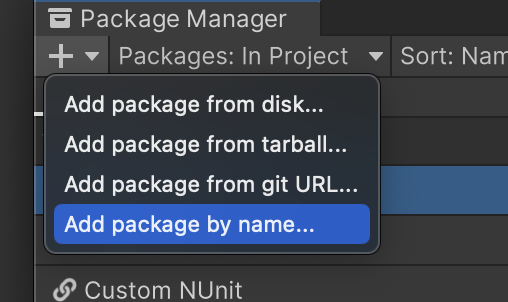

# New Entities project setup

With Unity 2022.2, create a new project from either an HDRP or URP template, then add the DOTS packages that you need by name from the package manager:

- `com.unity.entities`
- `com.unity.entities.graphics` (for rendering entities)
- `com.unity.collections` (unmanaged collection types)
- `com.unity.physics` (for collision detection and physical simulation of entities)
- `com.havok.physics` (alternative Havok-provided "backend" for physics)
- `com.unity.netcode` (for entities-driven server-client multiplayer)

These packages will include `com.unity.burst` and `com.unity.mathematics` as dependencies.

When working in an Entities project, you normally want these two settings:

- In the "Entities" section of the Unity preferences, set the "Scene View Mode" to "Runtime Data".
- In the "Editor" section of the project settings, enable "Enter Play Mode Options" but leave "Reload Domain" and "Reload Scene" disabled. (See [Unity Manual - Configurable Enter Play Mode](https://docs.unity3d.com/Manual/ConfigurableEnterPlayMode.html) and [Unity Blog - Enter Play Mode faster in Unity 2019.3](https://blog.unity.com/technology/enter-play-mode-faster-in-unity-2019-3).)