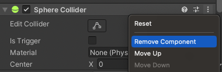

<!---
This file has been generated from README.src.md
Do not modify manually! Use the following tool:
https://github.com/Unity-Technologies/dots-tutorial-processor
-->
# The Entities tutorial

This simple tutorial project teaches essential `Entities` package usage and related DOTS concepts.

*Only the very basics of the `Entities.Graphics` package are used. The `Netcode` and `Physics` packages are not used at all.*

The completed running project looks like this:


- Randomly colored tanks move on a plane and spin their turrets.
- The tanks shoot colored projectiles which bounce on the ground and despawn after a while.

**The [walkthrough](#walkthrough) below explains how to create the full tutorial project from scratch, step-by-step.**

**A pre-completed version of the tutorial project is found in the `EntitiesSamples/EntitiesTutorial` directory.** Use the `TutorialSelector` window (opened from the `Tutorial` menu in the menubar) to jump between the completed steps.

| &#x26A0; WARNING |
| :- |
| Some features are initially used in a non-optimal or incorrect way before being corrected in subsequent steps, so be sure to absorb the full context before imitating the presented code.  |

*Please report any bugs and points of confusion you encounter in the [DOTS Forum](https://forum.unity.com/forums/data-oriented-technology-stack.147/).*

<br>

# Steps

**Step 1: Spawn a single, immobile tank (a cube, a sphere, and a cylinder).** 

Introduces instantiation of rendered entities using a baked "subscene".


<br>

**Step 2: Rotate the turret at a fixed rate.** 

Introduces unmanaged systems (`ISystem`), queries, and `SystemAPI.Query`.


<br>

**Step 3: Move the tank along a random curvy path.** 

Introduces `SystemBase` and scheduling a parallel job with `Entities.ForEach`.


<br>

**Step 4: Spawn cannon balls at the tip of the turret at a fixed interval.**

Introduces use of entity prefabs, referencing entities from other entities, and scheduling a single-threaded job with `IJobEntity`.


<br>

**Step 5: Move the cannon balls.**

Introduces aspects and scheduling a parallel job with `IJobEntity`.


<br>

**Step 6: Spawn many tanks.**

Introduces a pattern for "initialization" systems (systems that should only run once).


<br>

**Step 7: Randomly color the tanks and cannon balls.**

Introduces baking systems.


<br>

**Step 8: Prevent the tanks from firing when within a circle area around the origin.**

Introduces enableable components (`IEnableableComponent`), live conversion, and storing basic configuration data in a singleton.


<br>

**Step 9: Move the camera to follow a random tank. Change which tank is followed when the player hits space bar.**

Introduces input handling in a system and simple runtime coordination between ECS and GameObjects.


<br>

# Walkthrough

## Required Unity Version

This tutorial uses Unity version **2022.2.0f1**. Install this version from the hub or download from these links:

- [Windows Unity Editor 64-bit](https://beta.unity3d.com/download/9eb452e2ea43/Windows64EditorInstaller/UnitySetup64.exe)
- [Mac Unity Editor (Intel)](https://beta.unity3d.com/download/9eb452e2ea43/MacEditorInstaller/Unity.pkg)
- [Mac Unity Editor (Apple Silicon)](https://beta.unity3d.com/download/9eb452e2ea43/MacEditorInstallerArm64/Unity.pkg)
- [Linux Unity Editor](https://beta.unity3d.com/download/9eb452e2ea43/LinuxEditorInstaller/Unity.tar.xz)

## Using directives and provided code
> A remark about code inlined in this tutorial.

Every code snippet in this document is automatically extracted from a reference project, and the using directives from the whole file that includes the snippet are copied. As a consequence, note that you will encounter using directives which are not yet necessary at the point where they are introduced.

Also, pay close attention to the way we explicitly reference `UnityEngine` types. This is a convention used in this tutorial to clearly delineate the ECS-related types from the classic Unity types (GameObject, MonoBehaviour, and the like).

## Project setup
> Create a new project, install the packages we need, and tune the settings.


1. Create a new project in the Unity Hub, using the 3D (URP) template. You will eventually have to download the template if you haven't used it before. Make sure you are using the right Editor version.
1. Once the project is loaded, click the button "Remove Readme Assets" in the "URP Empty Template" inspector. This will get rid of the folder "Assets/TutorialInfo" which we don't need for this tutorial. This inspector should be selected by default, but if it isn't just select `Assets/Readme.asset` in the Project window.
1. Only one package needs to be explicitly installed for this tutorial. The other packages will be pulled into the project as dependencies. Go to `Window > Package Manager`, click the `+` button on the top left and select "Add package by name". Set the "Name" field to "com.unity.entities.graphics" and leave the "Version" field blank then click the "Add" button and wait for the package and its dependencies to install.

    
1. In `Edit > Project Settings > Editor`, enable "Enter Play Mode Options" but leave the reload sub-options unchecked. For more information about what these options do, please follow these links:
    * [Unity Manual - Configurable Enter Play Mode](https://docs.unity3d.com/Manual/ConfigurableEnterPlayMode.html)
    * [Unity Blog - Enter Play Mode faster in Unity 2019.3](https://blog.unity.com/technology/enter-play-mode-faster-in-unity-2019-3)

    Pay close attention to the implication of those settings on the use of static fields (cf. blog post).<p>
    

1. In the Project window, create the missing folders from the following list in the Assets folder:
    * Prefabs
    * Scenes (already created)
    * Scripts/Aspects
    * Scripts/Authoring
    * Scripts/Components
    * Scripts/MonoBehaviours
    * Scripts/Systems
    * Settings (already created)

    

## Conversion settings
> Setup the baking pipeline properly.

The rest of this tutorial assumes that the "Scene View Mode" (in `Preferences/Entities`) is set to "Runtime Data":


## Types accessibility

This tutorial takes the convention to make all classes and structs internal. Internal types or members are accessible only within files in the same assembly, and this is the default accessibility level in C#.

When working on larger projects which are split over multiple assemblies, explicit accessibility modifiers will be required. Discussing this is out of scope for this tutorial, and isn't specific to DOTS in any way.

## Step 1 - Authoring Scene
> Create the scene from which ECS data will be constructed.

1. Make sure the SampleScene from the Scenes folder is currently open. (The following steps will only work on a scene which is saved as a file.)

1. Within the Hierarchy window, right click and select `New Subscene > Empty Scene...`. Name the new scene "EntityScene", and put it in `Scenes/SampleScene`.<p>


1. Right click "EntityScene" in the Hierarchy window, select `GameObject > 3D Object > Cube` and name the new GameObject "Tank". Set its Position to (0,0,0), Rotation to (0,0,0) and Scale to (1,1,1).

1. Right click "Tank" in the Hierarchy window, select `3D Object > Sphere` and name the new GameObject "Turret". Set its **Position to (0,0.5,0)**, **Rotation to (45,0,0)** and Scale to (1,1,1).

1. Right click "Turret" in the Hierarchy window, select `3D Object > Cylinder` and name the new GameObject "Cannon". Set its **Position to (0,0.5,0)**, Rotation to (0,0,0) and **Scale to (0.2,0.5,0.2)**.

1. Right click "Cannon" in the Hierarchy window, select `Create Empty` and name the new GameObject "SpawnPoint". Set its **Position to (0,1,0)**, **Rotation to (-90,0,0)** and Scale to (1,1,1).

1. You should now have something similar to the following screenshot.<p>


1. One last thing about that little tank is that each primitive contains by default a collider. We are not going to use those colliders, and they are discarded during baking anyway (conversion to entities) because we don't have a DOTS compatible physics engine in the project. But in the spirit of Data-Oriented Design, let's get rid of useless data: remove the Box Collider component from "Tank", remove the Sphere Collider component from "Turret", and remove the Capsule Collider from "Cannon". There is no collider on "SpawnPoint", so nothing to do there.<p>


## Step 2 - Turret Rotation
> Introducing the concepts of unmanaged systems (`ISystem`), queries, idiomatic `foreach`.

1. Create a new file named "TurretRotationSystem.cs" in the folder "Scripts/Systems", put the following contents in there:

    ```c#
    using Unity.Burst;
    using Unity.Entities;
    using Unity.Mathematics;
    using Unity.Transforms;

    // Unmanaged systems based on ISystem can be Burst compiled, but this is not yet the default.
    // So we have to explicitly opt into Burst compilation with the [BurstCompile] attribute.
    // It has to be added on BOTH the struct AND the OnCreate/OnDestroy/OnUpdate functions to be
    // effective.
    [BurstCompile]
    partial struct TurretRotationSystem : ISystem
    {
        // Every function defined by ISystem has to be implemented even if empty.
        [BurstCompile]
        public void OnCreate(ref SystemState state)
        {
        }

        // Every function defined by ISystem has to be implemented even if empty.
        [BurstCompile]
        public void OnDestroy(ref SystemState state)
        {
        }

        // See note above regarding the [BurstCompile] attribute.
        [BurstCompile]
        public void OnUpdate(ref SystemState state)
        {
            // The amount of rotation around Y required to do 360 degrees in 2 seconds.
            var rotation = quaternion.RotateY(SystemAPI.Time.DeltaTime * math.PI);

            // The classic C# foreach is what we often refer to as "Idiomatic foreach" (IFE).
            // Aspects provide a higher level interface than directly accessing component data.
            // Using IFE with aspects is a powerful and expressive way of writing main thread code.
            foreach (var transform in SystemAPI.Query<TransformAspect>())
            {
                transform.RotateWorld(rotation);
            }
        }
    }
    ```

1. Enter play mode and notice that everything is spinning in a funny way (the cannon is progressively detaching from the rest, the animation below shows the situation after letting it run for a bit).<p>


    | &#x1F4DD; NOTE |
    | :- |
    | The problem is that the `foreach` we created matches anything that has a transform, this causes every part of the tank hierarchy to rotate. We need to constrain it to only affect the rotation of the turret. |

1. Leave play mode.

1. Create a new C# source file named "TurretAuthoring.cs" in the folder "Scripts/Authoring", put the following contents in there:

    ```c#
    using Unity.Entities;

    // Authoring MonoBehaviours are regular GameObject components.
    // They constitute the inputs for the baking systems which generates ECS data.
    class TurretAuthoring : UnityEngine.MonoBehaviour
    {
        // Bakers convert authoring MonoBehaviours into entities and components.
        // (Nesting a baker in its associated Authoring component is not necessary but is a common convention.)
        class TurretBaker : Baker<TurretAuthoring>
        {
            public override void Bake(TurretAuthoring authoring)
            {
                AddComponent<Turret>();
            }
        }
    }

    // An ECS component.
    // An empty component is called a "tag component".
    struct Turret : IComponentData
    {
    }
    ```

1. Add the "TurretAuthoring" component to the "Turret" GameObject, either by drag & dropping the TurretAuthoring.cs file onto the Turret GameObject or by using the "Add Component" button in the GameObject inspector and locating "Turret Authoring".

1. While the "Turret" GameObject is selected, check in the "Entity Conversion" panel (you might have to expand it by dragging it up) that the "Turret" component is now present on the entity.<p>


1. Modify the contents of the file named "TurretRotationSystem.cs" in the folder "Scripts/Systems" as follows:

    ```diff
     using Unity.Burst;
     using Unity.Entities;
     using Unity.Mathematics;
     using Unity.Transforms;
     
     [BurstCompile]
     partial struct TurretRotationSystem : ISystem
     {
         [BurstCompile]
         public void OnCreate(ref SystemState state)
         {
         }
     
         [BurstCompile]
         public void OnDestroy(ref SystemState state)
         {
         }
     
         [BurstCompile]
         public void OnUpdate(ref SystemState state)
         {
             var rotation = quaternion.RotateY(SystemAPI.Time.DeltaTime * math.PI);
     
    +        // WithAll adds a constraint to the query, specifying that every entity should have such component.
    +        foreach (var transform in SystemAPI.Query<TransformAspect>().WithAll<Turret>())
    -        foreach (var transform in SystemAPI.Query<TransformAspect>())
             {
                 transform.RotateWorld(rotation);
             }
         }
     }
    ```

1. Enter play mode and notice that only the turret is now spinning.<p>


1. Leave play mode.

## Step 3 - Tank movement
> Introducing `SystemBase` and `Entities.ForEach` parallelism.

1. Create a new C# source file named "TankAuthoring.cs" in the folder "Scripts/Authoring", put the following contents in there:

    ```c#
    using Unity.Entities;

    class TankAuthoring : UnityEngine.MonoBehaviour
    {
        class TankBaker : Baker<TankAuthoring>
        {
            public override void Bake(TankAuthoring authoring)
            {
                AddComponent<Tank>();
            }
        }
    }   

    // Just like we did with the turret, we create a tag component to identify the tank (cube).
    struct Tank : IComponentData
    {
    }
    ```

1. Add the "TankAuthoring" component to the "Tank" GameObject. 

1. Create a new C# source file named "TankMovementSystem.cs" in the folder "Scripts/Systems", put the following contents in there:

    ```c#
    using Unity.Entities;
    using Unity.Mathematics;
    using Unity.Transforms;

    // Contrarily to ISystem, SystemBase systems are classes.
    // They are not Burst compiled, and can use managed code.
    partial class TankMovementSystem : SystemBase
    {
        protected override void OnUpdate()
        {
            // The Entities.ForEach below is Burst compiled (implicitly).
            // And time is a member of SystemBase, which is a managed type (class).
            // This means that it wouldn't be possible to directly access Time from there.
            // So we need to copy the value we need (DeltaTime) into a local variable.
            var dt = SystemAPI.Time.DeltaTime;

            // Entities.ForEach is an older approach to processing queries. Its use is not
            // encouraged, but it remains convenient until we get feature parity with IFE.
            Entities
                .WithAll<Tank>()
                .ForEach((TransformAspect transform) =>
                {
                    // Notice that this is a lambda being passed as parameter to ForEach.
                    var pos = transform.LocalPosition;

                    // Unity.Mathematics.noise provides several types of noise functions.
                    // Here we use the Classic Perlin Noise (cnoise).
                    // The approach taken to generate a flow field from Perlin noise is detailed here:
                    // https://www.bit-101.com/blog/2021/07/mapping-perlin-noise-to-angles/
                    var angle = (0.5f + noise.cnoise(pos / 10f)) * 4.0f * math.PI;

                    var dir = float3.zero;
                    math.sincos(angle, out dir.x, out dir.z);
                    transform.LocalPosition += dir * dt * 5.0f;
                    transform.LocalRotation = quaternion.RotateY(angle);

                    // The last function call in the Entities.ForEach sequence controls how the code
                    // should be executed: Run (main thread), Schedule (single thread, async), or
                    // ScheduleParallel (multiple threads, async).
                    // Entities.ForEach is fundamentally a job generator, and it makes it very easy to
                    // create parallel jobs. This unfortunately comes with a complexity cost and weird
                    // arbitrary constraints, which is why more explicit approaches are preferred.
                    // Those explicit approaches (IJobEntity) are covered later in this tutorial.
                }).ScheduleParallel();
        }
    }
    ```

1. Enter play mode, the tank should start moving along the flow field.<p>


1. Leave play mode.

## Step 4 - Cannon Balls
> Creating a prefab, referencing entities from other entities.

1. Create a new C# source file named "CannonBallAuthoring.cs" in the folder "Scripts/Authoring", put the following contents in there:

    ```c#
    using Unity.Entities;
    using Unity.Rendering;
    using Unity.Mathematics;

    class CannonBallAuthoring : UnityEngine.MonoBehaviour
    {
        class CannonBallBaker : Baker<CannonBallAuthoring>
        {
            public override void Bake(CannonBallAuthoring authoring)
            {
                // By default, components are zero-initialized.
                // So in this case, the Speed field in CannonBall will be float3.zero.
                AddComponent<CannonBall>();
            }
        }
    }
    
    // Same approach for the cannon ball, we are creating a component to identify the entities.
    // But this time it's not a tag component (empty) because it contains data: the Speed field.
    // It won't be used immediately, but will become relevant when we implement motion.
    struct CannonBall : IComponentData
    {
        public float3 Speed;
    }
    ```

1. Right click "SampleScene" in the Hierarchy window, select `GameObject > 3D Object > Sphere` and name the new GameObject "CannonBall". Set its Position to (0,0,0), Rotation to (0,0,0) and **Scale to (0.2,0.2,0.2)**.

1. Add the "CannonBallAuthoring" component to the "CannonBall" GameObject.

1. Remove the "Sphere Collider" component from the "CannonBall" GameObject.

1. Drag & drop the "CannonBall" GameObject to the "Prefabs" folder in the Project window.

1. Delete the "CannonBall" GameObject (now a prefab instance) from "SampleScene".<p>


1. Modify the contents of the file named "TurretAuthoring.cs" in the folder "Scripts/Authoring" as follows:

```diff
     using Unity.Entities;
     
    class TurretAuthoring : UnityEngine.MonoBehaviour
    {
    +    public UnityEngine.GameObject CannonBallPrefab;
    +    public UnityEngine.Transform CannonBallSpawn;

        class TurretBaker : Baker<TurretAuthoring>
        {
            public override void Bake(TurretAuthoring authoring)
            {
        -        AddComponent<Turret>();
        +        AddComponent(new Turret
        +        {
        +            // By default, each authoring GameObject turns into an Entity.
        +            // Given a GameObject (or authoring component), GetEntity looks up the resulting Entity.
        +            CannonBallPrefab = GetEntity(authoring.CannonBallPrefab),
        +            CannonBallSpawn = GetEntity(authoring.CannonBallSpawn)
        +        });
            }
        }
    }

    struct Turret : IComponentData
    {
    +    // This entity will reference the nozzle of the cannon, where cannon balls should be spawned.
    +    public Entity CannonBallSpawn;
     
    +    // This entity will reference the prefab to be spawned every time the cannon shoots.
    +    public Entity CannonBallPrefab;
    }
```

1. Select the "Turret" GameObject, and set the new fields "CannonBallPrefab" and "CannonBallSpawn" of the "Turret Authoring" component respectively to the "CannonBall" prefab (drag & drop) from the Project folder and to the "SpawnPoint" GameObject (drag & drop from the Hierarchy window).<p>


1. Create a new C# source file named "TurretAspect.cs" in the folder "Scripts/Aspects", put the following contents in there:

    ```c#
    using Unity.Entities;
    using Unity.Mathematics;
    using Unity.Rendering;

    // Instead of directly accessing the Turret component, we are creating an aspect.
    // Aspects allows you to provide a customized API for accessing your components.
    readonly partial struct TurretAspect : IAspect
    {
        // This reference provides read only access to the Turret component.
        // Trying to use ValueRW (instead of ValueRO) on a read-only reference is an error.
        readonly RefRO<Turret> m_Turret;

        // Note the use of ValueRO in the following properties.
        public Entity CannonBallSpawn => m_Turret.ValueRO.CannonBallSpawn;
        public Entity CannonBallPrefab => m_Turret.ValueRO.CannonBallPrefab;
    }
    ```

1.
    | &#x1F4DD; NOTE |
    | :- |
    | The following step uses `ComponentLookup<T>` which provides random access to typed components. For more information about this feature, check the [API Documentation](https://docs.unity3d.com/Packages/com.unity.entities@latest/index.html?subfolder=/api/Unity.Entities.ComponentLookup-1.html). |
    
    Create a new C# source file named "TurretShootingSystem.cs" in the folder "Scripts/Systems", put the following contents in there:

    ```c#
    using Unity.Burst;
    using Unity.Collections;
    using Unity.Entities;
    using Unity.Rendering;
    using Unity.Transforms;

    [BurstCompile]
    partial struct TurretShootingSystem : ISystem
    {
        // A ComponentLookup provides random access to a component (looking up an entity).
        // We'll use it to extract the world space position and orientation of the spawn point (cannon nozzle).
        ComponentLookup<WorldTransform> m_WorldTransformLookup;

        [BurstCompile]
        public void OnCreate(ref SystemState state)
        {
            // ComponentLookup structures have to be initialized once.
            // The parameter specifies if the lookups will be read only or if they should allow writes.
            m_LocalToWorldTransformFromEntity = state.GetComponentLookup<WorldTransform>(true);
        }

        [BurstCompile]
        public void OnDestroy(ref SystemState state)
        {
        }

        [BurstCompile]
        public void OnUpdate(ref SystemState state)
        {
            // ComponentLookup structures have to be updated every frame.
            m_WorldTransformLookup.Update(ref state);

            // Creating an EntityCommandBuffer to defer the structural changes required by instantiation.
            var ecbSingleton = SystemAPI.GetSingleton<BeginSimulationEntityCommandBufferSystem.Singleton>();
            var ecb = ecbSingleton.CreateCommandBuffer(state.WorldUnmanaged);

            // Creating an instance of the job.
            // Passing it the ComponentLookup required to get the world transform of the spawn point.
            // And the entity command buffer the job can write to.
            var turretShootJob = new TurretShoot
            {
                WorldTransformLookup = m_WorldTransformLookup,
                ECB = ecb
            };

            // Schedule execution in a single thread, and do not block main thread.
            turretShootJob.Schedule();
        }
    }

    [BurstCompile]
    partial struct TurretShoot : IJobEntity
    {
        [ReadOnly] public ComponentLookup<LocalToWorldTransform> WorldTransformLookup;
        public EntityCommandBuffer ECB;

        // Note that the TurretAspects parameter is "in", which declares it as read only.
        // Making it "ref" (read-write) would not make a difference in this case, but you
        // will encounter situations where potential race conditions trigger the safety system.
        // So in general, using "in" everywhere possible is a good principle.
        void Execute(in TurretAspect turret)
        {
            var instance = ECB.Instantiate(turret.CannonBallPrefab);
            var spawnLocalToWorld = WorldTransformLookup[turret.CannonBallSpawn];
            var cannonBallTransform = LocalTransform.FromPosition(spawnLocalToWorld.Position);

            // We are about to overwrite the transform of the new instance. If we didn't explicitly
            // copy the scale it would get reset to 1 and we'd have oversized cannon balls.
            cannonBallTransform.Scale = WorldTransformLookup[turret.CannonBallPrefab].Scale;
            ECB.SetComponent(instance, cannonBallTransform);
            ECB.SetComponent(instance, new CannonBall
            {
                Speed = spawnLocalToWorld.Forward() * 20.0f
            });
        }
    }
    ```

1. Enter play mode, you should see the tank leaving a trail of cannon balls behind it.<p>


## Step 5 - Cannon ball movement
> Introducing parallel jobs.

1. Create a new C# source file named "CannonBallAspect.cs" in the folder "Scripts/Aspects", put the following contents in there:

    ```c#
    using Unity.Entities;
    using Unity.Mathematics;
    using Unity.Transforms;

    readonly partial struct CannonBallAspect : IAspect
    {
        // An Entity field in an aspect provides access to the entity itself.
        // This is required for registering commands in an EntityCommandBuffer for example.
        public readonly Entity Self;

        // Aspects can contain other aspects.
        readonly TransformAspect Transform;

        // A RefRW field provides read write access to a component. If the aspect is taken as an "in"
        // parameter, the field will behave as if it was a RefRO and will throw exceptions on write attempts.
        readonly RefRW<CannonBall> CannonBall;

        // Properties like this are not mandatory, the Transform field could just have been made public instead.
        // But they improve readability by avoiding chains of "aspect.aspect.aspect.component.value.value".
        public float3 Position
        {
            get => Transform.LocalPosition;
            set => Transform.LocalPosition = value;
        }

        public float3 Speed
        {
            get => CannonBall.ValueRO.Speed;
            set => CannonBall.ValueRW.Speed = value;
        }
    }
    ```

1. Create a new C# source file named "CannonBallSystem.cs" in the folder "Scripts/Systems", put the following contents in there:

    ```c#
    using Unity.Burst;
    using Unity.Entities;
    using Unity.Mathematics;

    [BurstCompile]
    // IJobEntity relies on source generation to implicitly define a query from the signature of the Execute function.
    partial struct CannonBallJob : IJobEntity
    {
        // A regular EntityCommandBuffer cannot be used in parallel, a ParallelWriter has to be explicitly used.
        public EntityCommandBuffer.ParallelWriter ECB;
        // Time cannot be directly accessed from a job, so DeltaTime has to be passed in as a parameter.
        public float DeltaTime;

        // The ChunkIndexInQuery attributes maps the chunk index to an int parameter.
        // Each chunk can only be processed by a single thread, so those indices are unique to each thread.
        // They are also fully deterministic, regardless of the amounts of parallel processing happening.
        // So those indices are used as a sorting key when recording commands in the EntityCommandBuffer,
        // this way we ensure that the playback of commands is always deterministic.
        void Execute([ChunkIndexInQuery] int chunkIndex, ref CannonBallAspect cannonBall)
        {
            var gravity = new float3(0.0f, -9.82f, 0.0f);
            var invertY = new float3(1.0f, -1.0f, 1.0f);

            cannonBall.Position += cannonBall.Speed * DeltaTime;
            if (cannonBall.Position.y < 0.0f)
            {
                cannonBall.Position *= invertY;
                cannonBall.Speed *= invertY * 0.8f;
            }

            cannonBall.Speed += gravity * DeltaTime;

            var speed = math.lengthsq(cannonBall.Speed);
            if (speed < 0.1f) ECB.DestroyEntity(chunkIndex, cannonBall.Self);
        }
    }

    [BurstCompile]
    partial struct CannonBallSystem : ISystem
    {
        [BurstCompile]
        public void OnCreate(ref SystemState state)
        {
        }

        [BurstCompile]
        public void OnDestroy(ref SystemState state)
        {
        }

        [BurstCompile]
        public void OnUpdate(ref SystemState state)
        {
            var ecbSingleton = SystemAPI.GetSingleton<EndSimulationEntityCommandBufferSystem.Singleton>();
            var ecb = ecbSingleton.CreateCommandBuffer(state.WorldUnmanaged);
            var cannonBallJob = new CannonBallJob
            {
                // Note the function call required to get a parallel writer for an EntityCommandBuffer.
                ECB = ecb.AsParallelWriter(),
                // Time cannot be directly accessed from a job, so DeltaTime has to be passed in as a parameter.
                DeltaTime = SystemAPI.Time.DeltaTime
            };
            cannonBallJob.ScheduleParallel();
        }
    }
    ```

1. Enter play mode, the cannon balls are now moving away from the tank and bouncing on the ground.<p>


## Step 6 - Spawning many tanks
> Dealing with initialization systems that should only run once.

1. Drag & drop the "Tank" GameObject from "EntityScene" to the "Assets/Prefabs" folder in the Project window.

1. Delete the "Tank" GameObject (now a prefab instance) from "EntityScene".

1. Create a new C# source file named "ConfigAuthoring.cs" in the folder "Scripts/Authoring", put the following contents in there:

    ```c#
    using Unity.Entities;

    class ConfigAuthoring : UnityEngine.MonoBehaviour
    {
        public UnityEngine.GameObject TankPrefab;
        public int TankCount;
        public float SafeZoneRadius;

        class ConfigBaker : Baker<ConfigAuthoring>
        {
            public override void Bake(ConfigAuthoring authoring)
            {
                AddComponent(new Config
                {
                    TankPrefab = GetEntity(authoring.TankPrefab),
                    TankCount = authoring.TankCount,
                    SafeZoneRadius = authoring.SafeZoneRadius
                });
            }
        }
    }    

    struct Config : IComponentData
    {
        public Entity TankPrefab;
        public int TankCount;
        public float SafeZoneRadius;
    }
    ```

1. Right click "EntityScene" in the Hierarchy window, select `Create Empty` and name the new GameObject "Config".

1. Add the "ConfigAuthoring" component to the "Config" GameObject.

1. Select the "Config" GameObject, set the new field "TankPrefab" to the "Tank" prefab (drag & drop) from the Project folder, set "TankCount" to 20, and set "SafeZoneRadius" to 15.<p>
    

    | &#x1F4DD; NOTE |
    | :- |
    | The "SafeZoneRadius" is not used yet, but will be relevant for a later step. |

1. Create a new C# source file named "TankSpawningSystem.cs" in the folder "Scripts/Systems", put the following contents in there:

    ```c#
    using Unity.Burst;
    using Unity.Collections;
    using Unity.Entities;
    using Unity.Mathematics;
    using Unity.Rendering;

    [BurstCompile]
    partial struct TankSpawningSystem : ISystem
    {
        [BurstCompile]
        public void OnCreate(ref SystemState state)
        {
        }

        [BurstCompile]
        public void OnDestroy(ref SystemState state)
        {
        }

        [BurstCompile]
        public void OnUpdate(ref SystemState state)
        {
            var config = SystemAPI.GetSingleton<Config>();

            var ecbSingleton = SystemAPI.GetSingleton<BeginSimulationEntityCommandBufferSystem.Singleton>();
            var ecb = ecbSingleton.CreateCommandBuffer(state.WorldUnmanaged);

            var vehicles = CollectionHelper.CreateNativeArray<Entity>(config.TankCount, Allocator.Temp);
            ecb.Instantiate(config.TankPrefab, vehicles);

            // This system should only run once at startup. So it disables itself after one update.
            state.Enabled = false;
        }
    }
    ```

    | &#x26A0; WARNING |
    | :- |
    | If you enter playmode at this point, you might be surprised to only see a single tank. There are actually 20 tanks, but they all spawn at the same location and move in exactly the same way. |

1. Modify the contents of the file named "TankMovementSystem.cs" in the folder "Scripts/Systems" as follows:

    ```diff
     using Unity.Entities;
     using Unity.Mathematics;
     using Unity.Transforms;
     
     partial class TankMovementSystem : SystemBase
     {
         protected override void OnUpdate()
         {
             var dt = SystemAPI.Time.DeltaTime;
     
             Entities
                 .WithAll<Tank>()
    -            .ForEach((TransformAspect transform) =>
    +            .ForEach((Entity entity, TransformAspect transform) =>
                 {
                     var pos = transform.LocalPosition;
     
    +                // This does not modify the actual position of the tank, only the point at
    +                // which we sample the 3D noise function. This way, every tank is using a
    +                // different slice and will move along its own different random flow field.
    +                pos.y = entity.Index;
                     var angle = (0.5f + noise.cnoise(pos / 10f)) * 4.0f * math.PI;
     
                     var dir = float3.zero;
                     math.sincos(angle, out dir.x, out dir.z);
                     transform.LocalPosition += dir * dt * 5.0f;
                     transform.LocalRotation = quaternion.RotateY(angle);
     
                 }).ScheduleParallel();
         }
     }
    ```

1. Enter play mode, each of the 20 tanks starts moving along its own flow field.<p>


1. Leave play mode.

## Step 7 - Colored tanks and cannon balls
> Advanced baking, introducing baking systems.

ECS components can control the inputs to the shaders used for rendering. Creating our own shaders (via shadergraph) and mapping custom ECS components to their inputs is out of scope for this tutorial, but we will use an already existing component called `URPMaterialPropertyBaseColor`. As the name implies, it allows controlling the base color of a standard URP material.

Our tanks are made of three primitives (tank, turret, cannon), and each of those entities need to have the `URPMaterialPropertyBaseColor` component added.

To do so, open the Tank prefab and select all three primitives in the hierarchy (tank, turret, cannon) but not the SpawnPoint transform. Since it doesn't have a renderer, it doesn't need a color.

With the three primitives selected, use the "Add Component" button in the inspector to add a `URPMaterialPropertyBaseColorAuthoring` component.

1. Enter play mode, notice that the tanks are now completely black (which is the default 0,0,0,0 value of the authoring component we just added).<p>


1. Leave play mode.

1.
    | &#x1F4DD; NOTE |
    | :- |
    | The EntityCommandBuffer used by the system below requires a query to specify which entities should be targeted by SetComponentForLinkedEntityGroup.<br>The core of an entity query consists a set of component types, and the query provides a filtered view of only the entities matching that set.<br>For more information about entity queries, see the [package documentation](https://docs.unity3d.com/Packages/com.unity.entities@latest/index.html?subfolder=/manual/ecs_entity_query.html). |

    Modify the contents of the file named "TankSpawningSystem.cs" in the folder "Scripts/Systems" as follows:

    ```diff
     using Unity.Burst;
     using Unity.Collections;
     using Unity.Entities;
     using Unity.Mathematics;
     using Unity.Rendering;
     
     [BurstCompile]
     partial struct TankSpawningSystem : ISystem
     {
    +    // Queries should not be created on the spot in OnUpdate, so they are cached in fields.
    +    EntityQuery m_BaseColorQuery;
     
         [BurstCompile]
         public void OnCreate(ref SystemState state)
         {
    +        // This system should not run before the Config singleton has been loaded.
    +        state.RequireForUpdate<Config>();
     
    +        m_BaseColorQuery = state.GetEntityQuery(ComponentType.ReadOnly<URPMaterialPropertyBaseColor>());
         }
     
         [BurstCompile]
         public void OnDestroy(ref SystemState state)
         {
         }
     
         [BurstCompile]
         public void OnUpdate(ref SystemState state)
         {
             var config = SystemAPI.GetSingleton<Config>();
     
    +        // This system will only run once, so the random seed can be hard-coded.
    +        // Using an arbitrary constant seed makes the behavior deterministic.
    +        var random = Random.CreateFromIndex(1234);
    +        var hue = random.NextFloat();
     
    +        // Helper to create any amount of colors as distinct from each other as possible.
    +        // The logic behind this approach is detailed at the following address:
    +        // https://martin.ankerl.com/2009/12/09/how-to-create-random-colors-programmatically/
    +        URPMaterialPropertyBaseColor RandomColor()
    +        {
    +            // Note: if you are not familiar with this concept, this is a "local function".
    +            // You can search for that term on the internet for more information.
     
    +            // 0.618034005f == 2 / (math.sqrt(5) + 1) == inverse of the golden ratio
    +            hue = (hue + 0.618034005f) % 1;
    +            var color = UnityEngine.Color.HSVToRGB(hue, 1.0f, 1.0f);
    +            return new URPMaterialPropertyBaseColor { Value = (UnityEngine.Vector4)color };
    +        }
     
             var ecbSingleton = SystemAPI.GetSingleton<BeginSimulationEntityCommandBufferSystem.Singleton>();
             var ecb = ecbSingleton.CreateCommandBuffer(state.WorldUnmanaged);
     
             var vehicles = CollectionHelper.CreateNativeArray<Entity>(config.TankCount, Allocator.Temp);
             ecb.Instantiate(config.TankPrefab, vehicles);
     
    +        // An EntityQueryMask provides an efficient test of whether a specific entity would
    +        // be selected by an EntityQuery.
    +        var queryMask = m_BaseColorQuery.GetEntityQueryMask();
     
    +        foreach (var vehicle in vehicles)
    +        {
    +            // Every prefab root contains a LinkedEntityGroup, a list of all of its entities.
    +            ecb.SetComponentForLinkedEntityGroup(vehicle, queryMask, RandomColor());
    +        }
     
             state.Enabled = false;
         }
     }
    ```

1. Enter play mode, notice that the tanks are now randomly colored.<p>


1. Leave play mode.

1. Modify the contents of the file named "CannonBallAuthoring.cs" in the folder "Scripts/Authoring" as follows:

    ```diff
    using Unity.Entities;
    using Unity.Rendering;
    
    class CannonBallAuthoring : UnityEngine.MonoBehaviour
    {
        class CannonBallBaker : Baker<CannonBallAuthoring>
        {
            public override void Bake(CannonBallAuthoring authoring)
            {
                AddComponent<CannonBall>();
        +        AddComponent<URPMaterialPropertyBaseColor>();
            }
        }
    }

    struct CannonBall : IComponentData
    {
        public float3 Speed;
    }
    ```

1. Modify the contents of the file named "TurretAspect.cs" in the folder "Scripts/Aspects" as follows:

    ```diff
     using Unity.Entities;
     using Unity.Mathematics;
     using Unity.Rendering;
     
     readonly partial struct TurretAspect : IAspect
     {
         readonly RefRO<Turret> m_Turret;
    +    readonly RefRO<URPMaterialPropertyBaseColor> m_BaseColor;
     
         public Entity CannonBallSpawn => m_Turret.ValueRO.CannonBallSpawn;
         public Entity CannonBallPrefab => m_Turret.ValueRO.CannonBallPrefab;
    +    public float4 Color => m_BaseColor.ValueRO.Value;
     }
    ```

1. Modify the contents of the file named "TurretShootingSystem.cs" in the folder "Scripts/Systems" as follows:

    ```diff
     [BurstCompile]
     partial struct TurretShoot : IJobEntity
     {
         [ReadOnly] public ComponentLookup<LocalToWorldTransform> LocalToWorldTransformFromEntity;
         public EntityCommandBuffer ECB;
     
         void Execute(in TurretAspect turret)
         {
             var instance = ECB.Instantiate(turret.CannonBallPrefab);
             var spawnLocalToWorld = LocalToWorldTransformFromEntity[turret.CannonBallSpawn];
             var cannonBallTransform = UniformScaleTransform.FromPosition(spawnLocalToWorld.Value.Position);
     
             cannonBallTransform.Scale = LocalToWorldTransformFromEntity[turret.CannonBallPrefab].Value.Scale;
             ECB.SetComponent(instance, new LocalToWorldTransform
             {
                 Value = cannonBallTransform
             });
             ECB.SetComponent(instance, new CannonBall
             {
                 Speed = spawnLocalToWorld.Value.Forward() * 20.0f
             });
     
    +         // The line below propagates the color from the turret to the cannon ball.
    +         ECB.SetComponent(instance, new URPMaterialPropertyBaseColor { Value = turret.Color });
         }
     }
    ```

1. Enter play mode, notice that the cannon balls now have the same color as the tank they spawned from.<p>


1. Leave play mode.

## Step 8 - Safe zone
> Config singleton, live conversion.

1. Create a new C# source file named "Shooting.cs" in the folder "Authoring/Components", put the following contents in there:

    ```c#
    using Unity.Entities;

    // This is a tag component that is also an "enableable component".
    // Such components can be toggled on and off while remaining present on the entity.
    // Doing so is a lot more efficient than adding and removing the component.
    struct Shooting : IComponentData, IEnableableComponent
    {
    }
    ```

1. Modify the contents of the file named "TurretAuthoring.cs" in the folder "Scripts/Authoring" as follows:

    ```diff
    using Unity.Entities;
     
    class TurretAuthoring : UnityEngine.MonoBehaviour
    {
        public UnityEngine.GameObject CannonBallPrefab;
        public UnityEngine.Transform CannonBallSpawn;

        class TurretBaker : Baker<TurretAuthoring>
        {
            public override void Bake(TurretAuthoring authoring)
            {
                AddComponent(new Turret
                {
                    CannonBallPrefab = GetEntity(authoring.CannonBallPrefab),
                    CannonBallSpawn = GetEntity(authoring.CannonBallSpawn)
                });

        +        // Enableable components are always initially enabled.
        +        AddComponent<Shooting>();
            }
        }
    }

    struct Turret : IComponentData
    {
        // This entity will reference the nozzle of the cannon, where cannon balls should be spawned.
        public Entity CannonBallSpawn;

        // This entity will reference the prefab to be spawned every time the cannon shoots.
        public Entity CannonBallPrefab;
    }
    ```

1. Create a new C# source file named "SafeZoneSystem.cs" in the folder "Scripts/Systems", put the following contents in there:

    ```c#
    using Unity.Burst;
    using Unity.Collections;
    using Unity.Entities;
    using Unity.Mathematics;
    using Unity.Transforms;

    // Requires the Turret type without processing it (it's not part of the Execute method).
    [WithAll(typeof(Turret))]
    [BurstCompile]
    partial struct SafeZoneJob : IJobEntity
    {
        // When running this job in parallel, the safety system will complain about a
        // potential race condition with ShootingLookup because accessing the same entity
        // from different threads would cause problems.
        // But the code of this job is written in such a way that only the entity being currently
        // processed will be looked up in TurretActiveFromEntity, making this process safe.
        // So we can disable the parallel safety check.
        [NativeDisableParallelForRestriction] public ComponentLookup<Shooting> ShootingLookup;

        public float SquaredRadius;

        void Execute(Entity entity, TransformAspect transform)
        {
            // The tag component Shooting will be enabled only if the tank is outside the given range.
            ShootingLookup.SetComponentEnabled(entity, math.lengthsq(transform.Position) > SquaredRadius);
        }
    }

    [BurstCompile]
    partial struct SafeZoneSystem : ISystem
    {
        // The ComponentLookup random accessors should not be created on the spot.
        // Just like EntityQuery, they should be created once and stored in a field.
        ComponentLookup<Shooting> m_ShootingLookup;

        [BurstCompile]
        public void OnCreate(ref SystemState state)
        {
            state.RequireForUpdate<Config>();

            m_ShootingLookup = state.GetComponentLookup<Shooting>();
        }

        [BurstCompile]
        public void OnDestroy(ref SystemState state)
        {
        }

        [BurstCompile]
        public void OnUpdate(ref SystemState state)
        {
            float radius = SystemAPI.GetSingleton<Config>().SafeZoneRadius;
            const float debugRenderStepInDegrees = 20;

            // Debug rendering (the white circle).
            for (float angle = 0; angle < 360; angle += debugRenderStepInDegrees)
            {
                var a = float3.zero;
                var b = float3.zero;
                math.sincos(math.radians(angle), out a.x, out a.z);
                math.sincos(math.radians(angle + debugRenderStepInDegrees), out b.x, out b.z);
                UnityEngine.Debug.DrawLine(a * radius, b * radius);
            }

            m_TurretActiveFromEntity.Update(ref state);
            var safeZoneJob = new SafeZoneJob
            {
                ShootingLookup = m_ShootingLookup,
                SquaredRadius = radius * radius
            };
            safeZoneJob.ScheduleParallel();
        }
    }
    ```

1. Modify the contents of the file named "TurretShootingSystem.cs" in the folder "Scripts/Systems" as follows:

    ```diff
    +// Requiring the Shooting tag component effectively prevents this job from running
    +// for the tanks which are in the safe zone.
    +[WithAll(typeof(Shooting))]
     [BurstCompile]
     partial struct TurretShoot : IJobEntity
     {
         [ReadOnly] public ComponentLookup<WorldTransform> WorldTransformLookup;
         public EntityCommandBuffer ECB;
     
         void Execute(in TurretAspect turret)
         {
             var instance = ECB.Instantiate(turret.CannonBallPrefab);
             var spawnLocalToWorld = WorldTransformLookup[turret.CannonBallSpawn];
             var cannonBallTransform = LocalTransform.FromPosition(spawnLocalToWorld.Position);
     
             cannonBallTransform.Scale = WorldTransformLookup[turret.CannonBallPrefab].Value.Scale;
             ECB.SetComponent(instance, cannonBallTransform);
             ECB.SetComponent(instance, new CannonBall
             {
                 Speed = spawnLocalToWorld.Value.Forward() * 20.0f
             });
     
             // The line below propagates the color from the turret to the cannon ball.
             ECB.SetComponent(instance, new URPMaterialPropertyBaseColor { Value = turret.Color });
         }
     }
    ```

1. Enter play mode, notice that the tanks are only shooting once they get outside of the safe zone. Make sure the gizmos are enabled in the view options, otherwise you will not see the white circle.<p>


1. Still in play mode, select the "Config" authoring GameObject and modify the "Safe Zone Radius". Notice that the changes are reflected in real time thanks to "Live Conversion" (see "Entities" in the Unity preferences).

1. Leave play mode.

## Step 9 - Camera follow
> Simple interaction between ECS and GameObjects at runtime.

1. Create a new C# source file named "CameraSingleton.cs" in the folder "Scripts/MonoBehaviours", put the following contents in there:

    ```c#
    // There are many ways of getting access to the main camera, but the approach using
    // a singleton (as we use here) works for any kind of MonoBehaviour.
    class CameraSingleton : UnityEngine.MonoBehaviour
    {
        public static UnityEngine.Camera Instance;

        void Awake()
        {
            Instance = GetComponent<UnityEngine.Camera>();
        }
    }
    ```

1. Add the "CameraSingleton" MonoBehaviour to the "Main Camera" GameObject in "SampleScene".

1. Create a new C# source file named "CameraSystem.cs" in the folder "Scripts/Systems", put the following contents in there:

    ```c#
    using Unity.Collections;
    using Unity.Entities;
    using Unity.Mathematics;
    using Unity.Transforms;

    [BurstCompile]
    // This system should run after the transform system has been updated, otherwise the camera
    // will lag one frame behind the tank and will jitter.
    [UpdateInGroup(typeof(LateSimulationSystemGroup))]
    partial struct CameraSystem : ISystem
    {
        Entity Target;
        Random Random;
        EntityQuery TanksQuery;

        [BurstCompile]
        public void OnCreate(ref SystemState state)
        {
            Random = Random.CreateFromIndex(1234);
            TanksQuery = SystemAPI.QueryBuilder().WithAll<Tank>().Build(); 
            state.RequireForUpdate(TanksQuery);
        }

        [BurstCompile]
        public void OnDestroy(ref SystemState state)
        {
        }

        // Because this OnUpdate accesses managed objects, it cannot be Burst-compiled.
        public void OnUpdate(ref SystemState state)
        {
            if (Target == Entity.Null || UnityEngine.Input.GetKeyDown(UnityEngine.KeyCode.Space))
            {
                var tanks = TanksQuery.ToEntityArray(Allocator.Temp);
                Target = tanks[Random.NextInt(tanks.Length)];
            }

            var cameraTransform = CameraSingleton.Instance.transform;
            var tankTransform = GetComponent<LocalToWorld>(Target);
            cameraTransform.position = tankTransform.Position - 10.0f * tankTransform.Forward + new float3(0.0f, 5.0f, 0.0f);
            cameraTransform.LookAt(tankTransform.Position, new float3(0.0f, 1.0f, 0.0f));
        }
    }
    ```

1. Enter play mode, look at the Game view (and not the Scene view as before), and notice that the camera is following one of the tanks. Make sure the Game view has input focus (click on it), and repeatedly press the spacebar. The camera should switch to another random tank every time.<p>


1. Leave play mode.

## Congratulations!

You reached the end of this tutorial! Go get some cake and celebrate!
