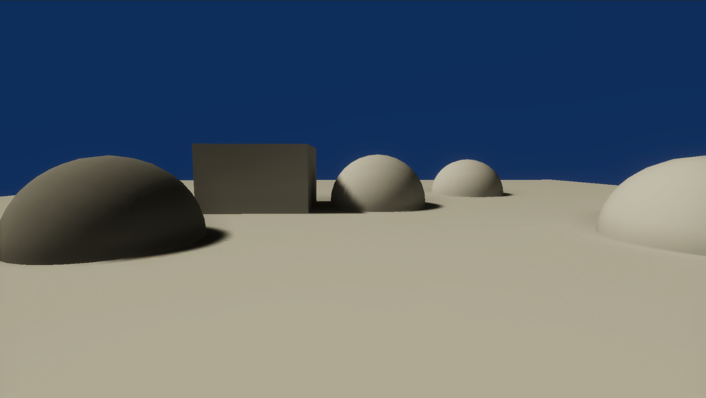

# Lightmaps

This sample demonstrates lightmap support for Entities.

## What does it show?

The scene contains spheres that use different lit shaders. The scene also uses baked global illumination.

## How to use this sample scene?

1. In the Hierarchy, select the Subscene
2. In the Inspector, click **Open**
3. Go to: **Window > Rendering > Lighting**
4. In the Scene tab, configure the lightmap settings, click **Generate Lighting**
5. Save the scene and the Subscene, and then Close the Subscene
