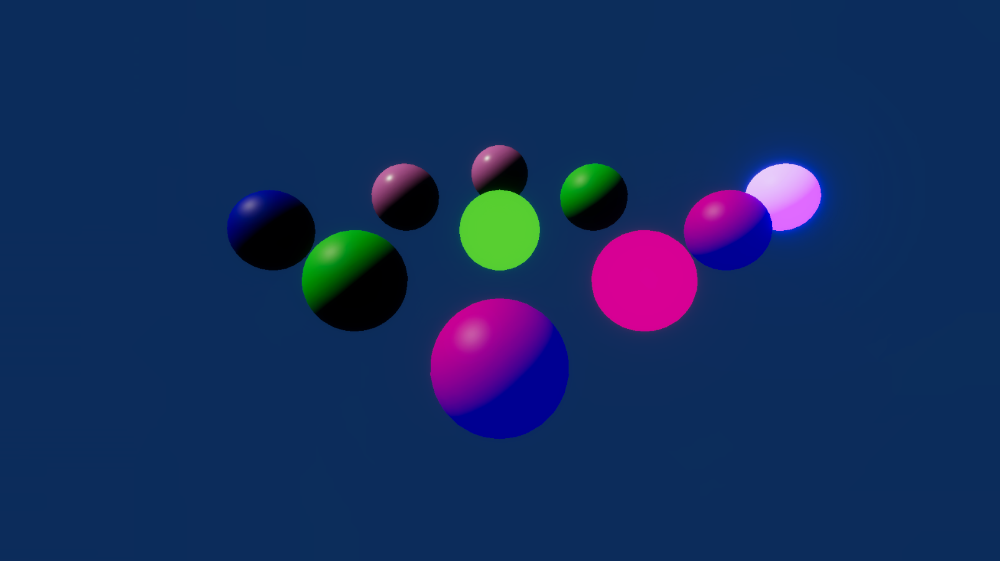

# HDRPShaders

This sample demonstrates material property overrides for HDRP Lit, LitTessellation, Unlit, LayeredLit, LayeredLitTessellation shaders on Entities.

## What does it show?

The scene contains spheres which use the Lit, LitTessellation, Unlit, LayeredLit, LayeredLitTessellation and Shader Graph PBR output.

The material override authoring components attached to the MeshRenderers of the spheres override values for the the spheres' colors and emissive values.

Enter Play mode to see the sphere GameObjects bake to Entities and have the material override components change the color accordingly.

## How to use this sample scene?

1. In the Hierarchy, select the **LitRedEmissive** or **UnlitRedEmissive** sphere
2. In the Inspector, note that there is a HDRP Material Property Base Color Authoring and Emissive Color Authoring components. If you want to override other HDRP material properties, you can add the other HDRP Material Property Authoring components
3. Select **LayeredLit** or **LayeredLitTessellationMagenta** and in the Inspector observe that there is "Layered Lit Base Color 0 Authoring" component, which is a script in the HDRPShaders directory using HDRP LayeredLit "_BaseColor0" keyword.
4. In the Hierarchy, select **PBRBlue** sphere
5. In the Inspector, note that there is Material Color component. If you want to override other custom Shader Graph material properties, you can reference the MaterialColor script and create one for each of your custom material properties
6. Click **Edit** to edit the Shader Graph, note that the Node Settings of the Color property has the Hybrid Per Instanced property enabled  

## More information

For more information about material property overrides, see the [documentation](https://docs.unity3d.com/Packages/com.unity.entities.graphics@latest/index.html).