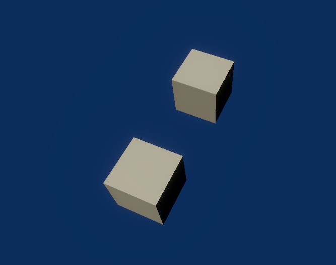

# DisabledEntities

This sample demonstrates disabled entities.

## What does it show?

The scene contains 3 cubes with one of them disabled. This means only two cubes render to the screen. Working with disabled Entities is no different to GameObjects in the Editor.

Disabling an entity disables everything. To stop rendering the entity using an ECS script, add the DisableRendering tag to the entity.

## How to use this sample scene?

1. In the Hierarchy, open the Subscenes
2. Select the disabled Cube
3. In the Inspector, note that the Cube object is disabled. 

