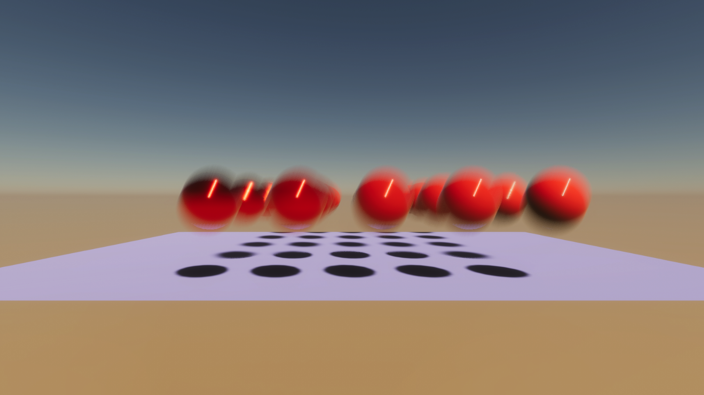

# MatrixPrevious

This sample demonstrates how to move multiple Entities and support for HDRP Motion Vectors making Entities react correctly to Motion Blur 

## What does it show?

The scene contains sphere GameObjects parented to **Balls** GameObject. Each sphere contains Sphere Id Authoring component attached which gets used by MoveBallsSystem.cs script iterating through each sphere id and translating all sphere entities each frame.

## How to use this sample scene?

1. In the Hierarchy, select any Sphere parented to **Balls** GameObject
2. In the Inspector, note that the Sphere ID Authoring components are attached
3. Enter Play mode. All spheres are baked to Entities and change their position with a trail of Motion Blur 
