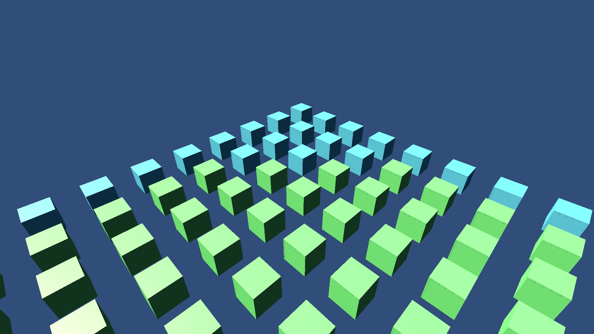

# Entities Graphics HDRP Samples Project
This Project includes feature sample Scenes, stress test Scenes, and unit tests for HDRP Entities Graphics.

## Feature sample Scenes
The feature sample Scenes are in the _SampleScenes_ folder. To ensure full workflow coverage, most of these Scenes include GameObjects in a SubScene and GameObjects that have a ConvertToEntity component. 

Unity renders GameObjects with Entities Graphics when a corresponding DOTS entity exists, and without Entities Graphics when a corresponding DOTS entity does not exist. For the GameObjects in the SubScene, this means that Unity renders them with Entities Graphics at all times; in Edit Mode, in Play Mode, and in the built player.

### Scene List

| Scene | Description | Screenshot |
| --- | --- | - |
| AddComponentsExample | Demonstrates the new RenderMeshUtility.AddComponents API |  |
| BuiltinProperties | Demonstrates override of the built-in material SH property values |  |
| MeshDeformations | Demonstrates BlendShape and SkinWeight entities |  |
| DisabledEntities |  Demonstrates disabled entities |  |
| EntityCreationAPI | Demonstrates how to efficiently create entities at run time that are rendered via Entities Graphics  |  |
| HybridEntitiesConversion | Demonstrates the graphics related Hybrid entities that you can put in a Subscene |  |
| Lightmaps | Demonstrates lightmap support for Entities |  |
| Lightprobes | Demonstrates lightprobe support for Entities |  |
| LODs | Demonstrates LODs in Entities Graphics|  |
| MaterialMeshChange | Demonstrates how to change a Material and Mesh on Entities at runtime |  |
| MaterialOverridesSample | Demonstrates the setup of overriding a material's properties without having to write code |  |
| MatrixPrevious | Demonstrates moving Entities and support for HDRP Motion Vectors |  |
| ShaderGraphProperties | Demonstrates material property overrides for Shader Graph shaders on Entities |  |
| SkinnedMeshes | Demonstrates SkinnedMeshRenderer entities |  |
| TransparencyOrdering | Demonstrates transparent entities ordering |  |
| TriggerParticles | Demonstrates how to play VFX from an ECS System |  |
| HDRPLitProperties | Demonstrates material property overrides for different HDRP Lit material properties on Entities |  |
| HDRPShaders | Demonstrates material property overrides for HDRP Lit, LitTessellation, Unlit, LayeredLit, LayeredLitTessellation shaders on Entities |  |
