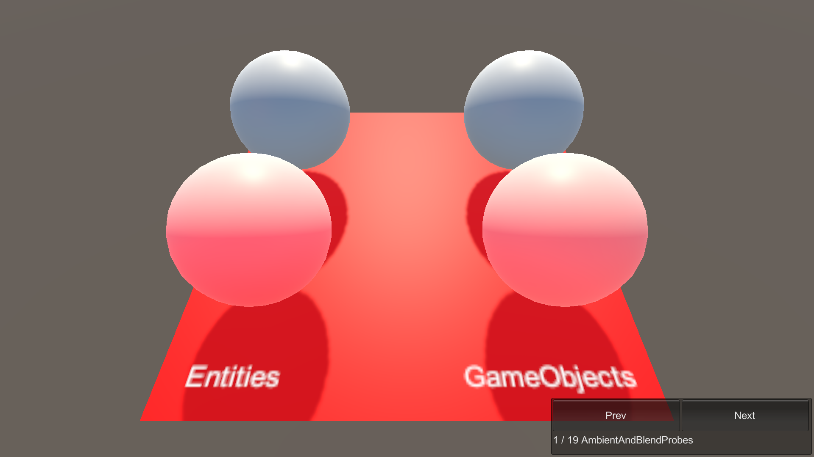

# AmbientAndBlendProbes

This sample demonstrates how ambient and blend probes work in a subscene.

## What does it show?

The AmbientAndBlendProbes scene shows how to use `Light Probes`. There is 2 gameobjects paired up next to 2 entities with the same settings in the `MeshRenderer.Probes.LightProbes` component configuration.

## How to use this sample scene?

1. In the Hierarchy, notice there are 2 **SphereAmbient** and 2 **SphereBlend** objects. 2 outside the subscene and 2 inside
2. Select one and go to the inspector
3. Under **Mesh Renderer - Probes - Light Probes** notice that the settings is either set to off or Blend Probes depending on the object selected

## More information

For more information about Blend Probes, see the [Using Reflection Probes](https://docs.unity3d.com/Manual/UsingReflectionProbes.html) documentation.