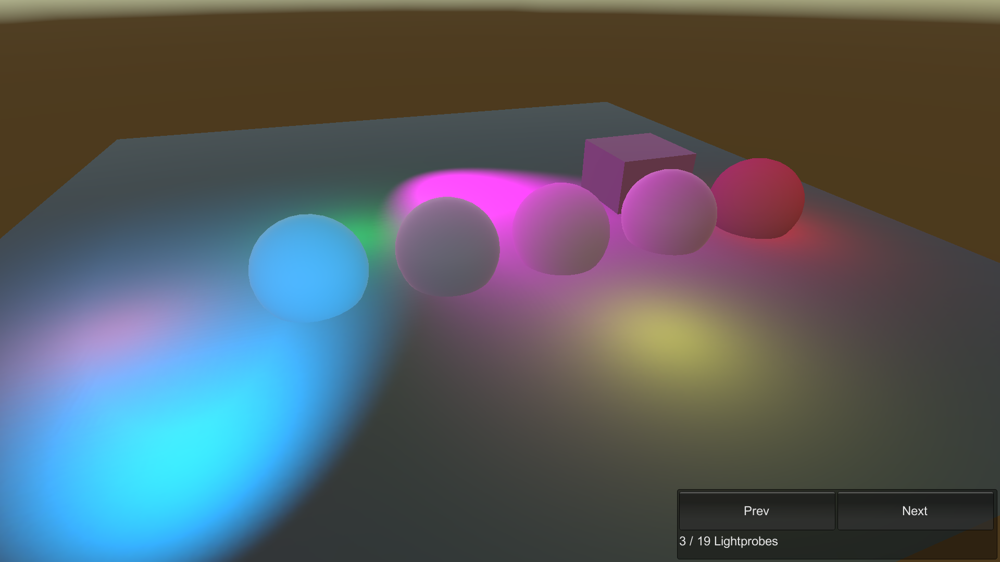

# Lightprobes

This sample demonstrates lightprobe support for Entities.

## What does it show?

The scene contains spheres that uses different lit shaders. This sample uses light probes to light the scene.

## How to use this sample scene?

1. In the Hierarchy, select the Subscene
2. In the Inspector, click **Open**
3. Note that in the subscene, the lights are Static and the spheres are not Static
4. Go to: **Window > Rendering > Lighting**
5. In the Scene tab, make sure to enable **Baked Global Illumination**. Configure the lightmap settings, click **Generate Lighting**
6. Save the scene and the Subscene, and then Close the Subscene
