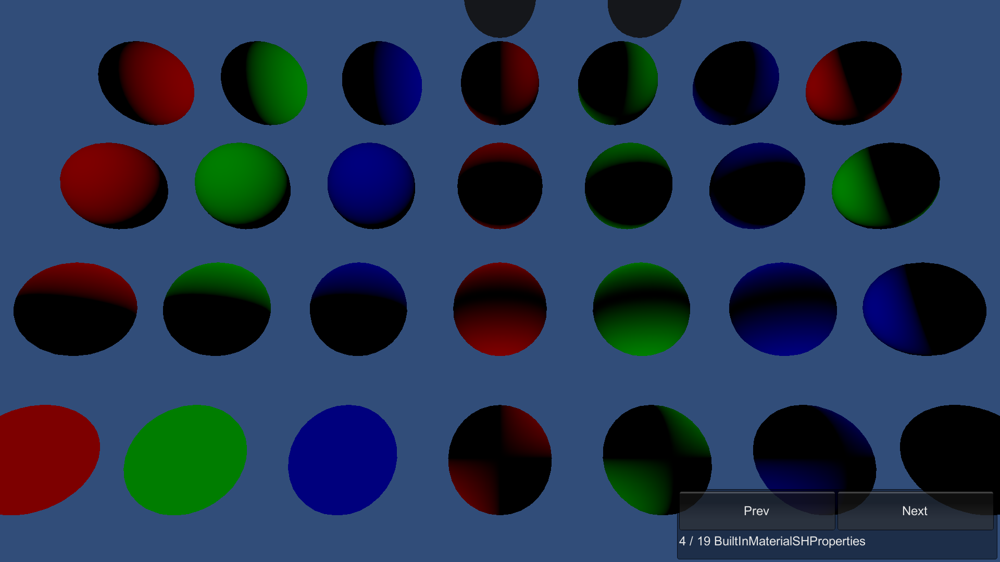

# BuiltInMaterialSHProperties

This sample demonstrates override of the built-in material SH property values.

## What does it show?

The scene contains spheres which are lit by the LightProbe SH property values on the Authoring components attached to the MeshRenderers.

## How to use this sample scene?

1. In the Hierarchy, select one of the Subscenes
2. In the Inspector, click **Open**
3. In the Hierarchy, select a sphere object
4. In the Inspector, note that **MeshRenderer > Probes > Light Probes** is set to **Custom Provided**
5. Try to change values on the built-in material property Unity_SH authoring components
6. Close the Subscene, Save the Subscene
