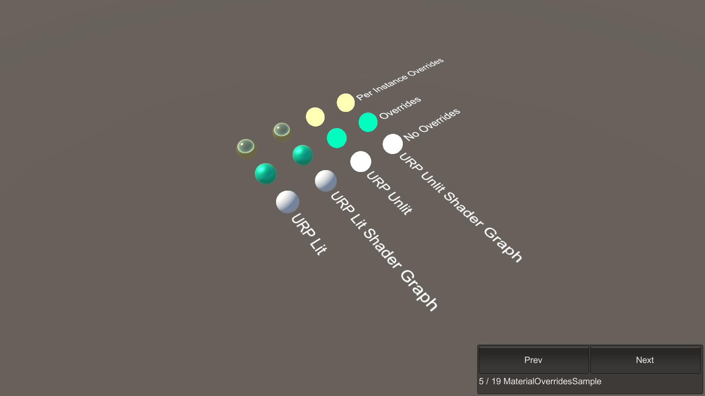

# MaterialOverridesSample

This sample demonstrates the setup of overriding a material's properties without having to write code.

## What does it show?

The scene contains spheres which use the URP Lit and URP Unlit shaders and Shader Graphs. The spheres' MaterialOverride component, attached on the MeshRenderer, overrides the material property values. The MaterialOverride component references a MaterialOverride asset which you can use to configure the properties to override.

## How to use this sample scene?

1. In the Hierarchy, select any sphere which includes **PerInstance** in its name
2. In the Inspector, note that there is MaterialOverride component attached
3. Click on the MaterialOverride asset, observe the configured properties

## More information

For more information about material overrides, see the [material overrides](https://docs.unity3d.com/Packages/com.unity.entities.graphics@1.0/manual/material-overrides.html) documentation.