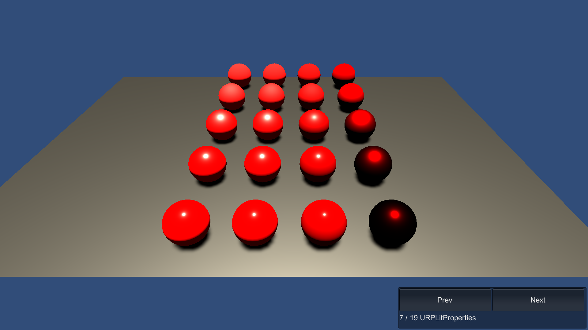

# URPLitProperties

This sample demonstrates material property overrides for different URP Lit material properties on Entities.

## What does it show?

The scene contains spheres which use the URP Lit shader. The spheres are in a Subscene.

The material override authoring components attached to the MeshRenderers of the spheres override values for the spheres' color, smoothness, and metallic properties.

## How to use this sample scene?

1. In the Hierarchy, select the Subscene
2. In the Inspector, click Open
3. In the Hierarchy, select a sphere
4. In the Inspector, note that there are several URP Material Property Authoring components. If you want to override other URP material properties, you can add the other URP Material Property Authoring components

## More information

For more information about material property overrides, see the [documentation](https://docs.unity3d.com/Packages/com.unity.entities.graphics@1.0/manual/material-overrides-code.html).