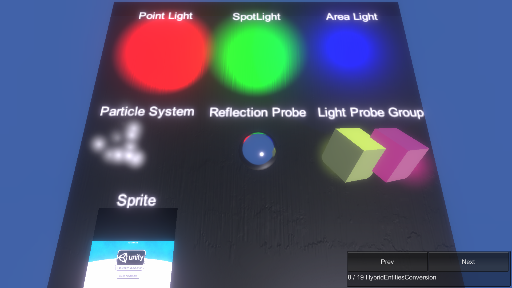

# HybridEntitiesConversion

This sample demonstrates the graphics related companion components that you can put in a Subscene. Note that **Particle System** does not preview in subscenes but will simulate correctly at runtime.

## What does it show?

The scene contains a Subscene in which there are Lights, Volumes, and other objects. Entities Graphics supports all these graphics related components.

## How to use this sample scene?

1. In the Hierarchy, select the Subscene
2. In the Inspector, click Open
3. In the Hierarchy, see the objects in the Subscene. Note that URP needs to be configured to use the Forward+ rendering mode in order to see **point**, **spot** and **area** lights with Entities Graphics. 

## More information

For more information about companion components, see the [documentation](https://docs.unity3d.com/Packages/com.unity.entities.graphics@1.0/manual/index.html).