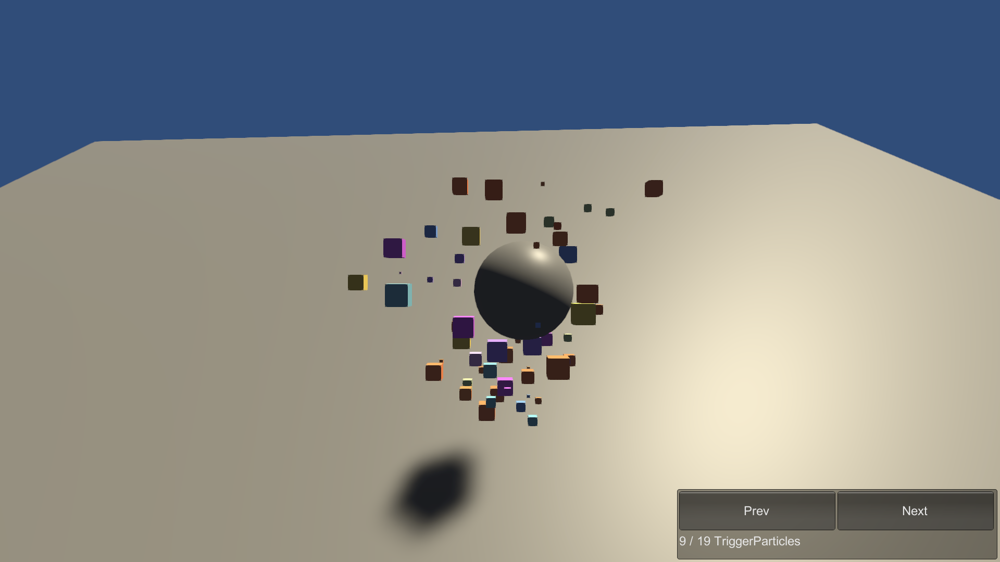

# TriggerParticles

This sample demonstrates how to play a ParticleSystem from an ECS System. Enter Play mode to see the animation.

## What does it show?

The scene contains a Subscene and in the Subscene there is a sphere and a ParticleSystem. The JumpingSpherePSSystem script animates the jumping sphere and plays the ParticleSystem when the sphere hits the ground.

## How to use this sample scene?

1. In the Hierarchy, select the Subscene
2. In the Inspector, click Open
3. Note that the ParticleSystem is in the Subscene and baked to be a companion component that you can access from the ECS System script.

## More information

For more information about companion components, see the [documentation](https://docs.unity3d.com/Packages/com.unity.entities.graphics@1.0/manual/companion-components.html).