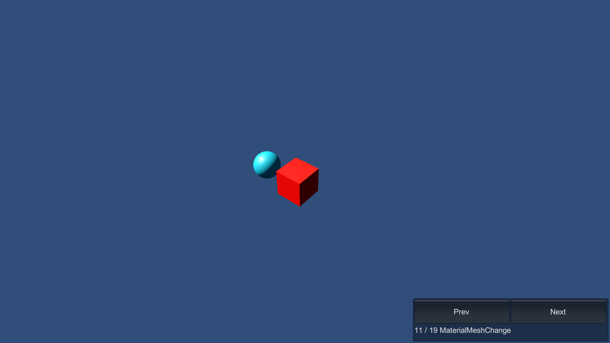

# MaterialMeshChange

This sample demonstrates how to change a Material and Mesh on Entities at runtime. Enter Play mode to see the rendering change over different frames.

## What does it show?

The scene contains two entities. One changes it's Mesh and another changes it's Material. The MeshChanger and MaterialChanger are the ECS scripts that perform the respective Mesh / Material swapping.

## How to use this sample scene?

1. In the Hierarchy, select the Subscene
2. In the Inspector, click Open
3. In the Hierarchy, select the **MeshChange** or **MaterialChange** GameObject
4. In the Inspector, note that the Authoring components is attached
5. Close the Subscene and enter Play mode. These two GameObjects are baked to Entities and change their mesh and material using the ECS System