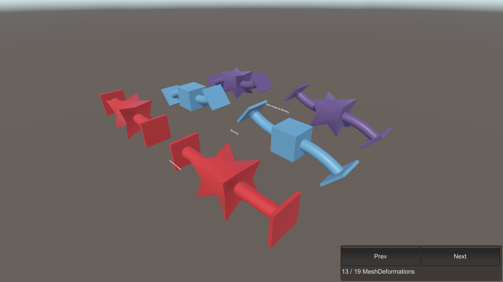

# Mesh Deformations

This sample demonstrates BlendShape and SkinWeight entities. Enter Play mode to see the simple mesh deformations.

## What does it show?

The scene shows various meshes using combinations of common mesh deformations. The red meshes are deformed using blend shapes. The blue meshes are deformed using skinning only. In purple you can see both methods applied to the same mesh. All values and transforms are animated using a simple animation system that writes to the ECS transform components. These in turn are used to calculate the skin matrices picked up by the Mesh Deformation system.

## How to use this sample scene?

1. Note that to use this sample you need to add the ENABLE_COMPUTE_DEFORMATIONS define symbol to the **Scripting Define Symbols** list in **Edit > ProjectSettings > Player > Other Settings**
2. In the Hierarchy, select one of the Subscenes
3. In the Inspector, click Open
4. Select the **cube_test_mesh** object, note that the material must use a Shader Graph that includes the Compute Deformation node

## More information

For more information about deformations, see the [Mesh Deformations](https://docs.unity3d.com/Packages/com.unity.entities.graphics@1.0/manual/mesh_deformations.html) documentation.
