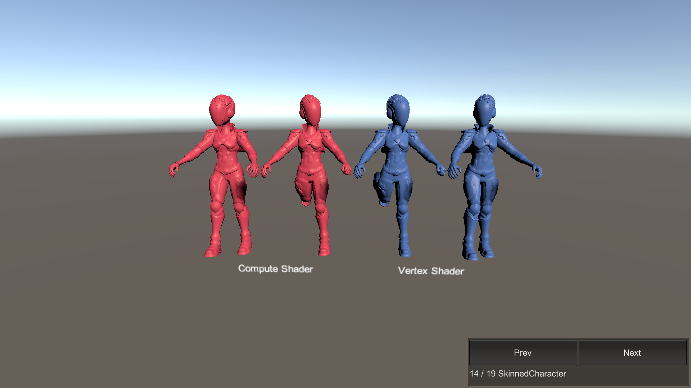

# SkinnedCharacter

This sample demonstrates characters that use a skinned mesh.

## What does it show?

The scene shows four animated characters using Mesh Deformations. It demonstrates both compute shader deformation (pink) and vertex shader deformation (blue). Vertex skinning must use the Linear Blend Skinning node; compute skinning must use the Compute Deformation node in Shader Graph. All characters are animated using a simple animation system that writes to the ECS transform components. These in turn are used to calculate the skin matrices picked up by the Mesh Deformation system.

## How to use this sample scene?

1. Note that to use this sample you need to add the ENABLE_COMPUTE_DEFORMATIONS define symbol to the **Scripting Define Symbols** list in **Edit > ProjectSettings > Player > Other Settings**
2. In the Hierarchy, select one of the Subscenes
3. In the Inspector, click Open
4. Select the **Geom_Body_LOD0** object, note that the material must use a Shader Graph with Linear Blend Skinning or with the Compute Deformation node setup.

## More information

For more information about deformations, see the [Mesh Deformations](https://docs.unity3d.com/Packages/com.unity.entities.graphics@1.0/manual/mesh_deformations.html) documentation.