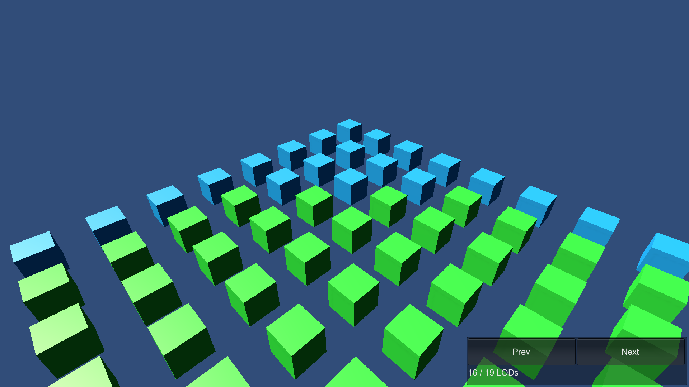

# LODs

This sample demonstrates LODs in Entities Graphics.

## What does it show?

The scene contains a grid of cubes, and each LOD has its own color.

## How to use this sample scene?

1. In the Hierarchy, select the Subscene
2. In the Inspector, click Open
3. In the Hierarchy, select **Root**
4. **Root** contains 100 LodGroup children and, in the Inspector, note that LOD Group component is attached to them.
