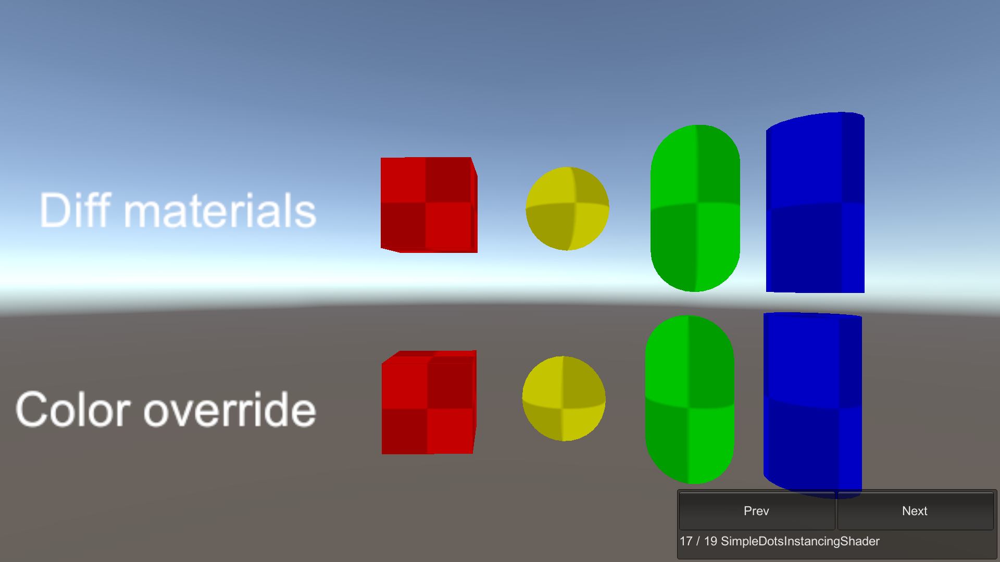

# SimpleDotsInstancingShader

This sample demonstrates a simple unlit shader which renders using DOTS instancing.

## What does it show?

The scene demonstrates how to write a custom HLSL shader that supports BatchRendererGroup and Entities Graphics. The
example shader can be found in the `CustomDotsInstancingShader.shader` asset. The scene contains two sets of Entities
whose colors are either from their own materials (top row), or from the MaterialColor component attached to the
MeshRenderers (bottom row). All of the entities use the same CustomDotsInstancingShader, thus all the eight objects
render in one SRP batch with DOTS_INSTANCING_ON.

## How to use this sample scene?

1. In the Hierarchy, make sure the Subscene is closed
2. Enter Play mode
3. Go to: **Window > Analysis > Frame Debugger**
4. In the Frame Debugger, click Enable
5. Select the **DrawOpaqueObjects** event and expand it 
6. Observe there is only one SRP Batch, and the number of draw calls is eight. The keywords show DOTS_INSTANCING_ON