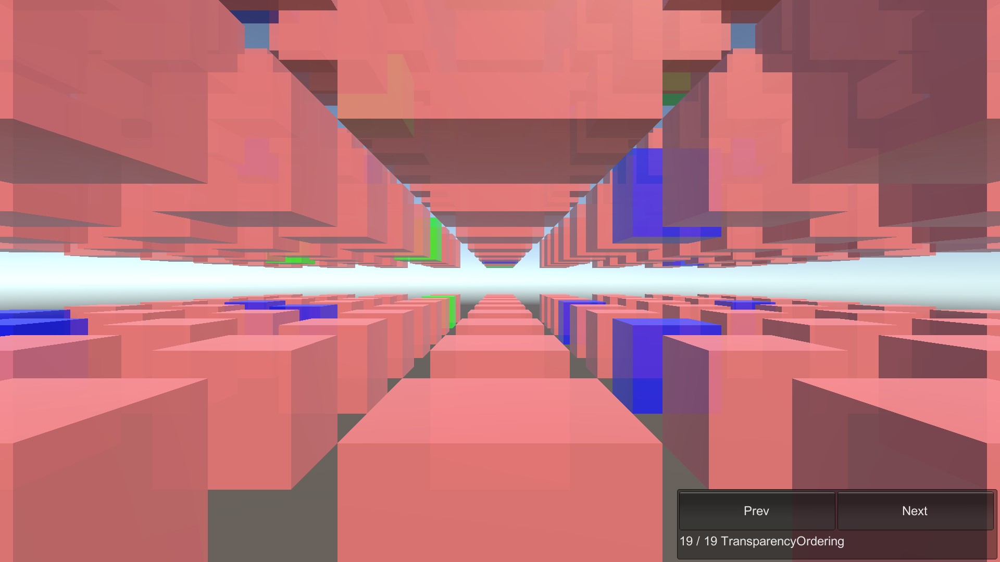

# TransparencyOrdering

This sample demonstrates transparent entities ordering.

## What does it show?

This scene contains a lot of semi-transparent cubes, which need to be rendered in a back-to-front order for
correct results. The Entities Graphics package supports this via the `DepthSorted_Tag` tag component, which
is automatically added to Entities with a transparent Material when the Entity is baked.

## How to use this sample scene?

1. In the Hierarchy, make sure the Subscene is closed
2. Go to: **Window > Entities > Hierarchy**
3. Select one of the Entities in the bottom level of the hierarchy
4. Observe that the Entity should have the `DepthSorted_Tag` tag component