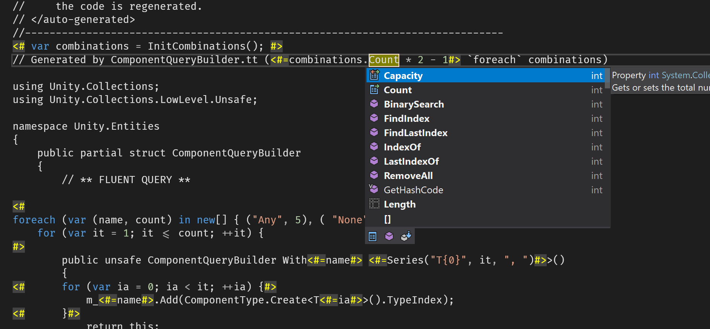

# Hacking

FIRST, read how to make [contributions](CONTRIBUTIONS.md).

Now some tips on hacking in the DOTS repo.

## T4

In our codebase we may have one or more files with a `.tt` extension. These are templates for the [Text Template Transformation Toolkit (T4)](https://en.wikipedia.org/wiki/Text_Template_Transformation_Toolkit) to generate code from. T4 was originally just a [Microsoft Visual Studio tool](https://docs.microsoft.com/en-us/visualstudio/modeling/generating-files-with-the-texttransform-utility), but there's now a [Mono version](https://github.com/mono/t4) that runs on .NET Core.

### Configure Your Tools

#### Visual Studio

This is probably the best T4 experience. T4 processing is built in, you can get dual-language colorizing and completion, and hitting ctrl-s quickly runs codegen.



Two extension options for richer T4 support:

  1. Best: [ReSharper](https://www.jetbrains.com/resharper) + [ForTea](https://plugins.jetbrains.com/plugin/11634-fortea) (install from ReSharper|Extension Manager)
  2. OK: [tangible T4 Editor](https://t4-editor.tangible-engineering.com/T4-Editor-Visual-T4-Editing.html)

__Important__: Unity doesn't understand .tt files, and when it generates .csproj's it doesn't include any markup for them. So VS thinks of it as an ordinary text file and you don't get auto-codegen.

To work around that, run this from Powershell in your DOTS repo: `Tools/Fix-ProjectsForT4 Samples/Samples.sln`. This will add the necessary markup. You'll need to run this _every time Unity regenerates the csproj's_, so keep it handy.

Ask Powershell `help Tools/Fix-ProjectsForT4` for important info on using T4+Unity effectively in Visual Studio.

#### Visual Studio Code

VSCode does a passable job at T4. With a couple extensions, you get syntax highlighting, auto-regen-on-save, but no completion.

To set up VSCode, run this from a command shell:

```sh
code --install-extension zbecknell.t4-support
code --install-extension aisoftware.tt-processor
```

One does colorizing, the other does auto-regen. You'll also need to go to your settings.json and add an entry for your T4 processor.

```json
"ttProcessor.TTPath": "path/to/my/t4",
```

(But.. _"Wait, how do I get a T4 processor??"_ See instructions in "All Other Editors" below.)

#### Rider (And Other Editors)

For other editors, you'll have to either run the T4 processor manually on the command line, or configure an External Tool to do it.

First, get a T4 processor:

* Windows: you already should have a `TextTransform.exe` in a Visual Studio under `Common7\IDE`
* All: [mono/t4](https://github.com/mono/t4) is available, actively maintained, and works in .NET or .NET Core. To install it, make sure you have .NET Core SDK [installed](https://dotnet.microsoft.com/download), and then run `dotnet tool install -g dotnet-t4`.

Now you can just run either `TextTransform` or `t4` manually, passing in the path to the .tt file. Your editor probably has a way to run shell commands or "external tools", which you can configure to run the T4 processor and maybe even bind to a hotkey.

For example, to add to Rider:

* File|Settings -> Tools\External Tools
* `+` to add
  * Name = Run T4 Codegen
  * Program = `path/to/my/t4`
  * Arguments = `$FilePath$`
  * Check boxes in Advanced Options for "Synchronize files", "Open console", and "Make active on stderr"

Now you can run codegen using Tools|External Tools -> Run T4 Codegen. Not automatic, no codegen, but better than nothing..?

(Note that Rider supposedly wants to engineer their own T4 implementation, go [vote for it](https://youtrack.jetbrains.com/issue/RIDER-5245))

### Adding New T4 Files

Do the following to add a new T4 file to Unity:

  1. Create a new .tt file however you want
  2. Copy-paste in the text from the **Standard T4 Template** below
  3. Go to Unity, let it notice the new .tt file and update the generated csproj so your editor sees it
  4. Visual Studio users: also run `Tools/Fix-ProjectsForT4 -RunCodeGen Samples/Samples.sln` (for more info, see "Configure Your Tools" above)

#### Standard T4 Template

When creating a new .tt file, copy this into the top to get started.

```xml
<#/*THIS IS A T4 FILE - see HACKING.md for what it is and how to run codegen*/#>
<#@ output extension=".gen.cs" #>
<#@ assembly name="System.Collections" #>
<#@ assembly name="System.Core" #>
<#@ import namespace="System.Collections.Generic" #>
//------------------------------------------------------------------------------
// <auto-generated>
//     This code was generated by a tool.
//
//     Changes to this file may cause incorrect behavior and will be lost if
//     the code is regenerated.
// </auto-generated>
//------------------------------------------------------------------------------
```

Note that the assemblies list _needs to work in both .NET and .NET Core_ so we can run on multiple desktop platforms. Keep this in mind as you add more references.
