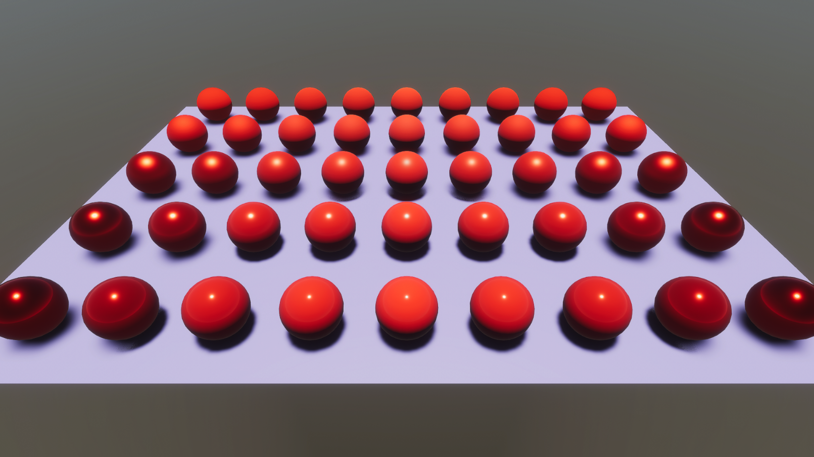

# HDRPLitProperties

This sample demonstrates material property overrides for different HDRP Lit material properties on Entities.

## What does it show?

The scene contains spheres which use the HDRP Lit shader. Half of the spheres are in a Subscene and half convert to Entities at runtime using the ConvertToEntity component attached to them.

The material override authoring components attached to the MeshRenderers of the spheres override values for the spheres' color, smoothness, and metallic properties.

Enter Play mode to see the sphere GameObjects convert to Entities and have the material override components change the properties accordingly.

## How to use this sample scene?

1. In the Hierarchy, select a sphere
2. In the Inspector, note that there are several HDRP Material Property Authoring components. If you want to override other HDRP material properties, you can add the other HDRP Material Property Authoring components

## More information

For more information about material property overrides, see the [documentation](https://docs.unity3d.com/Packages/com.unity.rendering.hybrid@latest/index.html).