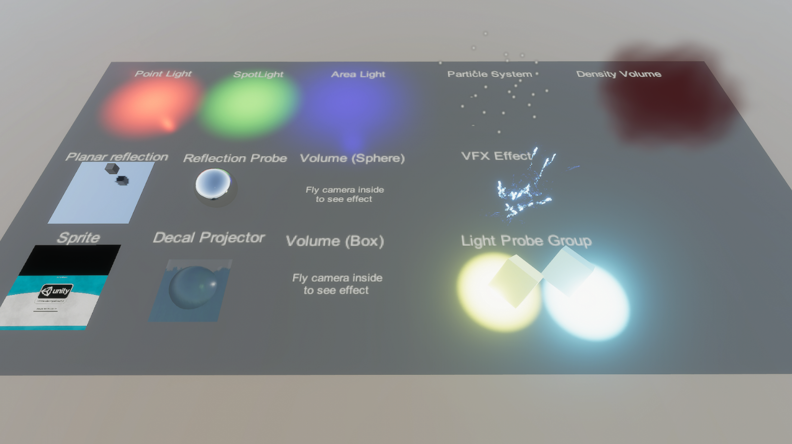

# HybridEntitiesConversion

This sample demonstrates the graphics related Hybrid entities that you can put in a Subscene.

## What does it show?

The scene contains a Subscene in which there are Lights, Volumes, Visual Effects, and other objects. Hybrid Renderer supports all these graphics related components.

## How to use this sample scene?

1. In the Hierarchy, select the Subscene
2. In the Inspector, click Open
3. In the Hierarchy, see the objects in the Subscene

## More information

For more information about hybrid entities, see the [documentation](https://docs.unity3d.com/Packages/com.unity.rendering.hybrid@latest/index.html).