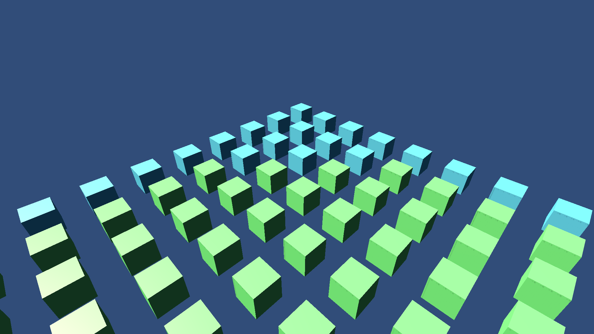

# LODsStatic

This sample demonstrates static optimized LOD hierarchies.

## What does it show?

This scene is same as LODs but with StaticOptimizeEntity component added in the LOD subscene root. This makes DOTS optimize the hierarchy as static immovable entities.

## How to use this sample scene?

1. In the Hierarchy, select the Subscene
2. In the Inspector, click Open
3. In the Hierarchy, select **Root**
4. Note that StaticOptimizeEntity component is attached together with LOD Group component and HLOD component