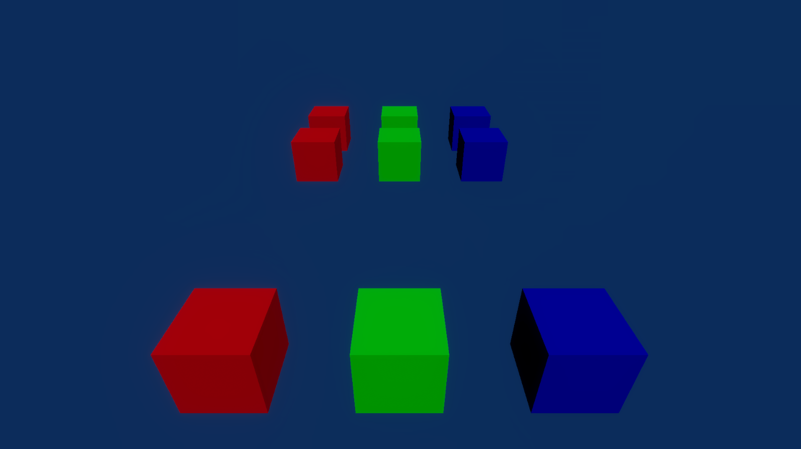

# SharedComponentOverrides

This sample demonstrates the support for overriding DOTS instanced material properties using ISharedComponentData.

## What does it show?

This scene uses ISharedComponenData to override the color of various cubes. It uses the ColorSharedComponentTest script to override the cubes's _BaseMap color values.
Using ISharedComponentData to override values only supports the float4 type. The IHybridSharedComponentFloat4Override interface is a temporary approach to support managed shared components and Hybrid Renderer will deprecate this as soon as DOTS supports unmanaged shared components.
The DynamicSharedComponentHandle allows you to access shared components without compile-time type information, similarly to DynamicComponentTypeHandle.

## How to use this sample scene?

1. In the Hierarchy, select the Subscene
2. In the Inspector, click **Open**
3. In the Hierarchy, select the **CubeRed1** cube
4. In the Inspector, note the Color Shared Component Test component

## More information

For more information about DynamicSharedComponentHandle, see the [documentation](https://docs.unity3d.com/Packages/com.unity.rendering.hybrid@latest/index.html).
