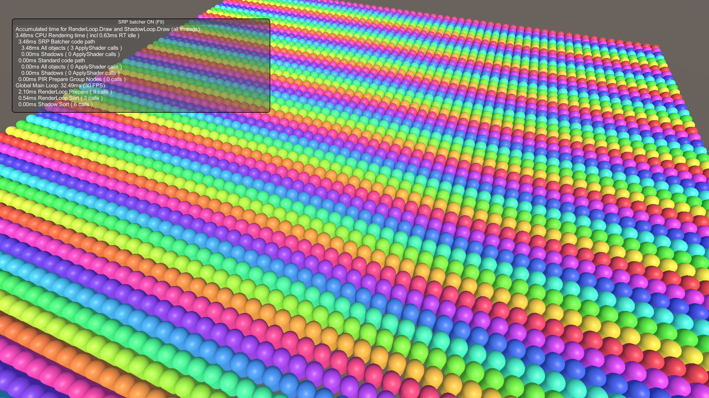

# AddComponentsExample

This sample demonstrates the new `RenderMeshUtility.AddComponents` API.

## What does it show?

The AddComponentsExample script shows how to use `RenderMeshUtility.AddComponents` to create a base entity and then instantiate that entity many times in a Burst job.

## How to use this sample scene?

1. In the Hierarchy, select Spawner
2. In the Inspector, configure settings
3. Hit play

## More information

For more information about RenderMeshUtility and run time entity creation, see the [Runtime entity creation](https://docs.unity3d.com/Packages/com.unity.rendering.hybrid@latest/index.html?subfolder=/manual/runtime-entity-creation.html) documentation.
