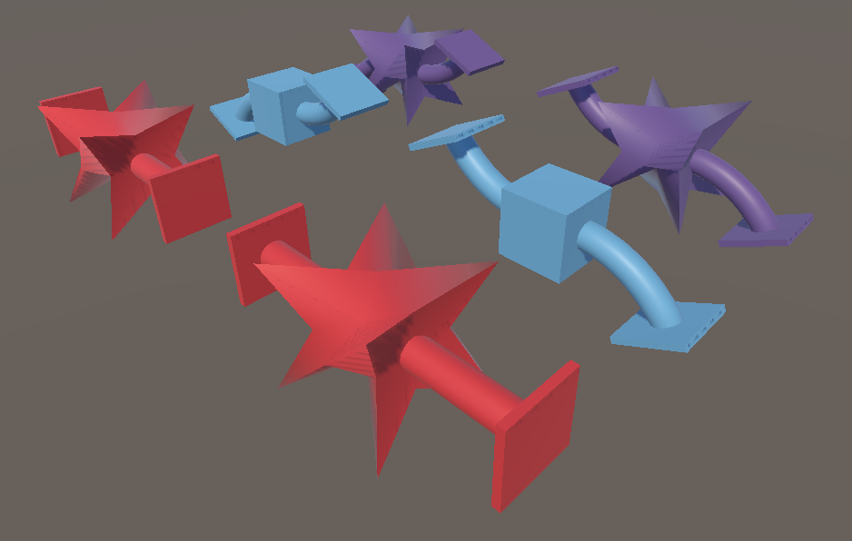

# Deformations

This sample demonstrates BlendShape and SkinWeight entities. Enter Play mode to see the simple mesh deformation animation.

## What does it show?

The scene shows three SkinnedMeshRenderer objects which use BlendShape only, SkinWeight only, and BlendShape + SkinWeight respectively. 
CustomMoveSystem scripts animate the bone transforms and the BlendShapeWeight values.

## How to use this sample scene?

1. Note that to use this sample you need to add the ENABLE_COMPUTE_DEFORMATIONS define symbol to the **Scripting Define Symbols** list in **Edit > ProjectSettings > Player > Other Settings**
2. In the Hierarchy, select one of the Subscenes
3. In the Inspector, click Open
4. Select the **cube_test_mesh** object, note that the material must use a Shader Graph that includes the Compute Deformation node

## More information

For more information about deformations, see the [Mesh Deformations](https://docs.unity3d.com/Packages/com.unity.rendering.hybrid@latest/index.html?subfolder=/manual/mesh_deformations.html) documentation.
