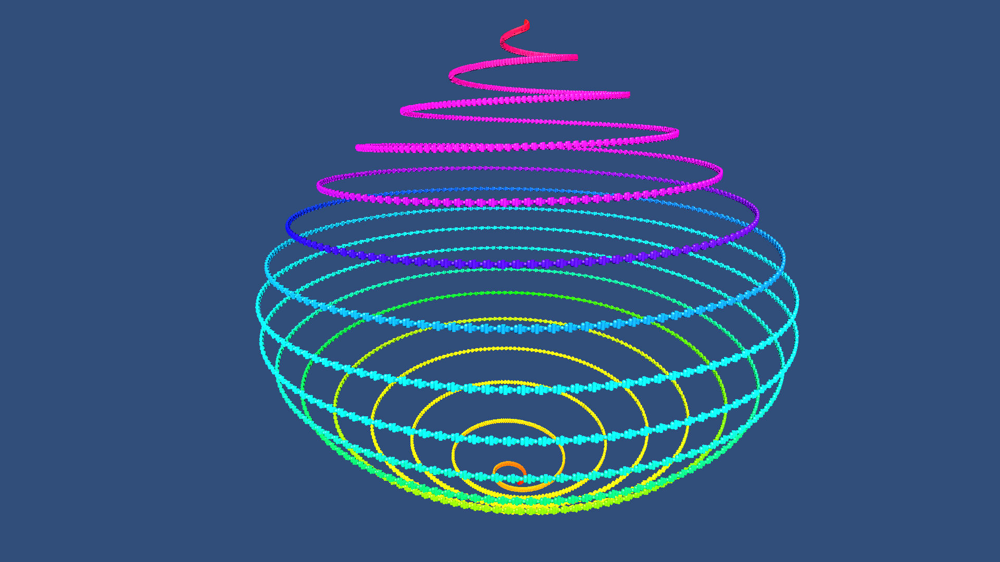

# EntityCreationAPI

This sample demonstrates how to efficiently create entities at run time that are rendered via Hybrid Renderer. Enter Play mode to see the generated entities.

## What does it show?

The TestEntityCreationAPI script uses RenderMeshDescription and RenderMeshUtility.AddComponent APIs with Instantiate to efficiently create Hybrid Rendered entities.

## How to use this sample scene?

1. In the Hierarchy, select Spawner
2. In the Inspector, configure settings
3. Hit play

## More information

For more information about RenderMeshUtility and run time entity creation, see the [documentation](https://docs.unity3d.com/Packages/com.unity.rendering.hybrid@latest/index.html).

