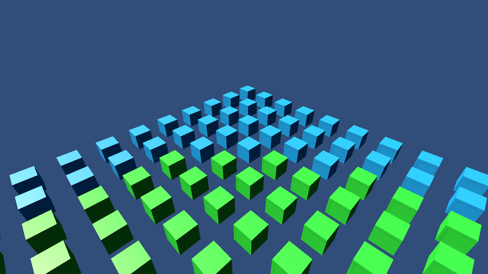

# LODs

This sample demonstrates LODs and HLODs in Hybrid Renderer.

## What does it show?

The scene contains a grid of cubes, and each LOD has its own color.
There are two HLOD levels. When the camera zooms in and out, the HLOD changes, and the grid of cubes merge into one large cube.

## How to use this sample scene?

1. In the Hierarchy, select the Subscene
2. In the Inspector, click Open
3. In the Hierarchy, select **Root**
4. **Root** contains two HLOD children and, in the Inspector, note that LOD Group and HLOD components are attached to it. The two HLOD children are assigned on the HLOD component