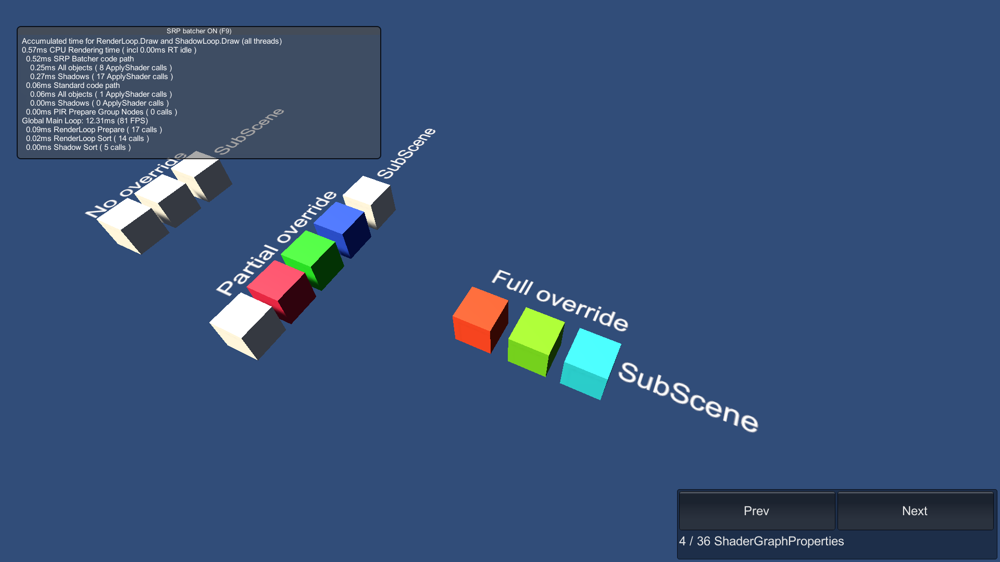

# ShaderGraphProperties

This sample demonstrates material property overrides for Shader Graph shaders on Entities.

## What does it show?

The scene contains cubes which use the Shader Graph PBR output. Some of these cubes have material override authoring components attached to their MeshRenderers. These component override the cubes' colors.

When you enter Play mode, the cubes convert to Entities and the material property overrides change the cube's colors accordingly.

## How to use this sample scene?

1. In the Hierarchy, select the **CubeRed** cube
2. In the Inspector, note the Material Color component. If you want to override other custom Shader Graph material properties, you can reference the MaterialColor script and create one for each of your custom material properties
3. Click **Edit** to edit the Shader Graph, note that the Node Settings of the Color property has the **Override Property Declaration** enabled and **Shader Declaration** set to **Hybrid Per Instance**

## More information

For more information about custom Shader Graph material overrides, see the [documentation](https://docs.unity3d.com/Packages/com.unity.rendering.hybrid@latest/index.html).
