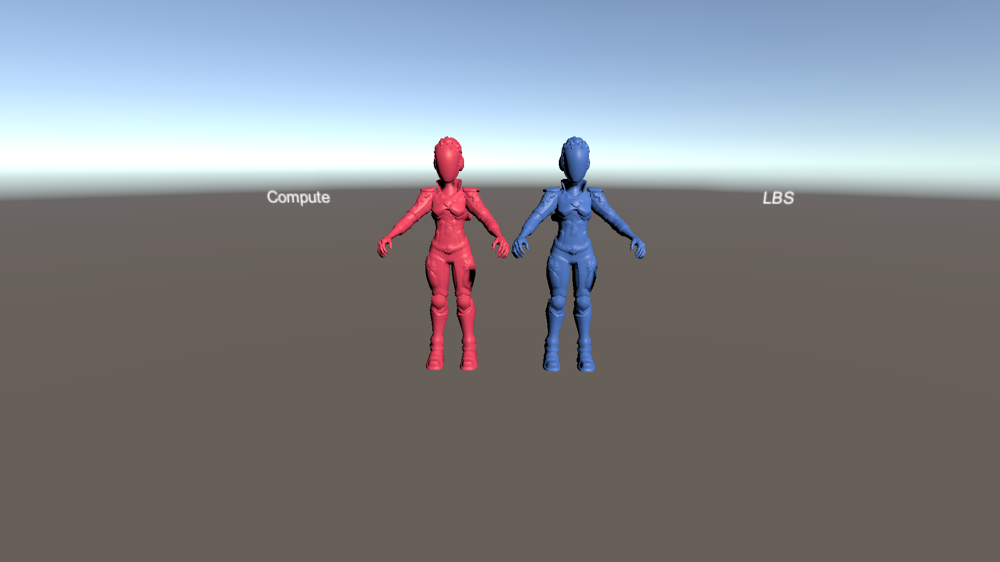

# SkinnedMeshes

This sample demonstrates SkinnedMeshRenderer entities.

## What does it show?

The scene shows two SkinnedMeshRenderer objects which use vertex skinning, and GPU skinning. Vertex skinning must use the Linear Blend Skinning node; GPU skinning must use the Compute Deformation node in Shader Graph.

## How to use this sample scene?

1. Note that to use this sample you need to add the ENABLE_COMPUTE_DEFORMATIONS define symbol to the **Scripting Define Symbols** list in **Edit > ProjectSettings > Player > Other Settings**
2. In the Hierarchy, select one of the Subscenes
3. In the Inspector, click Open
4. Select the **Geom_Body_LOD0** object, note that the material must use a Shader Graph with Linear Blend Skinning or with the Compute Deformation node setup.

## More information

For more information about deformations, see the [Mesh Deformations](https://docs.unity3d.com/Packages/com.unity.rendering.hybrid@latest/index.html?subfolder=/manual/mesh_deformations.html) documentation.