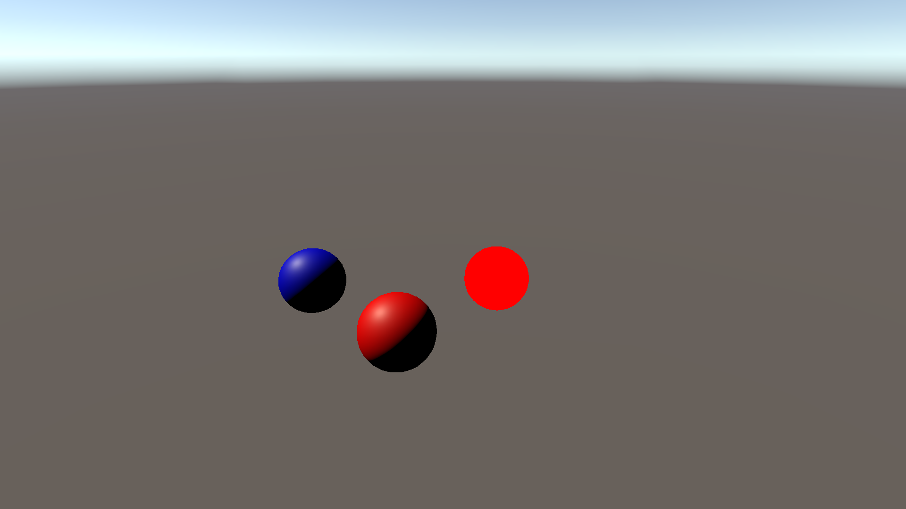

# URPShaders

This sample demonstrates material property overrides for URP Lit/Unlit shaders on Entities.

## What does it show?

The scene contains three spheres which use the URP Lit, URP Unlit, and Shader Graph PBR output.

The material override authoring components attached to the MeshRenderers of the spheres override values for the the spheres' colors.

Enter Play mode to see the sphere GameObjects convert to Entities and have the material override components change the color accordingly.

## How to use this sample scene?

1. In the Hierarchy, select the **LitRed** or **UnlitRed** sphere
2. In the Inspector, note that there is a URP Material Property Base Color Authoring component. If you want to override other URP material properties, you can add the other URP Material Property Authoring components
3. In the Hierarchy, select **PBRBlue** sphere
4. In the Inspector, note that there is Material Color component. If you want to override other custom Shader Graph material properties, you can reference the MaterialColor script and create one for each of your custom material properties
5. Click **Edit** to edit the Shader Graph, note that the Node Settings of the Color property has the Hybrid Instanced property enabled  

## More information

For more information about material property overrides, see the [documentation](https://docs.unity3d.com/Packages/com.unity.rendering.hybrid@latest/index.html).