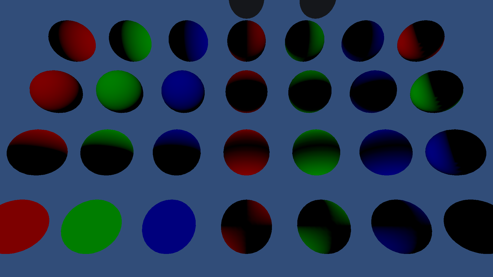
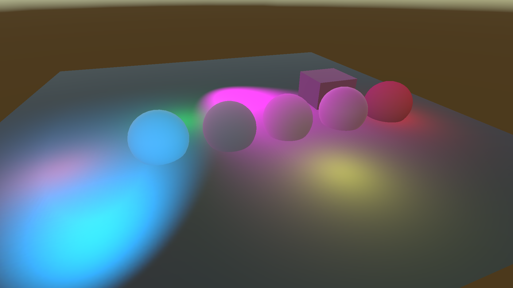
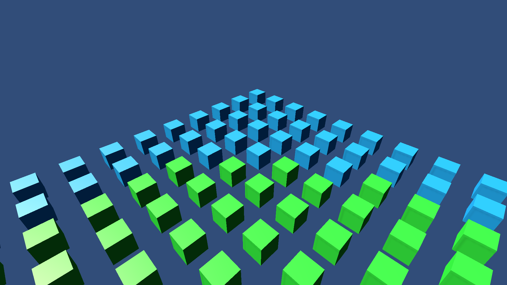
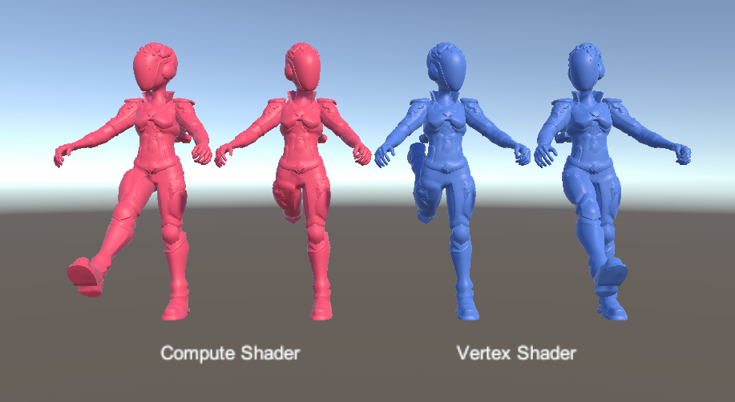

# Hybrid URP Samples Project
This Project includes feature sample Scenes, stress test Scenes, and unit tests for the URP Hybrid Renderer.\
Please visit official [Hybrid Renderer documentation](https://docs.unity3d.com/Packages/com.unity.rendering.hybrid@0.50/manual/index.html) for more details.

## Feature sample Scenes
The feature sample Scenes are in the _SampleScenes_ folder. To ensure full workflow coverage, most of these Scenes include GameObjects in a SubScene and GameObjects that have a ConvertToEntity component. 

Unity renders GameObjects with the Hybrid Renderer when a coresponding DOTS entity exists, and without the Hybrid Renderer when a corresponding DOTS entity does not exist. For the GameObjects in the SubScene, this means that Unity renders them with the Hybrid Renderer at all times; in Edit Mode, in Play Mode, and in the built player. For the GameObjects with a ConvertToEntity component, this means that Unity renders them with the Hybrid Renderer only in Play Mode and in the built player. This is because Unity converts the components to DOTS entities at runtime.

### Scene List

| Scene | Description | Screenshot |
| --- | --- | - |
| AddComponentsExample | Demonstrates the new RenderMeshUtility.AddComponents API |  |
| BuiltinProperties | Demonstrates override of the built-in material SH property values |  |
| DisabledEntities |  Demonstrates disabled entities |  |
| EntityCreationAPI | Demonstrates how to efficiently create entities at run time that are rendered via Hybrid Renderer  |  |
| HybridEntitiesConversion | Demonstrates the graphics related Hybrid entities that you can put in a Subscene |  |
| Lightmaps | Demonstrates lightmap support for Entities |  |
| Lightprobes | Demonstrates lightprobe support for Entities |  |
| LODs | Demonstrates LODs and HLODs in Hybrid Renderer |  |
| LODsStatic | Demonstrates static optimized LOD hierarchies |  |
| MaterialMeshChange | Demonstrates how to change a Material and Mesh on Entities at runtime |  |
| MaterialOverridesSample | Demonstrates the setup of overriding a material's properties without having to write code |  |
| MeshDeformations | Demonstrates BlendShape and SkinWeight entities |  |
| OcclusionCulling | Demonstrates the new occlusion culling system on Entities |  |
| ShaderGraphProperties | Demonstrates material property overrides for Shader Graph shaders on Entities |  |
| SharedComponentOverrides | Demonstrates the support for overriding DOTS instanced material properties using ISharedComponentData |  |
| SimpleDotsInstancingShader | Demonstrates a simple unlit shader which renders using DOTS instancing |  |
| SkinnedCharacter | Demonstrates SkinnedMeshRenderer entities |  |
| TransparencyOrdering | Demonstrates transparent entities ordering |  |
| TriggerParticles | Demonstrates how to play a ParticleSystem from an ECS System |  |
| URPLitProperties | Demonstrates material property overrides for different URP Lit material properties on Entities |  |
| URPShaders | Demonstrates material property overrides for URP Lit/Unlit shaders on Entities |  |

## Stress test scenes
Stress test Scenes are located in the _StressTestScenes_ folder.

The _BigBatches_ stress test measures maximum thoughput of perfectly batched content. _StressTestGameObjects_ uses GameObjects, and _StressTestHybrid_ uses the Hybrid Renderer. This allows you to measure performance differences between GameObject rendering and Hybrid Rendering. 

The stress test scene contains 100,000 spawned boxes. They cycle though four different animation modes: no animation, color animation, position animation, color + position animation. 

_StressTestGameObjects_ has two variants: one that includes the color overrides, and one that does not incude color overrides. This is because modifying GameObject color requires Material changes per GameObject, which causes material replication per object and has a large performance impact. Providing a variant without color overrides demonstrates more realistic performance for cases where you only modify position.

## Compatibility
Compatible with Unity 2020.3.30f1 and URP 10.8.1 or later.
