# Unity Physics Samples

## Controls 

In the *Game* window:

- Mouse spring : Click and drag with left mouse
- Camera rotate : Click and drag with right mouse
- Camera move : W,A,S,D keys

## Debug Display

A lot of the demos display extra information as debug display gizmos in the Editor, for example the Query demos (ray cast, distance cast, etc). This display for these gizmos is in the *Scene* not the *Game* window. So keep an eye on both if in doubt:

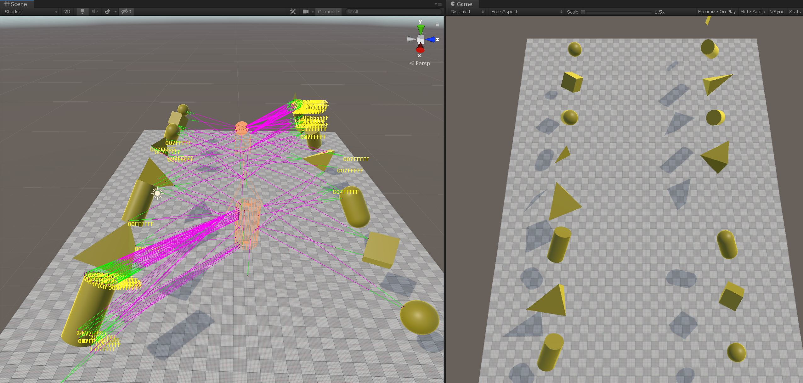

## Scene List

| Category | Scene | Description | Level | |
| --- | --- | --- | :---: | --- |
| Hello World | 1. Hello World.unity | Introductory scene for rigid body setup | Introductory |  |
| Setup | 2a1. Collider Parade.unity | Demo showing various shapes for collision detection | Introductory | 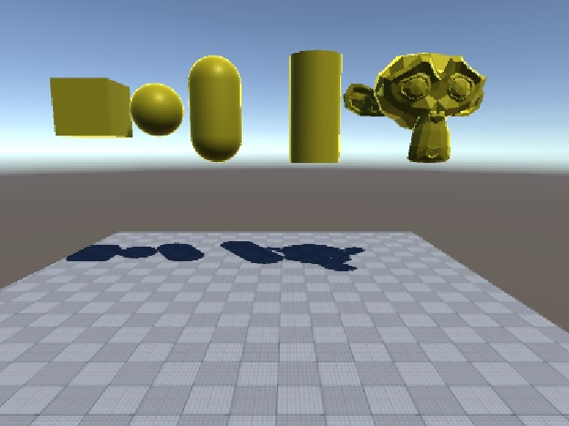 |
| Setup | 2b1. Motion Properties - Mass.unity | Demo showing how to explicitly set mass properties | Introductory | 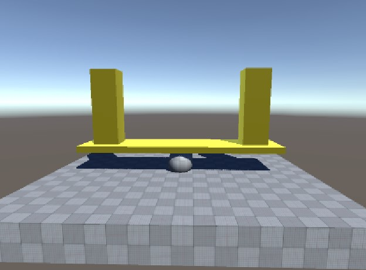 |
| Setup | 2b2. Motion Properties - Velocity.unity | Setting initial linear and angular velocities | Introductory |  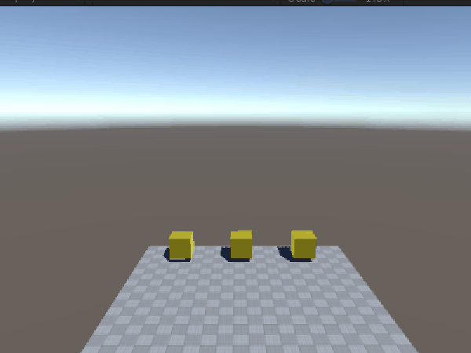 |
| Setup | 2b3. Motion Properties - Damping.unity | Demo showing the effect of linear and angular damping | Introductory |  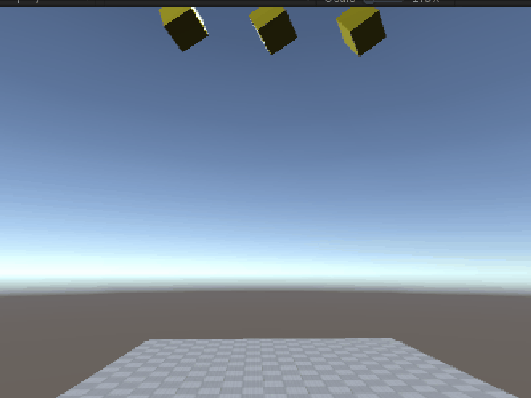 |
| Setup | 2b4. Motion Properties - Gravity Factor.unity | Demo showing the effect of per body gravity multipliers | Introductory |  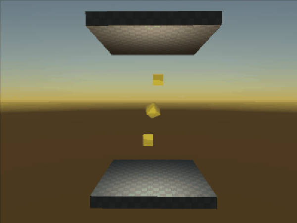 |
| Setup | 2b5. Motion Properties - Center of Mass.unity | Demo showing the effect of overriding center of mass and inertia tensor | Introductory | 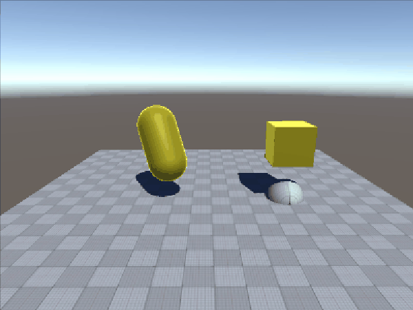 |
| Setup | 2c1. Material Properties - Friction.unity | Showing effect of different friction material values | Introductory | 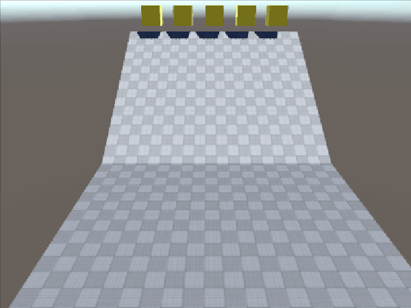 |
| Setup | 2c2. Material Properties - Restitution.unity | Showing effect of different restitution values | Introductory | 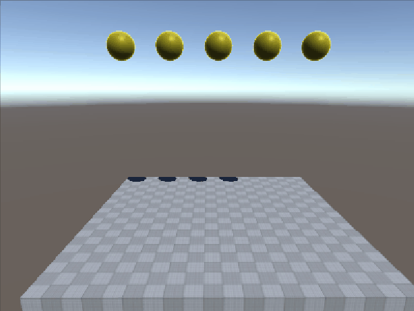 |
| Setup | ShapesSample.unity | Testing demo for colliders. Turn on / off spawners to test scalability | Introductory | 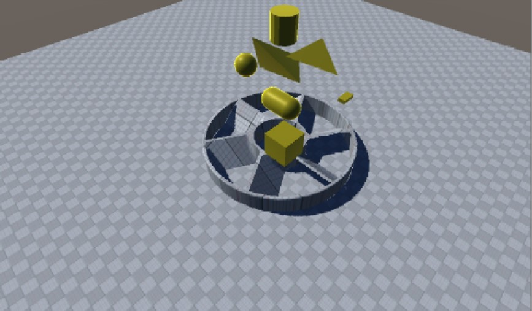 |
| Query | AllHitsDistanceTest.unity | Demo showing results of distance queries between multiple colliders | Introductory |  |
| Query | CastTest.unity | Demo showing the results of collider casting and ray casting | Introductory | 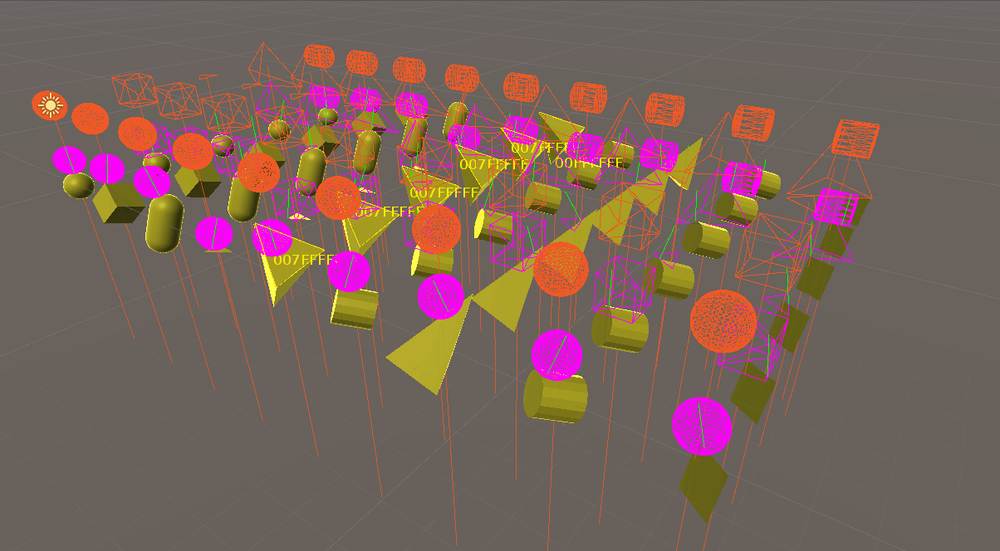 |
| Query | ClosestHitDistanceTest.unity | Demo showing results of distance queries | Introductory | 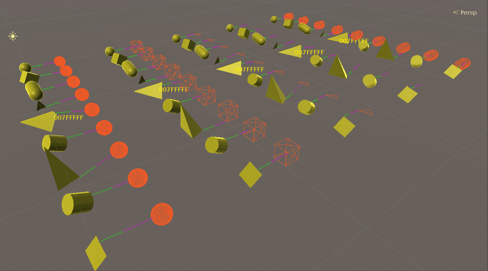 |
| Joints | 4a. Joints Parade.unity | Demo showing a range of joint types | Introductory  | 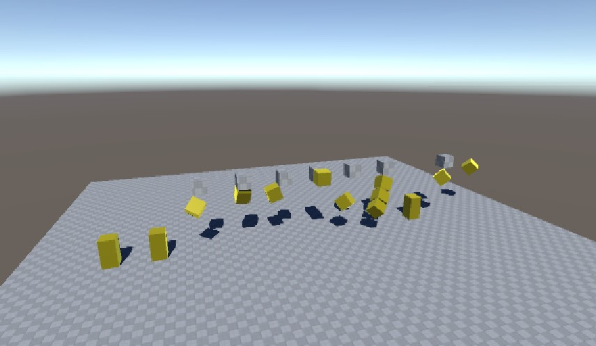 |
| Joints | Ragdoll.unity | Obligatory stack of ragdolls demo | Introductory  | 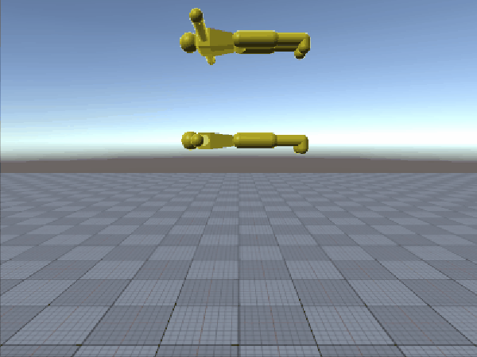 |
| Modify | ModifyBroadphasePairs.unity | Filter out collision by explicitly deleting pairs from broad phase | Advanced | 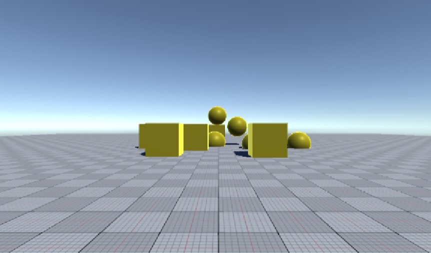 |
| Modify | ModifyContactJacobians.unity | Modify the results of contact generation to produce special effects | Advanced | 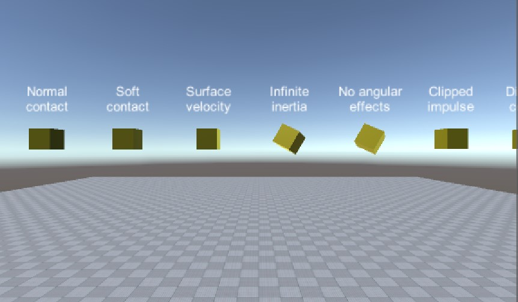 |
| Modify | ModifyNarrowphaseContacts.unity | Add new user contacts to simulation pipeline  | Advanced | No screenshot | 
| Use Case | CharacterController.unity | User case demo showing a rudimentary FPS character controller | Intermediate | 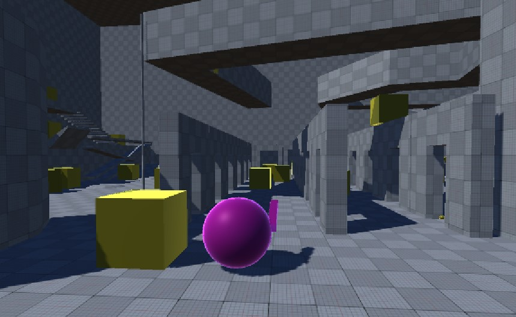 |
| Use Case | Pool.unity | Demonstration of calling immediate mode physics | Intermediate | 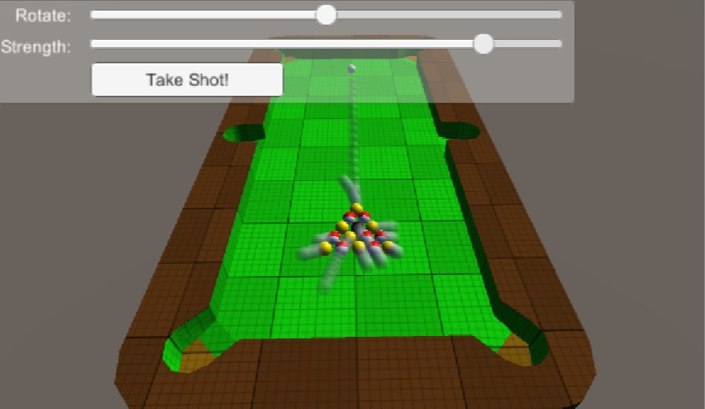 |
| Use Case | PlanetGravity.unity | Performance demo of asteroids around a planet using SP/HP | Introductory | 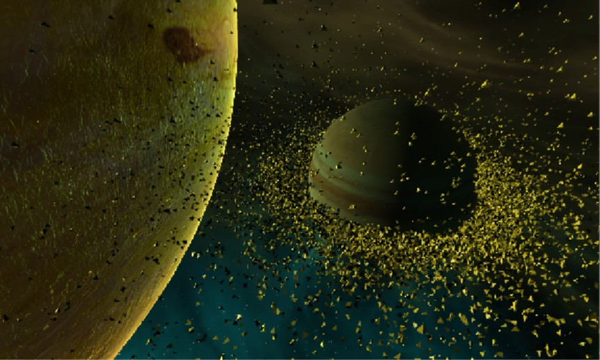 |
| Use Case | RaycastCar.unity | User case demo showing a set of vehicle behaviors | Intermediate | 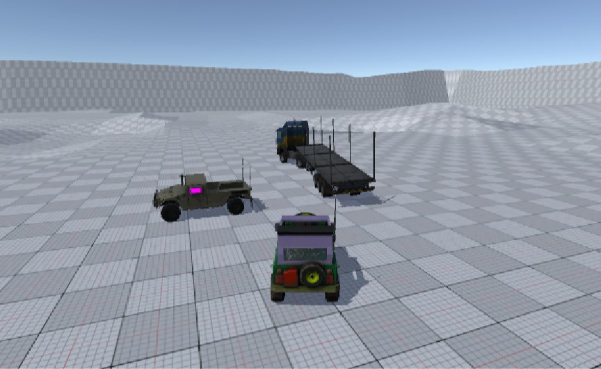 |
