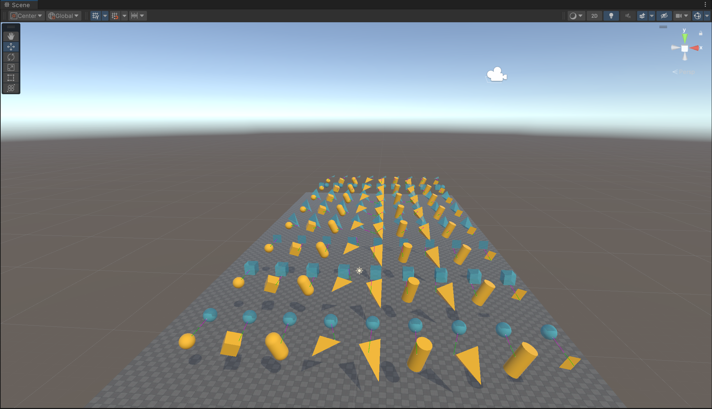
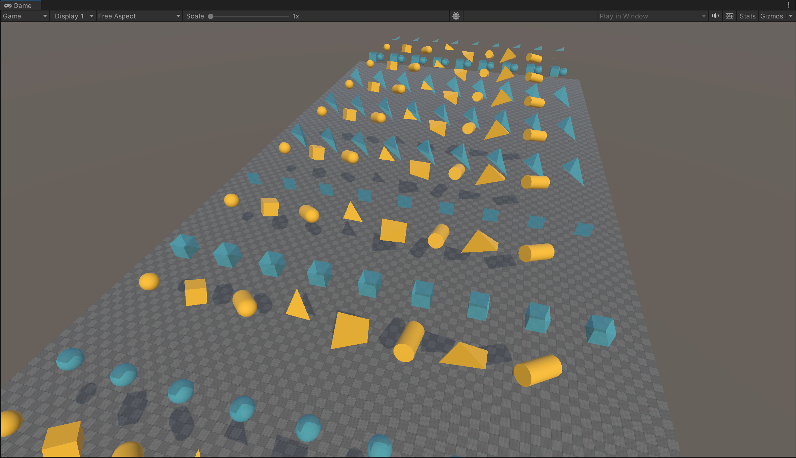
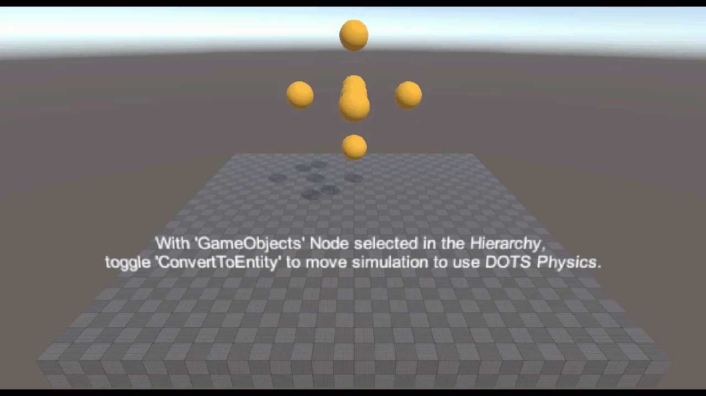
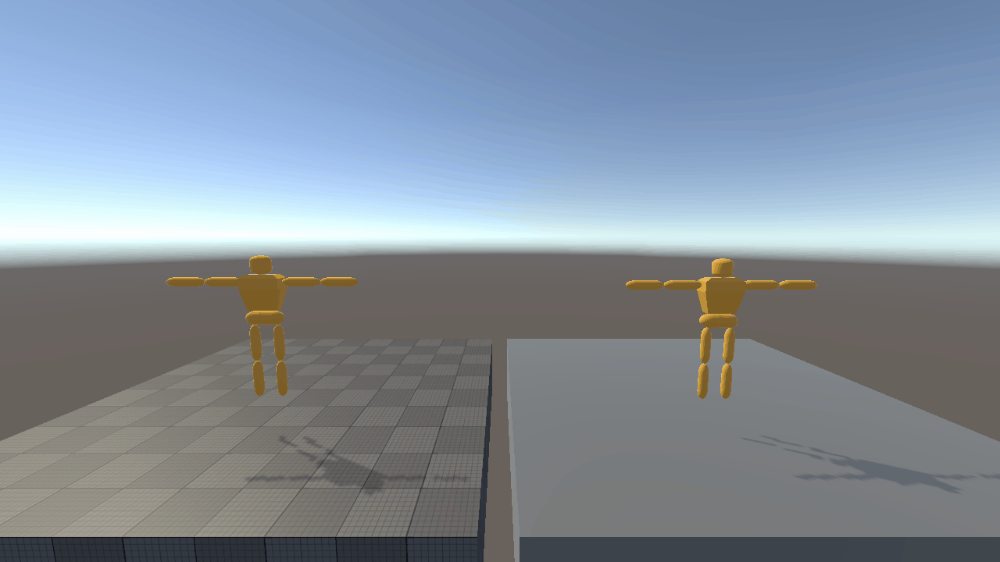
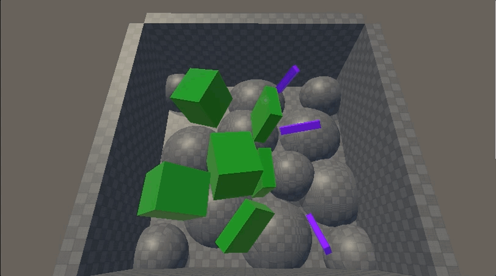
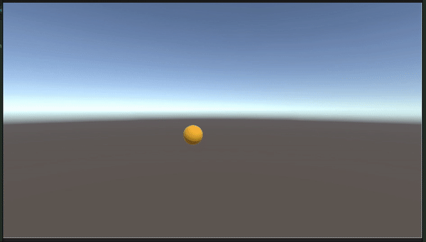
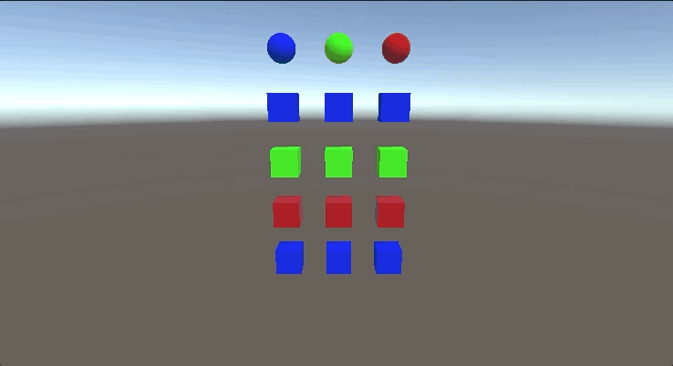

# Unity Physics Samples

*For more Phyiscs and DOTS starter material, see the [main page of this repo](../README.md).*

## Controls 

In the *Game* window:

- Mouse spring : Click and drag with left mouse
- Camera rotate : Click and drag with right mouse
- Camera move : W,A,S,D keys

## Debug Display

A lot of the demos display extra information as debug display gizmos in the Editor, for example the Query demos (ray cast, distance cast, etc). This display for these gizmos is in the *Scene* not the *Game* window. So keep an eye on both if in doubt:

| Scene view                                                                  | Game view                                                                   |
|-----------------------------------------------------------------------------|-----------------------------------------------------------------------------|
|                       |                        |

## Scene List

| Category    | Scene                                                         | Description                                                         |    Level     |                                                                                  |
|-------------|---------------------------------------------------------------|---------------------------------------------------------------------|:------------:|----------------------------------------------------------------------------------|
| Hello World | Hello World.unity                                  | Introductory scene for rigid body setup                             | Introductory |                                       |
| Hello World | SphereAndBoxColliders.unity                        | Basic colliders                                                     | Introductory |                                   |
| Hello World | GravityWell.unity                                  | Introductory scene                                                  | Introductory |                                        |
| Setup       | 2a1. Collider Parade - Basic.unity                 | Demo showing various shapes for collision detection                 | Introductory |                             |
| Setup       | 2a2. Collider Parade - Advanced                    | Demo showing various shapes for more advanced collision detection   | Introductory |                          |
| Setup       | 2b1. Motion Properties - Mass.unity                | Demo showing how to explicitly set mass properties using custom (yellow) and built-in (grey) authoring components | Introductory |  |
| Setup       | 2b2. Motion Properties - Velocity.unity            | Setting initial linear and angular velocities                       | Introductory |                        |
| Setup       | 2b3. Motion Properties - Damping.unity             | Demo showing the effect of linear and angular damping               | Introductory |                         |
| Setup       | 2b4. Motion Properties - Gravity Factor.unity      | Demo showing the effect of per body gravity multipliers             | Introductory |                  |
| Setup       | 2b5. Motion Properties - Center of Mass.unity      | Demo showing the effect of overriding center of mass                | Introductory |                  |
| Setup       | 2b6. Motion Properties - Inertia Tensor.unity      | Demo showing the effect of overriding inertia tensor                | Introductory |                  |
| Setup       | 2b7. Motion Properties - Smoothing.unity           | Demo showing the effect of interpolation and extrapolation          | Introductory |                       |
| Setup       | 2c1. Material Properties - Friction.unity          | Showing effect of different friction material values                | Introductory |                      |
| Setup       | 2c2. Material Properties - Restitution.unity       | Showing effect of different restitution values                      | Introductory |                   |
| Setup       | 2c3. Material Properties - Collision Filters.unity | Showing effect of different collision filters                       | Introductory |             |
| Setup       | 2d1. Events - Triggers.unity                       | Demo demonstrating the usage of triggers                            | Introductory |                                   |
| Setup       | 2d2. Events - Contacts.unity                       | Showing effect of different contacts                                | Introductory |                                   |
| Query       | 3a. All Hits Distance Test.unity                   | Demo showing results of distance queries between multiple colliders | Introductory |                            |
| Query       | 3b. Cast Test.unity                                | Demo showing the results of collider casting and ray casting        | Introductory |                                         |
| Query       | 3c. Closest Hit Distance Test.unity                | Demo showing results of distance queries                            | Introductory |                         |
| Query       | 3d. Custom Collector.unity                         | Demonstration of raycast                                            | Introductory |                                  |
| Joints      | 4a. Joints Parade.unity                            | Demo showing a range of joint types                                 | Introductory |                                     |
| Joints      | 4b. Limit DOF.unity                                | Showing effect of limiting degrees of freedom                       | Introductory |                                         |
| Joints      | 4c1. All Motors Parade.unity                       | Demo showing different motors                                       | Introductory |                                 |
| Joints      | 4c2. Position Motor.unity                          | Demo showing position motor                                         | Introductory |                                    |
| Joints      | 4c3. Linear Velocity Motor.unity                   | Showing linear velocity motor                                       | Introductory |                             |
| Joints      | 4c4. Angular Velocity Motor.unity                  | Demonstrating angular velocity motor                                | Introductory |                            |
| Joints      | 4c5. Rotational Motor.unity                        | Demonstrating rotational motor                                      | Introductory |                                  |
| Joints      | 4d. Ragdolls.unity                                 | Obligatory stack of ragdolls demo                                   | Introductory |                                              |
| Joints      | 4e. Single Ragdoll.unity                           | GameObject ragdoll for Unity Physics (left) and built-in physics (right), created using the [Ragdoll Wizard](https://docs.unity3d.com/Manual/wizard-RagdollWizard.html) | Introductory |  |
| Modify      | 5a. Change Motion Type.unity                       | Demo showing change of motion type                                  | Introductory |                               |
| Modify      | 5b. Change Box Collider Size.unity                 | Demonstrating runtime change of collider size                       | Introductory |                          |
| Modify      | 5c. Change Collider Type.unity                     | Demonstrating change of collider type                               | Introductory |                              |
| Modify      | 5d. Change Velocity.unity                          | Demo showing change of velocity                                     | Introductory |                                   |
| Modify      | 5e. Kinematic Motion.unity                         | Demo showing kinematic motion in combination with dynamic objects   | Introductory |                                  |
| Modify      | 5f. Change Surface Velocity.unity                  | Demo showing change of surface velocity                             | Introductory |                           |
| Modify      | 5g1. Change Collider Material - Bouncy Boxes.unity | Demo showing effect of unique prefab instantiation with collider material changes | Intermediate |  |
| Modify      | 5g2. Unique Collider Blob Sharing.unity            | Demo showing effect of instantiating prefabs during runtime, making collider blobs unique and sharing collider blob data | Advanced |  |
| Modify      | 5g3. Runtime Collider Creation.unity               | Create mesh colliders during runtime                                |   Advanced   |     |
| Modify      | 5g4. Runtime Collision Filter Modification.unity   | Modify collision filters during runtime                             |   Advanced   |  |
| Modify      | 5g5. Modify Collider Geometry.unity                | Modify collider geometry during runtime                             |   Advanced   |  |
| Modify      | 5h. Change Scale.unity                             | Demo showing scale change of entities                               | Introductory |                                      |
| Modify      | 5i. Apply Impulse.unity                            | Demo showing application of impulses                                | Introductory |                                     |
| Modify      | 5j. Modify Broadphase Pairs.unity                  | Filter out collision by explicitly deleting pairs from broad phase  |   Advanced   |             |
| Modify      | 5k. Modify Contact Jacobians.unity                 | Modify the results of contact generation to produce special effects |   Advanced   |                     |
| Modify      | 5l. Modify Narrowphase Contacts.unity              | Add new user contacts to simulation pipeline                        |   Advanced   |      | 
| Use Case    | 6a. Character Controller.unity                     | User case demo showing a rudimentary FPS character controller       | Intermediate |                       |
| Use Case    | 6b. Pool.unity                                     | Demonstration of calling immediate mode physics                     | Intermediate |                                       |
| Use Case    | 6c. Planet Gravity.unity                           | Performance demo of asteroids around a planet using SP/HP           | Introductory |                                |
| Use Case    | 6d. Raycast Car.unity                              | User case demo showing a set of vehicle behaviors                   | Intermediate |                                         |
