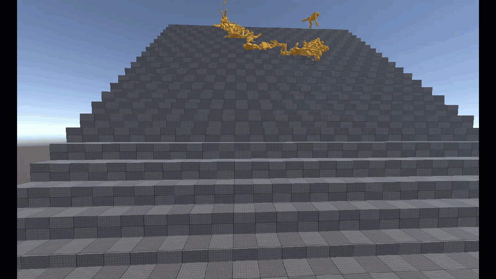
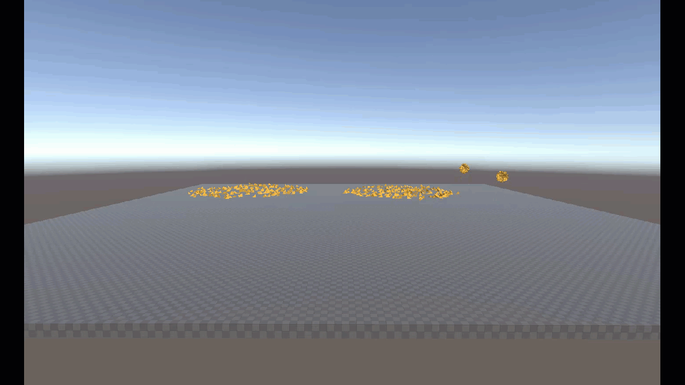

# Unity Physics Samples

In the *Game* window:

- Drag objects: click and drag with left mouse
- Rotate camera: click and drag with right mouse
- Move camera: WASD keys

**NOTE:** Many of these samples display extra information as debug display gizmos in the Editor. For example, the Query samples display raycasts as debug lines that are only visible when Gizmos are enabled.

## Scene List

Scene                                                         | Description                                                         |    Level     |                                                                                  |
|---------------------------------------------------------------|-----------------------------------------------------------------|:------------:|----------------------------------------------------------------------------------|
| 1. Hello World /  Hello World       | Objects with convex hull colliders                              |                                       |
| 1. Hello World /  Sphere and Box Colliders    | Objects with sphere and box colliders               |                                   |
| 2. Gravity Well /  Gravity Well                | Two objects rotating around a center and smaller objects gravitating to the larger two. |                                        |
| 3. Collider Geometry /  Collision Parade - Basic                 | The basic collider shapes                  |                             |
| 3. Collider Geometry /  Collision Parade - Advanced                  | Colliders of all shapes, including compound colliders    |                          |
| 4. Motion Properties /  Mass                | Overriding mass                   |                            |
| 4. Motion Properties /  Velocity            | Objects that spawn with a set initial linear and angular velocity                        |                        |
| 4. Motion Properties /  Damping             | Linear and angular damping                |                         |
| 4. Motion Properties /  Gravity Factor      | Per-body gravity multipliers              |                  |
| 4. Motion Properties /  Center of Mass      | Overriding center of mass                 |                  |
| 4. Motion Properties /  Inertia Tensor      | Overriding inertia tensor                 |                  |
| 4. Motion Properties /  Smoothing           | Objects with either interpolation, extrapolation, or neither           |                       |
| 5. Material Properties /  Friction          | Objects with different friction strength sliding down a slope                 |                      |
| 5. Material Properties /  Restitution       | Falling objects with different restitution (fancy word for bounciness!)                       |                   |
| 5. Material Properties /  Collision Filters | Objects only collide with other objects belonging to the matching material collision filter                        |             |
| 6. Events /  Collisions                   | Detecting object contact with a trigger surface  |  |
| 6. Events /  Contacts                    | Object repelled upon hitting a trigger volume                                 |                       |
| 6. Events /  Triggers                       | Objects reverse gravity upon entering trigger volume                             |                                   |
| 6. Events /  Triggers - Change Material                       | Objects change material upon entering trigger volume                             |                                         |
| 6. Events /  Triggers - Force Field                    | Objects float upward when inside moving trigger volume                |                                         |
| 6. Events /  Triggers - Portals                   | Teleport an object from one portal to another upon contact                             |                    |
| 7. Query /  All Distances                     | Query for the distance between the colliders for each collider vertex  |                            |
| 7. Query /  Closest Distance                   | Query for closest distance between two colliders                            |                         |
| 7. Query /  Cast                                 | Collider casting and ray casting         |                                         |
| 7. Query /  Custom Collector                         | Raycast with custom filtering                                             |                                  |
| 8. Joints and Motors /  Joints - Parade                           | All joint types                                  |                                     |
| 8. Joints and Motors /  Joints - Limit DOF                                | Limiting degrees of freedom                        |                                         |
| 8. Joints and Motors /  Joints - Ragdolls                                  | Obligatory stack of ragdolls                                    |                       |
| 8. Joints and Motors /  Motors - Parade                       | All motor types                                        |                                 |
| 8. Joints and Motors /  Motors - Position                          | Position motors                                          |                                    |
| 8. Joints and Motors /  Motors - Linear Velocity                  | Linear velocity motors                                        |                             |
| 8. Joints and Motors /  Motors - Angular Velocity              | Angular velocity motors                                 |                            |
| 8. Joints and Motors /  Motors - Rotational                | Rotational motors                                       |                                  |
| 9. Modify /  Motion Type                      | Dynamically modifying motion type                                   |                               |
| 9. Modify /  Box Collider Size                 | Dynamically modifying collider size                        |                          |
| 9. Modify /  Collider Type                     | Dynamically modifying collider type                                |                              |
| 9. Modify /   Velocity                  | Modifying velocity                                      |                                   |
| 9. Modify /   Kinematic Motion                         | Moving kinematic objects that collide with dynamic objects    |                                  |
| 9. Modify /   Surface Velocity                  | Dynamically modifying surface velocity                              |                           |
| 9. Modify /   Collider Filter                   | Dynamically modifying collider filters                        |                            |
| 9. Modify /   Scale                             | Dynamically modifying scale                                |                                      |
| 9. Modify /   Impulse                            | Applying impulses                                 |                                     |
| 9. Modify /  Broadphase Pairs                    | Filter out collision by explicitly deleting pairs from the broad phase  |               |
| 9. Modify /  Contacts                   | Dynamically modifying the results of contact generation to produce special effects |                       |
| 9. Modify /  Narrowphase Contacts                | Dynamically add new contacts in narrowphase                        |        | 
| 10. Character Controller /  Character Controller                      | A rudimentary 3rd-person character controller       |                       |
| 11. Immediate Mode /  Pool                                     | A pool game that uses "immediate mode" to project the ball movements before the shot is taken            |                                       |
| 12. Planet Gravity /  Planet Gravity                            | Stress test of many asteroids orbiting a planet            |                                |
| 13. Raycast Car /  Raycast Car                               | Drivable vehicles                   |                                         |
